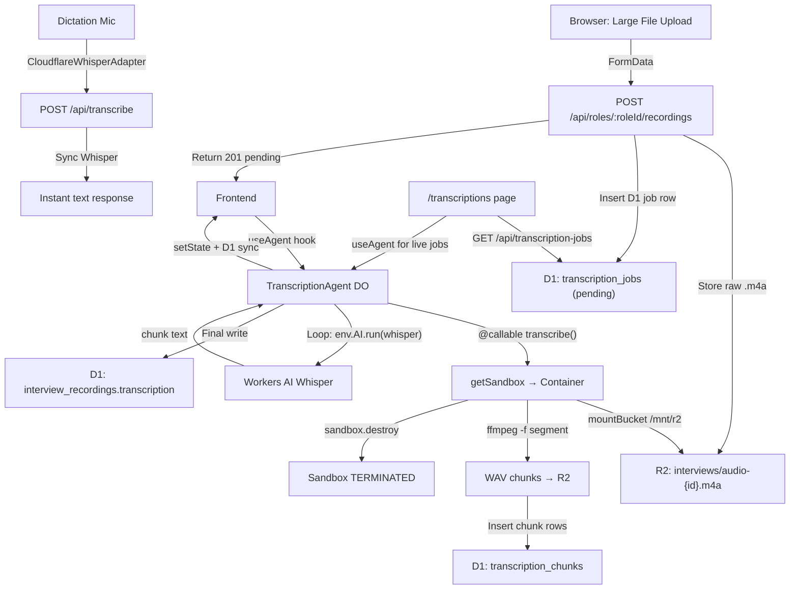

# Audio Transcription Pipeline — Agent-Orchestrated Sandbox & Real-Time Transparency

Refactor the audio transcription system to orchestrate large `.m4a` file processing using the **Cloudflare Agents SDK** and the **Sandbox SDK**. The Sandbox is used **only** for FFmpeg chunking (minimizing usage cost), then immediately destroyed. The Agent then runs `env.AI.run()` natively for each chunk. All state is dual-written to D1 for historical persistence.

## User Review Required

> [!IMPORTANT]
> **Queue Already Created**: `core-resumes-transcription` is provisioned. Binding: `core_resumes_transcription`. Kept as a future extension point but NOT used in the primary flow.

> [!IMPORTANT]
> **Cost Optimization**: The Sandbox is alive ONLY for the FFmpeg chunking step (typically seconds). All Whisper inference happens via `env.AI.run()` on the Agent/Worker — zero Sandbox compute for AI calls.

> [!IMPORTANT]
> **Dual State Persistence**: Agent `setState()` drives real-time WebSocket UI. D1 tables provide durable historical state that survives Agent lifecycle resets. The frontend reads from Agent state when connected, falls back to D1 API for historical/disconnected views.

> [!WARNING]
> **Sandbox Version Sync**: A `verify-sandbox-version.mjs` script will be added and wired into `pnpm run deploy` to ensure the `@cloudflare/sandbox` npm package and Docker image tag always match.

---

## Proposed Changes

### Overview



**Two distinct flows:**

1. **Large file upload** — Upload → R2 → `TranscriptionAgent` via WebSocket RPC →
   - **Phase 1 (Sandbox):** FFmpeg splits `.m4a` into 30-second WAV chunks → writes chunks to R2 → chunk metadata to D1 → Sandbox destroyed
   - **Phase 2 (Agent native):** Agent reads each chunk from R2 → `env.AI.run()` → dual-writes progress to Agent state + D1 → final transcription to `interview_recordings`
2. **Dictation (fast-path)** — `assistant-ui` adapter → `/api/transcribe` → synchronous Whisper → instant text

---

### Component 1: Custom Sandbox Container

#### [NEW] [Dockerfile](file:///Volumes/Projects/workers/core-resumes/Dockerfile)

```dockerfile
FROM docker.io/cloudflare/sandbox:0.7.0

RUN apt-get update && apt-get install -y ffmpeg && rm -rf /var/lib/apt/lists/*

COPY scripts/process_audio.py /workspace/process_audio.py

EXPOSE 8080
```

Minimal image: base sandbox + `ffmpeg` only. No `requests`, no `python3-pip` — the Sandbox does NOT call any APIs.

---

### Component 2: Python Audio Chunker (FFmpeg Only)

#### [NEW] [scripts/process_audio.py](file:///Volumes/Projects/workers/core-resumes/scripts/process_audio.py)

Python script executed inside the Sandbox. **Its only job is FFmpeg chunking — zero API calls.**

**Input args:**

- `sys.argv[1]` — mounted R2 file path (e.g., `/mnt/r2/interviews/audio-{id}.m4a`)
- `sys.argv[2]` — output directory on the mounted R2 (e.g., `/mnt/r2/chunks/{recordingId}/`)

**Pipeline:**

1. `os.makedirs(output_dir, exist_ok=True)`
2. `subprocess.run(["ffmpeg", "-i", input_path, "-f", "segment", "-segment_time", "30", "-ar", "16000", "-ac", "1", "-c:a", "pcm_s16le", f"{output_dir}/chunk_%03d.wav"])`
   - 30-second WAV chunks, 16kHz mono — optimal for Whisper
   - ~960KB per chunk (well under any limit)
3. List output files, sort by name, emit structured stdout:
   - `CHUNK_COUNT:{n}` — total chunks created
   - `CHUNK_FILE:{filename}` — each chunk filename (ordered)
   - `DONE` — FFmpeg complete, Sandbox can be destroyed

**No network calls.** No API tokens. Pure FFmpeg + filesystem.

---

### Component 3: Database Schema — Transcription Jobs & Chunks

#### [NEW] [transcription-jobs.ts](file:///Volumes/Projects/workers/core-resumes/src/backend/db/schemas/transcription-jobs.ts)

Top-level job table that mirrors Agent state and persists beyond DO lifecycle:

```typescript
export const transcriptionJobs = sqliteTable("transcription_jobs", {
  id: text("id")
    .primaryKey()
    .$defaultFn(() => crypto.randomUUID()),
  recordingId: text("recording_id")
    .notNull()
    .references(() => interviewRecordings.id, { onDelete: "cascade" }),
  roleId: text("role_id")
    .notNull()
    .references(() => roles.id, { onDelete: "cascade" }),
  status: text("status", {
    enum: ["pending", "chunking", "transcribing", "complete", "error"],
  })
    .notNull()
    .default("pending"),
  phase: text("phase"), // Human-readable phase label
  progress: integer("progress").default(0), // 0–100
  totalChunks: integer("total_chunks"),
  completedChunks: integer("completed_chunks").default(0),
  fullText: text("full_text"), // Accumulated transcription
  error: text("error"),
  r2Key: text("r2_key").notNull(), // Original uploaded file R2 key
  createdAt: integer("created_at", { mode: "timestamp" })
    .notNull()
    .$defaultFn(() => new Date()),
  updatedAt: integer("updated_at", { mode: "timestamp" })
    .notNull()
    .$defaultFn(() => new Date()),
  completedAt: integer("completed_at", { mode: "timestamp" }),
});
```

**Documentation exports:** `TRANSCRIPTION_JOBS_TABLE_DESCRIPTION` + `TRANSCRIPTION_JOBS_COLUMN_DESCRIPTIONS`.

#### [NEW] [transcription-chunks.ts](file:///Volumes/Projects/workers/core-resumes/src/backend/db/schemas/transcription-chunks.ts)

Per-chunk metadata with individual transcription results:

```typescript
export const transcriptionChunks = sqliteTable("transcription_chunks", {
  id: text("id")
    .primaryKey()
    .$defaultFn(() => crypto.randomUUID()),
  jobId: text("job_id")
    .notNull()
    .references(() => transcriptionJobs.id, { onDelete: "cascade" }),
  chunkIndex: integer("chunk_index").notNull(),
  r2Key: text("r2_key").notNull(), // e.g., "chunks/{recordingId}/chunk_003.wav"
  status: text("status", {
    enum: ["pending", "processing", "complete", "failed"],
  })
    .notNull()
    .default("pending"),
  transcription: text("transcription"), // Individual chunk transcript
  durationSeconds: integer("duration_seconds"), // ~30s per chunk
  createdAt: integer("created_at", { mode: "timestamp" })
    .notNull()
    .$defaultFn(() => new Date()),
  completedAt: integer("completed_at", { mode: "timestamp" }),
});
```

**Indexes:** `jobId` + `chunkIndex` composite for ordered retrieval.

#### [MODIFY] [schema.ts (barrel)](file:///Volumes/Projects/workers/core-resumes/src/backend/db/schema.ts)

Add exports:

```typescript
export * from "./schemas/transcription-jobs";
export * from "./schemas/transcription-chunks";
```

---

### Component 4: TranscriptionAgent (Durable Object)

#### [NEW] [transcription-agent.ts](file:///Volumes/Projects/workers/core-resumes/src/backend/ai/agents/transcription-agent.ts)

```typescript
import { Agent, callable } from "agents";
import { getSandbox } from "@cloudflare/sandbox";
```

**State shape:**

```typescript
type TranscriptionState = {
  status: "idle" | "chunking" | "transcribing" | "complete" | "error";
  phase: string;
  progress: number;
  totalChunks: number;
  completedChunks: number;
  fullText: string;
  logs: string[];
  error: string | null;
  recordingId: string | null;
  roleId: string | null;
  jobId: string | null; // D1 transcription_jobs.id
};
```

**`@callable() transcribe(r2Key, recordingId, roleId, jobId)`:**

**Phase 1 — Sandbox (FFmpeg only):**

1. Guard against concurrent execution
2. `setState({ status: "chunking", phase: "Initializing Sandbox…" })`
3. **D1 sync:** Update `transcription_jobs` → `status: "chunking"`
4. Provision sandbox: `getSandbox(this.env.PROCESSOR_SANDBOX, recordingId)`
5. Mount R2: `await sandbox.mountBucket("core-resumes-audio", "/mnt/r2", { ... })`
6. Execute FFmpeg: `await sandbox.exec("python3 /workspace/process_audio.py ...")`
7. Parse stdout → extract chunk filenames
8. **D1 sync:** Insert rows into `transcription_chunks` for each chunk (status: "pending", r2Key)
9. **D1 sync:** Update `transcription_jobs` → `totalChunks`
10. **`await sandbox.destroy()`** — free Sandbox immediately
11. `setState({ status: "transcribing", phase: "Sandbox released. Starting transcription…" })`

**Phase 2 — Native Workers AI (no Sandbox):** 12. For each chunk file (sorted): - **D1 sync:** Update chunk → `status: "processing"` - Fetch from R2: `env.R2_AUDIO_BUCKET.get("chunks/{recordingId}/chunk_000.wav")` - Convert to base64: `Buffer.from(await obj.arrayBuffer()).toString("base64")` - Call Whisper: `env.AI.run("@cf/openai/whisper-large-v3-turbo", { audio: base64 }, { gateway: { id: env.AI_GATEWAY_ID } })` - **D1 sync:** Update chunk → `status: "complete"`, `transcription: res.text` - Append `res.text` to `fullText` - `setState({ completedChunks: i+1, progress: pct, phase: "Transcribing chunk {i+1}/{total}" })` - **D1 sync:** Update `transcription_jobs` → `completedChunks`, `progress`, `fullText` 13. **D1 sync:** Update `interview_recordings` → `transcription: fullText`, `transcriptionStatus: "complete"` 14. **D1 sync:** Update `transcription_jobs` → `status: "complete"`, `completedAt: now` 15. Clean up R2 chunk files (optional, configurable) 16. `setState({ status: "complete", progress: 100 })`

**Error handling:** try/catch wraps entire flow. `finally` always calls `sandbox.destroy()`. On error: update both Agent state and D1 (`transcription_jobs.status = "error"`, `transcription_jobs.error = message`).

---

### Component 5: Backend API — Transcription Jobs

#### [MODIFY] [interview-recordings.ts](file:///Volumes/Projects/workers/core-resumes/src/backend/api/routes/interview-recordings.ts)

Refactor `POST /:roleId/recordings`:

- **Remove** the synchronous Whisper call (lines 58–101)
- Keep R2 upload
- Insert `interview_recordings` row with `transcriptionStatus: "pending"`
- Insert `transcription_jobs` row with `status: "pending"`, `r2Key`, `recordingId`, `roleId`
- Return `201 { id: recordingId, r2Key, jobId, transcriptionStatus: "pending" }`

#### [NEW] [transcription-jobs.ts (route)](file:///Volumes/Projects/workers/core-resumes/src/backend/api/routes/transcription-jobs.ts)

New Hono router mounted at `/api/transcription-jobs`:

- **`GET /`** — List all jobs, ordered by `createdAt` desc. Returns job status, progress, recording metadata. Supports `?roleId=` filter.
- **`GET /:jobId`** — Single job with full detail including all chunk rows (ordered by `chunkIndex`). Returns `{ job, chunks }`.
- **`GET /:jobId/chunks`** — List chunks for a job with individual transcription text.

#### [MODIFY] [api/index.ts](file:///Volumes/Projects/workers/core-resumes/src/backend/api/index.ts)

Mount `transcriptionJobsRouter` at `/api/transcription-jobs`.

#### [KEEP] [transcribe.ts](file:///Volumes/Projects/workers/core-resumes/src/backend/api/routes/transcribe.ts)

No changes — stays as the fast-path for dictation.

---

### Component 6: Wrangler Configuration

#### [MODIFY] [wrangler.jsonc](file:///Volumes/Projects/workers/core-resumes/wrangler.jsonc)

**1. Queues** (provisioned, future use):

```jsonc
"queues": {
  "producers": [
    {
      "queue": "core-resumes-transcription",
      "binding": "core_resumes_transcription"
    }
  ],
  "consumers": [
    {
      "queue": "core-resumes-transcription"
    }
  ]
}
```

**2. Sandbox container binding:**

```jsonc
"containers": [{
  "class_name": "Sandbox",
  "image": "./Dockerfile",
  "instance_type": "lite",
  "max_instances": 1
}]
```

**3. TranscriptionAgent DO** — add to existing `durable_objects.bindings`:

```jsonc
{ "name": "TRANSCRIPTION_AGENT", "class_name": "TranscriptionAgent" }
```

**4. Migration tag** — add to `migrations` array:

```jsonc
{ "tag": "v4", "new_sqlite_classes": ["TranscriptionAgent"] }
```

Then run `pnpm run cf-typegen` to regenerate types.

---

### Component 7: Worker Entry Point

#### [MODIFY] [\_worker.ts](file:///Volumes/Projects/workers/core-resumes/src/_worker.ts)

- Import and re-export `TranscriptionAgent`
- Import and re-export `Sandbox` from `@cloudflare/sandbox` (required for container deployment)
- Add both to the `createExports` return object
- `routeAgentRequest` at line 67 already handles all DO agent routing

---

### Component 8: Frontend — Upload + Real-Time Progress

#### [MODIFY] [InterviewRecordings.tsx](file:///Volumes/Projects/workers/core-resumes/src/frontend/components/role/InterviewRecordings.tsx)

Refactor `handleUpload`:

1. Upload file to `POST /:roleId/recordings` → returns `{ id, r2Key, jobId, transcriptionStatus: "pending" }`
2. Connect to `TranscriptionAgent` via `useAgent()`:
   ```tsx
   const agent = useAgent({
     agent: "transcription-agent",
     name: recordingId,
     onStateUpdate: (state) => setTranscriptionState(state),
   });
   ```
3. Trigger transcription: `agent.call("transcribe", [r2Key, recordingId, roleId, jobId])`
4. Render live progress from `agent.state`:
   - Phase 1 indicator: "Splitting audio…" with spinner
   - Phase 2: `<Progress value={state.progress} />` with "Transcribing chunk 3/12"
   - Streaming text preview: `state.fullText` in a scroll area
   - Log terminal: `state.logs`
5. On `status === "complete"`, refresh the recordings list

#### [NEW] [transcriptions.astro](file:///Volumes/Projects/workers/core-resumes/src/frontend/pages/transcriptions.astro)

New page at `/transcriptions` showing all transcription jobs:

- Astro page layout with `<Sidebar>` + `<TranscriptionJobsList client:load />`
- Add to sidebar navigation: `{ href: "/transcriptions", label: "Transcriptions", icon: FileAudio }`

#### [NEW] [TranscriptionJobsList.tsx](file:///Volumes/Projects/workers/core-resumes/src/frontend/components/transcription/TranscriptionJobsList.tsx)

React island for the transcription jobs dashboard:

- Fetches `GET /api/transcription-jobs` on mount (D1 source — works even after Agent reset)
- For any job with `status !== "complete" && status !== "error"`, connects via `useAgent()` for live updates
- Table with columns: Recording Name, Role, Status (badge), Progress (bar), Chunks (completed/total), Created, Duration
- Expandable rows showing per-chunk detail: index, R2 key, status, individual transcription text
- Click-through to the role's recording view

---

### Component 9: Sandbox Version Sync Script

#### [NEW] [scripts/verify-sandbox-version.mjs](file:///Volumes/Projects/workers/core-resumes/scripts/verify-sandbox-version.mjs)

Ported from `core-github-api`. Runs automatically as part of `pnpm run deploy`:

1. Reads installed `@cloudflare/sandbox` version from `node_modules`
2. Checks npm registry for latest version via `pnpm info`
3. If update available → runs `pnpm add -w @cloudflare/sandbox@{latest}` automatically
4. Scans all `Dockerfile` / `*.Dockerfile` files in the repo
5. Updates any `FROM docker.io/cloudflare/sandbox:{version}` lines to match
6. Prints sync status

#### [MODIFY] [package.json](file:///Volumes/Projects/workers/core-resumes/package.json)

```json
{
  "scripts": {
    "verify-sandbox": "node scripts/verify-sandbox-version.mjs",
    "deploy": "pnpm run verify-sandbox && pnpm run drizzle:generate && pnpm run migrate:remote && pnpm run build && pnpm dlx wrangler deploy"
  }
}
```

---

## File Summary

| File                                                              | Action | Purpose                                             |
| ----------------------------------------------------------------- | ------ | --------------------------------------------------- |
| `Dockerfile`                                                      | NEW    | Sandbox image: base + ffmpeg only                   |
| `scripts/process_audio.py`                                        | NEW    | FFmpeg chunking → WAV chunks to R2 mount            |
| `scripts/verify-sandbox-version.mjs`                              | NEW    | Auto-sync SDK + Docker image versions on deploy     |
| `src/backend/db/schemas/transcription-jobs.ts`                    | NEW    | D1 table: job-level state (mirrors Agent)           |
| `src/backend/db/schemas/transcription-chunks.ts`                  | NEW    | D1 table: per-chunk R2 key, status, transcription   |
| `src/backend/db/schema.ts`                                        | MODIFY | Barrel export new schemas                           |
| `src/backend/ai/agents/transcription-agent.ts`                    | NEW    | DO Agent: Sandbox + `env.AI.run()` + dual D1 sync   |
| `src/backend/api/routes/interview-recordings.ts`                  | MODIFY | Remove sync Whisper, insert job row, return pending |
| `src/backend/api/routes/transcription-jobs.ts`                    | NEW    | API: list jobs, get job + chunks                    |
| `src/backend/api/index.ts`                                        | MODIFY | Mount `/api/transcription-jobs`                     |
| `src/backend/api/routes/transcribe.ts`                            | KEEP   | Fast-path dictation (unchanged)                     |
| `src/_worker.ts`                                                  | MODIFY | Export TranscriptionAgent + Sandbox                 |
| `wrangler.jsonc`                                                  | MODIFY | Add queues, containers, DO bindings                 |
| `package.json`                                                    | MODIFY | Add `verify-sandbox` to deploy                      |
| `src/frontend/components/role/InterviewRecordings.tsx`            | MODIFY | useAgent() + progress UI                            |
| `src/frontend/pages/transcriptions.astro`                         | NEW    | Transcription jobs page                             |
| `src/frontend/components/transcription/TranscriptionJobsList.tsx` | NEW    | Jobs dashboard with live + historical views         |

---

## Verification Plan

### Automated Tests

1. `pnpm run build` — verify Agent exports, TS compilation
2. `pnpm run cf-typegen` — verify new bindings generate
3. `pnpm run db:generate` — verify migration generates for new tables
4. `docker build -t audio-processor-test .` — verify Dockerfile builds
5. `node scripts/verify-sandbox-version.mjs` — verify version sync passes

### Manual Verification

1. **Container Build**: `wrangler deploy` pushes Sandbox image
2. **Fast-Path Dictation**: Chat mic → `/api/transcribe` → instant text (unchanged)
3. **Agent Orchestration**: Upload 10+ minute `.m4a`:
   - Phase 1: "Splitting audio…" (Sandbox alive for seconds)
   - Sandbox destroyed after FFmpeg
   - Phase 2: Progress bar + chunk counter
   - Text streams in real-time
   - Green on completion
4. **D1 Persistence**: Verify `transcription_jobs` row has full history. Verify `transcription_chunks` has per-chunk transcriptions. Verify `interview_recordings.transcription` has concatenated result.
5. **Historical View**: Navigate to `/transcriptions` page → see completed jobs. Verify data loads from D1 (not Agent state).
6. **State Recovery**: Refresh browser mid-transcription → `useAgent` reconnects → UI resumes. After Agent resets → `/transcriptions` page still shows historical data from D1.
7. **Cost Verification**: Confirm Sandbox destroyed before Whisper begins (check logs).
