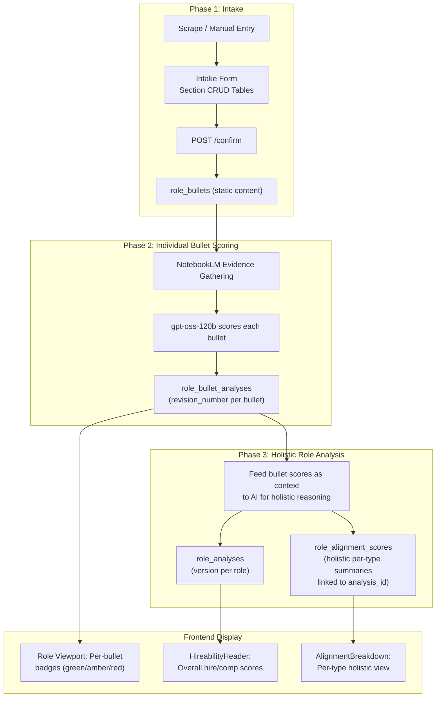

# Role Bullets — Structured Extraction, Intake CRUD, Two-Phase AI Scoring & Viewport Display

Add a `role_bullets` table for static job posting content, a `role_bullet_analyses` table for versioned per-bullet scoring, and a two-phase analysis pipeline that scores bullets individually first, then feeds those scores into the holistic role analysis.

## Architecture Overview



### Table Relationships

| Table                   | Purpose                                   | Versioning                                       | FK                                                   |
| ----------------------- | ----------------------------------------- | ------------------------------------------------ | ---------------------------------------------------- |
| `role_bullets`          | Static content extracted from job posting | None (immutable content, user-editable via CRUD) | `role_id` → `roles`                                  |
| `role_bullet_analyses`  | Per-bullet AI score + rationale           | `revision_number` per bullet                     | `bullet_id` → `role_bullets`                         |
| `role_analyses`         | Overall role hire/comp scores             | `version` per role (already exists)              | `role_id` → `roles`                                  |
| `role_alignment_scores` | Holistic per-type summaries               | Via `analysis_id` (already exists)               | `analysis_id` → `role_analyses`, `role_id` → `roles` |

---

## Proposed Changes

### 1. Database Layer

#### [NEW] [role-bullets.ts](file:///Volumes/Projects/workers/core-resumes/src/backend/db/schemas/role-bullets.ts)

Static content table — **no AI scoring fields** (scores live in `role_bullet_analyses`):

| Column       | Type                  | Notes                                                                                                                                              |
| ------------ | --------------------- | -------------------------------------------------------------------------------------------------------------------------------------------------- |
| `id`         | `integer`             | Auto-increment PK                                                                                                                                  |
| `role_id`    | `text`                | FK → `roles.id`, cascade delete                                                                                                                    |
| `type`       | `text` (enum)         | `REQUIRED_QUALIFICATION`, `PREFERRED_QUALIFICATION`, `KEY_RESPONSIBILITY`, `EDUCATION_REQUIREMENT`, `REQUIRED_SKILL`, `PREFERRED_SKILL`, `BENEFIT` |
| `content`    | `text`                | Extracted bullet text                                                                                                                              |
| `sort_order` | `integer`             | Display ordering within type group                                                                                                                 |
| `created_at` | `integer` (timestamp) | Auto-set                                                                                                                                           |
| `updated_at` | `integer` (timestamp) | Auto-set                                                                                                                                           |

#### [NEW] [role-bullet-analyses.ts](file:///Volumes/Projects/workers/core-resumes/src/backend/db/schemas/role-bullet-analyses.ts)

Versioned per-bullet scoring — each re-analysis creates a new row with incremented `revision_number`:

| Column            | Type                  | Notes                                     |
| ----------------- | --------------------- | ----------------------------------------- |
| `id`              | `integer`             | Auto-increment PK                         |
| `bullet_id`       | `integer`             | FK → `role_bullets.id`, cascade delete    |
| `revision_number` | `integer`             | Incremented per bullet on each re-scoring |
| `ai_score`        | `integer`             | 0–100 alignment score                     |
| `ai_rationale`    | `text`                | Evidence-based explanation                |
| `created_at`      | `integer` (timestamp) | Auto-set                                  |

#### [MODIFY] [role-alignment-scores.ts](file:///Volumes/Projects/workers/core-resumes/src/backend/db/schemas/role-alignment-scores.ts)

Update the `type` enum to match the new bullet type values so the holistic per-type analysis aligns with bullet categories:

```diff
-enum: ["requirement", "skill", "desired_trait", "responsibility"],
+enum: [
+  "REQUIRED_QUALIFICATION", "PREFERRED_QUALIFICATION",
+  "KEY_RESPONSIBILITY", "EDUCATION_REQUIREMENT",
+  "REQUIRED_SKILL", "PREFERRED_SKILL", "BENEFIT",
+],
```

Add a new `holistic_rationale` column for the AI's contextual reasoning that considers the full picture across all bullets within the type:

| Column               | Type   | Notes                                                                                                          |
| -------------------- | ------ | -------------------------------------------------------------------------------------------------------------- |
| `holistic_rationale` | `text` | AI reasoning considering bullet interactions (e.g. "while bullet X scored low, bullets Y and Z compensate...") |

#### [MODIFY] [schema.ts](file:///Volumes/Projects/workers/core-resumes/src/backend/db/schema.ts)

Add barrel exports:

```ts
export * from "./schemas/role-bullets";
export * from "./schemas/role-bullet-analyses";
```

---

### 2. AI Extraction Schema

#### No changes to [types.ts](file:///Volumes/Projects/workers/core-resumes/src/backend/ai/agents/orchestrator/types.ts)

The `JobPosting` Zod schema already extracts arrays for each bullet type. Mapping:

- `responsibilities` → `KEY_RESPONSIBILITY`
- `requiredQualifications` → `REQUIRED_QUALIFICATION`
- `preferredQualifications` → `PREFERRED_QUALIFICATION`
- `requiredSkills` → `REQUIRED_SKILL`
- `preferredSkills` → `PREFERRED_SKILL`
- `educationRequirements` → `EDUCATION_REQUIREMENT`
- `benefits` → `BENEFIT`

---

### 3. API Layer

#### [NEW] [role-bullets.ts](file:///Volumes/Projects/workers/core-resumes/src/backend/api/routes/role-bullets.ts)

CRUD router for `role_bullets` + read access to `role_bullet_analyses`:

| Method   | Path                                  | Purpose                                             |
| -------- | ------------------------------------- | --------------------------------------------------- |
| `GET`    | `/:roleId/bullets`                    | List all bullets with latest analysis scores joined |
| `POST`   | `/:roleId/bullets`                    | Bulk create bullets (intake confirm)                |
| `POST`   | `/:roleId/bullets/single`             | Add a single bullet (CRUD on viewport)              |
| `PUT`    | `/:roleId/bullets/:bulletId`          | Update bullet content/type                          |
| `DELETE` | `/:roleId/bullets/:bulletId`          | Delete a bullet                                     |
| `GET`    | `/:roleId/bullets/:bulletId/analyses` | Revision history for a specific bullet              |

#### [MODIFY] [index.ts](file:///Volumes/Projects/workers/core-resumes/src/backend/api/index.ts)

Mount: `app.route("/api/roles", roleBulletsRouter);`

#### [MODIFY] [intake.ts](file:///Volumes/Projects/workers/core-resumes/src/backend/api/routes/intake.ts)

Update `/confirm` handler:

1. Add `roleBullets` array to `confirmBody` Zod schema
2. After role insert, bulk-insert all bullets into `role_bullets` with `role.id`

```ts
roleBullets: z.array(z.object({
  type: z.enum([...ROLE_BULLET_TYPES]),
  content: z.string().min(1),
})).optional(),
```

---

### 4. AI Analysis Pipeline — Two-Phase Redesign

#### [MODIFY] [analyze-role.ts](file:///Volumes/Projects/workers/core-resumes/src/backend/ai/tasks/analyze-role.ts)

Complete pipeline redesign:

**Phase 1: Individual Bullet Scoring**

1. Load `role_bullets` from D1 (the user-curated content from intake)
2. Group by type, query NotebookLM for evidence per type
3. Score each bullet individually via `gpt-oss-120b` structured output
4. Compute next `revision_number` per bullet (max existing + 1)
5. Bulk-insert into `role_bullet_analyses`

**Phase 2: Holistic Role Analysis**

1. Load the freshly-scored bullet analyses as context
2. Feed to `gpt-oss-120b` with a system prompt that encourages holistic reasoning:
   - "While bullet X scored low individually, consider how the candidate's strengths in bullets Y and Z may compensate..."
   - Produce overall `hire_score`, `hire_rationale`, `compensation_score`, `compensation_rationale`
   - Produce per-type holistic summaries with `holistic_rationale`
3. Increment `version` on `role_analyses`
4. Insert new `role_alignment_scores` rows linked to the new `analysis_id`

Structured output schema for Phase 2:

```ts
const HolisticAnalysisSchema = z.object({
  hire_likelihood: z.number().int().min(0).max(100),
  hire_score_rationale: z.string(),
  compensation_score: z.number().int().min(0).max(100),
  compensation_score_rationale: z.string(),
  type_summaries: z.array(
    z.object({
      type: z.enum([...ROLE_BULLET_TYPES]),
      score: z.number().int().min(0).max(100),
      rationale: z.string(),
      holistic_rationale: z.string(),
    }),
  ),
});
```

---

### 5. Docs Route Update

#### [MODIFY] [docs.ts](file:///Volumes/Projects/workers/core-resumes/src/backend/api/routes/docs.ts)

Register `role_bullets` and `role_bullet_analyses` in the `TABLE_DOCS` registry.

---

### 6. Frontend — Intake Modal

#### [MODIFY] [IntakeModal.tsx](file:///Volumes/Projects/workers/core-resumes/src/frontend/components/intake/IntakeModal.tsx)

Replace textarea-based `ArrayField` sections with **CRUD section tables**:

**Each bullet type section:**

- Section heading with type label + count badge
- Table rows: editable content input + delete button
- "Add row" button at bottom of each section
- Rows are tracked as `{ type, content }` in `draft.roleBullets[]`

**Scrape → mapping flow:**

- When SSE returns `mapping` payload, convert existing arrays into `roleBullets`:
  ```ts
  const bullets = [
    ...(posting.responsibilities ?? []).map((c) => ({ type: "KEY_RESPONSIBILITY", content: c })),
    ...(posting.requiredQualifications ?? []).map((c) => ({
      type: "REQUIRED_QUALIFICATION",
      content: c,
    })),
    // ... etc
  ];
  ```

**Manual entry flow:**

- "Enter manually" sets `draft.roleBullets = []` — all sections start empty
- User adds rows per section as needed

**On confirm:**

- `roleBullets` array sent to `/api/intake/confirm` alongside existing fields

---

### 7. Frontend — Role Viewport

#### [NEW] [RoleBullets.tsx](file:///Volumes/Projects/workers/core-resumes/src/frontend/components/role/RoleBullets.tsx)

New component for the Overview tab showing all role bullets with latest scores:

- Fetches `GET /api/roles/:roleId/bullets` (includes latest analysis join)
- Groups by bullet type
- Each bullet row displays:
  - Content text
  - Score badge (colored): **green** ≥75, **amber** 40–74, **red** <40, **gray** = unscored
  - Expandable rationale on click
- Section-level CRUD (add/edit/delete bullets even after intake)

#### [MODIFY] [RoleViewport.tsx](file:///Volumes/Projects/workers/core-resumes/src/frontend/components/role/RoleViewport.tsx)

Add `<RoleBullets roleId={role.id} />` to the Overview tab below `HireabilityHeader`.

#### [MODIFY] [AlignmentBreakdown.tsx](file:///Volumes/Projects/workers/core-resumes/src/frontend/components/role/AlignmentBreakdown.tsx)

Update `TYPE_LABELS` to match new enum values and display `holistic_rationale` alongside per-type scores.

---

## Data Flow Summary

```
Intake Form → role_bullets (static content, user-editable)
                  ↓
           [Run Analysis]
                  ↓
   Phase 1: Score each bullet individually
                  ↓
          role_bullet_analyses (revision_number++)
                  ↓
   Phase 2: Feed bullet scores → holistic analysis
                  ↓
          role_analyses (version++)
          role_alignment_scores (per-type holistic summaries)
                  ↓
   [Re-score via chat] → revision_number++ on bullet analyses
                        → version++ on role analyses
```

---

## Verification Plan

### Automated Tests

1. `pnpm run db:generate` — verify Drizzle generates migrations for `role_bullets` and `role_bullet_analyses`
2. `pnpm run build` — verify TypeScript compilation
3. Browser flow tests:
   - Scrape → verify bullet sections populate on intake form
   - CRUD → add/edit/delete rows on intake form
   - Manual entry → verify sections accept user input from scratch
   - Confirm → verify `role_bullets` rows in D1
   - Trigger analysis → verify `role_bullet_analyses` rows created with `revision_number=1`
   - Re-trigger analysis → verify `revision_number=2` rows, `version` incremented on `role_analyses`
   - Viewport → verify colored badges + expandable rationale

### Manual Verification

- Role with zero bullets → analysis falls back gracefully
- Role with many bullets → performance check on batch scoring
