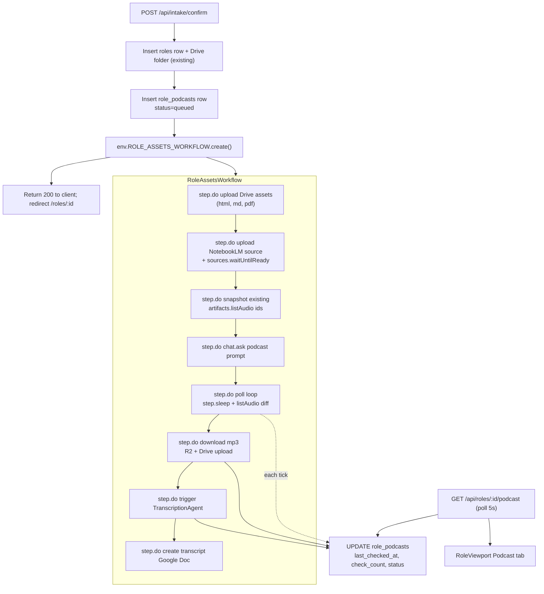

# Role intake + NotebookLM podcast pipeline

## Background and key choices

- **Background processing**: Cloudflare **Workflows** (`compatibility_date 2026-03-09` already supports it; `nodejs_compat` already on for `Buffer`). Single `RoleAssetsWorkflow` triggered from `/intake/confirm` runs Drive uploads, NotebookLM source upload + `waitUntilReady`, podcast chat trigger, baseline artifact snapshot, then a polling loop with `step.sleep` until the artifact appears, downloads it, kicks off transcription, and persists Google Doc transcript. Each `step.do` retries independently; one failed step never blocks unrelated downstream work.
- **Podcast trigger uses chat, not `artifacts.createAudio`**: per latest direction, send a structured prompt via `client.chat.ask(notebookId, prompt)`. Detect the resulting audio artifact by **diffing `client.artifacts.listAudio()` against a snapshot taken at trigger time** (the chat response confirms intent but doesn't return an artifact id).
- **Data model**: new `role_podcasts` table (one row per role/podcast attempt). Transcription reuses the existing `TranscriptionAgent` + `transcription_jobs` pipeline by adding a nullable `podcast_id` FK so the same Whisper chunking flow works.
- **Frontend updates**: REST polling (matches the user's "checks until found" mental model) on a new `GET /api/roles/:roleId/podcast` endpoint plus `Last-Modified`-style poll counter; existing `RoleViewport` gets a new **Podcast** tab.

## Architecture



## D1: new + extended schemas

- **New** `src/backend/db/schemas/role-podcasts.ts`. Columns:
  - `id` text PK
  - `role_id` text FK → `roles.id`, unique-ish (one active per role; allow history rows)
  - `notebooklm_source_id` text nullable
  - `notebooklm_source_filename` text (`role-{roleId}.md`)
  - `notebooklm_chat_conversation_id` text nullable
  - `notebooklm_chat_response` text nullable (acknowledgement text)
  - `notebooklm_artifact_id_baseline` text (JSON array of pre-existing audio artifact ids)
  - `notebooklm_artifact_id` text nullable (resolved after diff)
  - `r2_audio_key` text nullable (e.g. `podcasts/{roleId}/{podcastId}.mp3`)
  - `drive_audio_file_id` text nullable
  - `drive_transcript_doc_id` text nullable
  - `transcription_job_id` text nullable
  - `transcript_text` text nullable
  - `status` text enum: `queued | uploading_assets | indexing_source | awaiting_artifact | downloading | transcribing | complete | failed`
  - `step_errors` text JSON (per-step error log)
  - `check_count` integer default 0 (visible to UI)
  - `last_checked_at` integer timestamp
  - `workflow_instance_id` text
  - `created_at`, `updated_at`
  - Plus required `ROLE_PODCASTS_TABLE_DESCRIPTION` and `ROLE_PODCASTS_COLUMN_DESCRIPTIONS`.
- **Extend** `src/backend/db/schemas/transcription-jobs.ts`: add nullable `podcast_id` text column (FK → `role_podcasts.id`); keep `recording_id` nullable. Update `TRANSCRIPTION_JOBS_COLUMN_DESCRIPTIONS`. Drizzle migration generated via `pnpm run db:generate`.
- Barrel re-export from `src/backend/db/schema.ts`.

## NotebookLM service additions

New file `src/backend/ai/tools/notebooklm-sources.ts`:

- `withNotebookClient(env, fn)` — extracts the existing connect-with-cookies pattern from `src/backend/ai/tools/notebooklm.ts` so source/artifact code reuses identical auth (and `SessionExpiredError` mapping).
- `uploadMarkdownSource(env, { fileName, markdown, waitTimeoutSecs })` → `Promise<{ sourceId: string }>`. Wraps `client.sources.addFileBuffer(notebookId, Buffer.from(markdown, "utf8"), fileName, "text/markdown", { waitUntilReady: false })` then `client.sources.waitUntilReady(notebookId, sourceId, waitTimeoutSecs ?? 300, 2)`.
- `snapshotAudioArtifactIds(env)` → `Promise<string[]>` via `client.artifacts.listAudio(notebookId)` then `.map(a => a.id)`.
- `findNewAudioArtifact(env, baseline)` → `Promise<Artifact | null>` (filters new IDs, returns first).
- `downloadAudioArtifactBytes(env, artifactId)` → `Promise<ArrayBuffer>` (calls `client.artifacts.downloadAudio` and converts `Buffer` → `ArrayBuffer`).
- `sendPodcastChatPrompt(env, prompt)` → `Promise<{ answer: string; conversationId: string }>` — bypasses the agent-rules wrapper used by `consultNotebook` so the podcast prompt is sent verbatim. Uses raw `client.chat.ask`.

New file `src/backend/ai/tools/role-podcast-prompt.ts`:

- `buildRolePodcastPrompt({ roleSourceFileName, companyName, jobTitle })` — returns the multi-section prompt (full breakdown → Justin context → role-play interview → hiring committee debrief → coaching → apply/likelihood/salary).

Both modules return Worker-friendly types; `Buffer` works because of `nodejs_compat`.

## Google Drive helpers

Add to `src/backend/ai/tools/google/drive.ts`:

- `uploadFile(name, parentFolderId, bytes: ArrayBuffer | Uint8Array, mimeType)` — multipart upload (mirroring existing `createDocFromHtml` shape) returning `{ id, webViewLink }`. Used for raw `.html`, `.md`, `.pdf`, and `.mp3`.
- `createDocFromText(name, parentFolderId, plainText)` — convenience wrapper used to persist transcript text into a real Google Doc (mime `application/vnd.google-apps.document` via the existing HTML-upload shape, escaping plain text to HTML).

These avoid leaning on `GoogleDocsClient` (which is template-oriented) for raw asset uploads.

## Intake flow changes

`src/backend/api/routes/intake.ts`

- In `POST /api/intake/confirm` and the `batch` loop, after the existing `roles` insert, **also**:
  1. Insert a `role_podcasts` row with `status: "queued"` and a UUID id; `notebooklm_source_filename` defaults to `role-{role.id}.md`.
  2. `await c.env.ROLE_ASSETS_WORKFLOW.create({ id: podcast.id, params: { roleId, podcastId, scrapedHtml, scrapedMarkdown, jobPostingPdfUrl, manualMarkdown? } })`.
  3. Persist `workflow_instance_id` back onto `role_podcasts`.
  4. **Do not** await the workflow; `/confirm` still returns immediately and the user is redirected as today.
- Manual-entry path (`scrapedMarkdown` empty + user-supplied form): build markdown from form fields (`buildMarkdownFromForm` helper) and pass that as `manualMarkdown`. Workflow uses whichever of `scrapedMarkdown` / `manualMarkdown` is present.
- Keep the existing `job_extract` enqueue exactly as today; the new workflow runs alongside it.

## Workflow

New file `src/backend/workflows/role-assets.ts` exporting `RoleAssetsWorkflow extends WorkflowEntrypoint<Env, Params>`.

Steps (each wrapped in `try/catch` with `step_errors` accumulation; non-NotebookLM failures use Workflows default retry; NotebookLM session errors thrown as `NonRetryableError` so the row goes to `failed` immediately):

1. `upload_assets_to_drive` — uploads any of `{html, md, pdf-from-R2}` that exist into the role's `drive_folder_id`. PDF is fetched from `env.R2_FILES_BUCKET` using the key parsed back out of `roles.jobPostingPdfUrl` (which is `/api/files/<key>`); HTML/MD upload from in-memory params. Failure of one filetype does not block others (sub-`step.do` per file). Updates `status: "uploading_assets"` then `"indexing_source"` on success.
2. `upload_notebooklm_source` — calls `uploadMarkdownSource(env, { fileName, markdown, waitTimeoutSecs: 300 })`. Persists `notebooklm_source_id` and sets `status: "awaiting_artifact"`.
3. `snapshot_artifacts` — `notebooklm_artifact_id_baseline = await snapshotAudioArtifactIds(env)`.
4. `trigger_podcast_chat` — sends `buildRolePodcastPrompt(...)` via `sendPodcastChatPrompt`; persists `notebooklm_chat_conversation_id` and `notebooklm_chat_response`.
5. `poll_for_artifact` — loop:
   - `step.do("check artifact n", { retries: { limit: 1, delay: 0 } }, ...)` increments `check_count`, sets `last_checked_at`, calls `findNewAudioArtifact(env, baseline)`.
   - On hit: persist `notebooklm_artifact_id` and break loop.
   - On miss: `await step.sleep("wait before next check", "5 minutes")` then iterate (cap at e.g. 36 iterations = 3h total; configurable env var).
6. `download_audio` — `downloadAudioArtifactBytes`, `R2_AUDIO_BUCKET.put("podcasts/{roleId}/{podcastId}.mp3", bytes, { httpMetadata: { contentType: "audio/mpeg" }})`, then `GoogleDriveClient.uploadFile(...)` into `roles.drive_folder_id`. Persist `r2_audio_key` and `drive_audio_file_id`.
7. `start_transcription` — insert a `transcription_jobs` row with `podcast_id` set, `recording_id: null`, `r2_key: r2_audio_key`. Resolve `getAgentByName(env.TRANSCRIPTION_AGENT, podcastId)` and call `transcribe(r2Key, podcastId, roleId, jobId)`. Update `status: "transcribing"`.
8. `await_transcription_then_doc` — poll `transcription_jobs` until `status: "complete"`/`"failed"` (`step.sleep("30 seconds")`), then `createDocFromText(...)` into the role's Drive folder. Persist `transcript_text`, `drive_transcript_doc_id`, `status: "complete"`.

Wrangler binding (in `wrangler.jsonc`) — top-level `workflows` block (per Cloudflare docs):

```jsonc
"workflows": [
  {
    "name": "core-resumes-role-assets",
    "binding": "ROLE_ASSETS_WORKFLOW",
    "class_name": "RoleAssetsWorkflow"
  }
]
```

`src/_worker.ts` exports `RoleAssetsWorkflow` alongside the existing DO classes; run `pnpm run cf-typegen` afterwards.

## Transcription tie-in

`src/backend/ai/agents/transcription/methods/inference/whisper.ts` already writes `interview_recordings.transcription` on completion. Generalize:

- Where `recordingId` comes from a `podcast_id`-scoped job, write to `role_podcasts.transcript_text` instead of `interview_recordings.transcription`. Decide source by reading the `transcription_jobs` row's `podcast_id` column (added above).
- No change required to `TranscriptionAgent` constructor / RPC shape; only the persistence target inside `whisper.ts` branches.

## API surface

New file `src/backend/api/routes/role-podcasts.ts` mounted under `/api/roles`:

- `GET /api/roles/:roleId/podcast` → latest `role_podcasts` row + computed fields (`audioStreamUrl: "/api/files/podcasts/{key}"` proxy or `/api/role-podcasts/:id/stream`, `driveAudioUrl`, `driveTranscriptUrl`, `transcriptText`, `status`, `checkCount`, `lastCheckedAt`).
- `GET /api/role-podcasts/:id/stream` — streams from `R2_AUDIO_BUCKET` with `accept-ranges: bytes` for HTML5 `<audio>` seek + download (extends the pattern in `src/backend/api/routes/files.ts`).
- `POST /api/roles/:roleId/podcast/retry` (optional, follow-up) — kicks a fresh workflow instance if status is `failed`.

Hono + zod-openapi shape per AGENTS.md.

## Frontend

- New tab in `src/frontend/components/role/RoleViewport.tsx`: **Podcast** (between Documents and Recordings).
- New component `src/frontend/components/role/RolePodcast.tsx` (`client:load`):
  - Polls `/api/roles/:id/podcast` every 5s while `status` is non-terminal.
  - Renders status badge + step description ("uploading assets…", "indexing in NotebookLM…", "waiting on podcast (checked N times, last 12s ago)…", "downloading…", "transcribing…", "complete").
  - Buttons appear progressively: **Open in Drive** (audio) once `driveAudioUrl` available; HTML5 `<audio controls>` from `/api/role-podcasts/:id/stream` and **Download MP3** once `r2AudioKey` available; **Open transcript in Drive** once `driveTranscriptUrl` available; **View transcript** modal + read-only viewer (reuse `TranscriptionViewer.tsx`) once `transcriptText` available.
- Use existing shadcn primitives; keep markup parity with `DocumentsList.tsx` / `InterviewRecordings.tsx`.

## Configuration / migrations

- `pnpm run db:generate` for the new `role_podcasts` table + `transcription_jobs.podcast_id` column.
- `pnpm run cf-typegen` after editing `wrangler.jsonc`.
- Add `wrangler.jsonc` `vars` (sensible defaults; all overrideable):
  - `ROLE_PODCAST_POLL_INTERVAL` (e.g. `"5 minutes"`)
  - `ROLE_PODCAST_MAX_POLLS` (e.g. `36`)
  - `ROLE_PODCAST_SOURCE_WAIT_SECS` (e.g. `300`)

## Failure isolation

- Each `step.do` in the workflow is independent. If `upload_assets_to_drive` fails for one file, sub-step retries; if NotebookLM step fails non-recoverably (e.g. `SessionExpiredError`), the row's `status` becomes `failed` with `step_errors` populated, but Drive uploads already done are preserved. Workflow does not block intake/redirect because it runs out-of-band.

## Out of scope (explicit)

- No SDK `artifacts.createAudio` call (per latest direction).
- No new Cloudflare Queue (use Workflows instead).
- No changes to the existing `OrchestratorAgent` task queue or chat/draft pipelines.
- No NotebookLM source deletion on role delete (follow-up).
- No Greenhouse-specific HTML asset (today Greenhouse path returns text/HTML; we upload what `scrapeWithFallback` returned to us).
