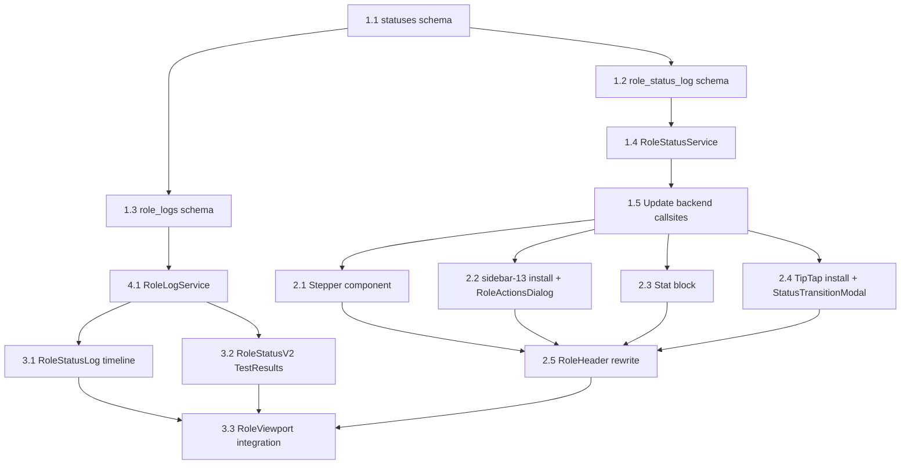

# Role Viewport Overhaul — State Machine, Observability, Hero Redesign

Full-stack upgrade: relational status state machine with audit ledger, real-time observability pipeline, and hero card redesign with stepper + action sidebar + stat blocks.

---

## User Review Required

> [!IMPORTANT]
> **`processing_error` status:** Your defined state machine doesn't include `processing_error`. It's currently used as a transient state for task failures. I'll **keep it as a system-only status** in the `statuses` table (`is_active=false`) — it won't appear in the dropdown but the backend can still set it. When tasks all pass on retry, it auto-transitions to `preparing`. Agree?

> [!IMPORTANT]
> **`posting_expired` status:** Your state machine includes this. It doesn't exist in the current system. I'll add it. When the orchestrator detects an expired posting (scrape failure / 404), it could auto-set this. Confirm?

> [!IMPORTANT]
> **TipTap install:** `npx shadcn@latest add http://tiptap-shadcn.vercel.app/r/basic.json` — this will install TipTap components into our existing shadcn setup. I'll use `--diff` first per our Manual Merge policy. This is a third-party registry, so I'll review for conflicts.

> [!WARNING]
> **sidebar-13 install:** `npx shadcn@latest add sidebar-13` installs the `sidebar` base component + demo block. Since `sidebar.tsx` doesn't exist yet in our `components/ui/`, this is safe. I'll adapt the block pattern for `RoleActionsDialog.tsx`.

---

## Proposed Changes

### Phase 1: Backend — Relational Status Table + Audit Ledger

---

#### 1.1 New `statuses` Table

##### [NEW] [statuses.ts](file:///Volumes/Projects/workers/core-resumes/src/backend/db/schemas/statuses.ts)

Drizzle schema for the relational status definitions table:

```ts
export const statuses = sqliteTable("statuses", {
  id: text("id").primaryKey(), // e.g. "preparing", "negotiating"
  name: text("name").notNull(), // Display label
  description: text("description"), // Full definition
  group: text("group", {
    enum: ["active", "terminal", "system"],
  })
    .notNull()
    .default("active"),
  sortOrder: integer("sort_order").notNull().default(0),
  isActive: integer("is_active", { mode: "boolean" }).notNull().default(true),
  requiresNotesPrompt: integer("requires_notes_prompt", { mode: "boolean" })
    .notNull()
    .default(false),
  createdAt: integer("created_at", { mode: "timestamp" })
    .notNull()
    .$defaultFn(() => new Date()),
});
```

Exported docs: `STATUSES_TABLE_DESCRIPTION`, `STATUSES_COLUMN_DESCRIPTIONS`.

**Seed data** (applied in migration):

| id                 | name             | group    | requires_notes_prompt | sort_order |
| ------------------ | ---------------- | -------- | --------------------- | ---------- |
| `preparing`        | Preparing        | active   | false                 | 10         |
| `posting_expired`  | Posting Expired  | terminal | false                 | 15         |
| `applied`          | Applied          | active   | false                 | 20         |
| `interviewing`     | Interviewing     | active   | true                  | 30         |
| `offer`            | Offer            | active   | true                  | 40         |
| `negotiating`      | Negotiating      | active   | true                  | 50         |
| `accepted`         | Accepted         | terminal | true                  | 60         |
| `rejected`         | Rejected         | terminal | true                  | 70         |
| `withdrawn`        | Withdrawn        | terminal | true                  | 80         |
| `archived`         | Archived         | terminal | false                 | 90         |
| `processing_error` | Processing Error | system   | false                 | 0          |

---

#### 1.2 New `role_status_log` Table

##### [NEW] [role-status-log.ts](file:///Volumes/Projects/workers/core-resumes/src/backend/db/schemas/role-status-log.ts)

Audit ledger for every status transition:

```ts
export const roleStatusLog = sqliteTable(
  "role_status_log",
  {
    id: integer("id").primaryKey({ autoIncrement: true }),
    roleId: text("role_id").notNull(), // FK to roles.id
    previousStatus: text("previous_status"), // null on first entry
    newStatus: text("new_status").notNull(),
    trigger: text("trigger", {
      // What caused the transition
      enum: ["user", "agent", "email_inference", "system"],
    })
      .notNull()
      .default("user"),
    notes: text("notes"), // Rich-text (TipTap HTML)
    metadata: text("metadata", { mode: "json" }), // Extra context (email ID, task ID, etc.)
    createdAt: integer("created_at", { mode: "timestamp" })
      .notNull()
      .$defaultFn(() => new Date()),
  },
  (table) => ({
    roleIdx: index("role_status_log_role_idx").on(table.roleId),
    statusIdx: index("role_status_log_status_idx").on(table.newStatus),
  }),
);
```

---

#### 1.3 New `role_logs` Table (Activity Log)

##### [NEW] [role-logs.ts](file:///Volumes/Projects/workers/core-resumes/src/backend/db/schemas/role-logs.ts)

Granular activity logging for Role Viewport (separate from status transitions):

```ts
export const roleLogs = sqliteTable(
  "role_logs",
  {
    id: text("id").primaryKey(),
    roleId: text("role_id"), // Nullable for global events
    category: text("category", {
      enum: ["agentic", "user_action", "email", "notebooklm", "document", "system"],
    }).notNull(),
    action: text("action").notNull(), // e.g. "resume_generated"
    message: text("message").notNull(),
    metadata: text("metadata", { mode: "json" }),
    createdAt: integer("created_at", { mode: "timestamp" })
      .notNull()
      .$defaultFn(() => new Date()),
  },
  (table) => ({
    roleIdx: index("role_logs_role_idx").on(table.roleId),
  }),
);
```

##### [MODIFY] [schema.ts](file:///Volumes/Projects/workers/core-resumes/src/backend/db/schema.ts)

Add barrel exports: `role-status-log`, `role-logs`, `statuses`.

---

#### 1.4 Status Transition Service

##### [NEW] [role-status-service.ts](file:///Volumes/Projects/workers/core-resumes/src/backend/services/role-status-service.ts)

Centralized service encapsulating all status transition logic:

```ts
class RoleStatusService {
  /** Transition a role's status with atomic D1 batch (update + log insert) */
  async transition(
    env,
    roleId,
    newStatus,
    opts?: {
      trigger: "user" | "agent" | "email_inference" | "system";
      notes?: string;
      metadata?: Record<string, unknown>;
    },
  ): Promise<void>;

  /** Get the full status log for a role, ordered desc */
  async getLog(env, roleId): Promise<RoleStatusLogRow[]>;

  /** Get the current status record (from statuses table) */
  async getCurrentStatusMeta(env, statusId): Promise<StatusRow>;

  /** Get all active statuses for dropdown */
  async getActiveStatuses(env): Promise<StatusRow[]>;
}
```

Key behavior:

- Uses `db.batch()` for atomic `roles.status` update + `role_status_log` insert
- Validates transition is allowed (role exists, status is active)
- Broadcasts `{ type: "role_status_update" }` via orchestrator if available

---

#### 1.5 Update Existing Backend Callsites

##### [MODIFY] [tasks.ts](file:///Volumes/Projects/workers/core-resumes/src/backend/ai/agents/orchestrator/methods/core/tasks.ts)

**`evaluateRoleStatus()`** — Fix the bug where errors are never cleared:

```diff
- if (anyFailed) {
-   await db.update(roles).set({ status: "processing_error" ... })
- }
+ if (anyFailed) {
+   await statusService.transition(env, roleId, "processing_error", {
+     trigger: "system",
+     metadata: { failedTasks: failedTaskIds },
+   });
+ } else if (allComplete) {
+   // All tasks passed — clear errors and restore to preparing
+   await statusService.transition(env, roleId, "preparing", {
+     trigger: "system",
+     notes: "All pipeline tasks completed successfully.",
+   });
+   // Clear persisted processing errors from metadata
+   const [role] = await db.select().from(roles).where(eq(roles.id, roleId)).limit(1);
+   if (role) {
+     const meta = (role.metadata as Record<string, unknown>) ?? {};
+     delete meta.processingErrors;
+     await db.update(roles).set({ metadata: meta }).where(eq(roles.id, roleId));
+   }
+   agent.broadcast(JSON.stringify({
+     type: "role_status_update",
+     payload: { roleId, status: "preparing" },
+   }));
+ }
```

##### [MODIFY] [handler.ts](file:///Volumes/Projects/workers/core-resumes/src/backend/email/handler.ts)

Update `associateEmailWithRole()` to use `RoleStatusService.transition()` instead of raw `db.update()`, which:

- Atomically logs the transition in `role_status_log`
- Records the email ID in metadata
- Adds `negotiating` to `VALID_STATUSES` for offer-email auto-transition

##### [MODIFY] [types.ts](file:///Volumes/Projects/workers/core-resumes/src/backend/ai/tasks/classify/types.ts)

Add `"negotiating"`, `"accepted"`, `"posting_expired"` to `VALID_STATUSES`.

##### [MODIFY] [roles.ts](file:///Volumes/Projects/workers/core-resumes/src/backend/db/schemas/roles.ts)

Expand enum: add `"negotiating"`, `"accepted"`, `"posting_expired"`.

##### [MODIFY] [roles.ts routes](file:///Volumes/Projects/workers/core-resumes/src/backend/api/routes/roles.ts)

**PATCH `/:id`** — When `body.status` is present, route through `RoleStatusService.transition()` instead of raw update. This ensures every status change (from frontend dropdown) gets logged in the audit ledger.

##### [NEW] API Routes

| Method | Path                                   | Purpose                                          |
| ------ | -------------------------------------- | ------------------------------------------------ |
| `GET`  | `/api/statuses`                        | List all active statuses                         |
| `GET`  | `/api/roles/:roleId/status-log`        | Get role's status transition history             |
| `POST` | `/api/roles/:roleId/status-transition` | Transition status atomically with optional notes |
| `GET`  | `/api/roles/:roleId/logs`              | Get paginated activity logs                      |

---

### Phase 2: Frontend — Hero Card Redesign

---

#### 2.1 Status Stepper Component

##### [NEW] [stepper.tsx](file:///Volumes/Projects/workers/core-resumes/src/frontend/components/ui/stepper.tsx)

Custom stepper component built from scratch (no external dep) following the ReUI API pattern. Exports: `Stepper`, `StepperNav`, `StepperItem`, `StepperTrigger`, `StepperIndicator`, `StepperTitle`, `StepperSeparator`.

#### [MODIFY] [RoleHeader.tsx](file:///Volumes/Projects/workers/core-resumes/src/frontend/components/role/RoleHeader.tsx)

**Replace** the inline workflow timeline (L261-295) with the Stepper.

Dynamic step chain based on the user's state machine:

```
Active flow (happy path):
  Preparing → Applied → Interviewing → Offer → Negotiating → Accepted

Terminal exits (render as final red/gray step):
  ... → Rejected (at any point after Applied)
  ... → Withdrawn (at any point)
  ... → Posting Expired (from Preparing only)
```

The stepper computes completed/active/pending from `current.status`:

- Steps before current = completed (green check)
- Current step = active (pulsing indicator)
- Steps after current = pending (muted)
- Terminal statuses render as a single terminal badge with distinctive color

**Sync with status dropdown:** When user changes status in dropdown, the stepper updates in real-time. When the orchestrator broadcasts `role_status_update`, the stepper also updates via WebSocket.

**New statuses in `STATUS_META`:**

- `negotiating` — `text-violet-400`, group `active`
- `accepted` — `text-emerald-400`, group `terminal`
- `posting_expired` — `text-zinc-400`, group `terminal`

---

#### 2.2 Action Command Menu (sidebar-13 Pattern)

##### Install

```bash
npx shadcn@latest add sidebar-13
```

##### [NEW] [RoleActionsDialog.tsx](file:///Volumes/Projects/workers/core-resumes/src/frontend/components/role/RoleActionsDialog.tsx)

Dialog with sidebar navigation. Categories:

| Category       | Icon        | Actions                                                        |
| -------------- | ----------- | -------------------------------------------------------------- |
| **Documents**  | `FileText`  | Create Resume, Create Cover Letter                             |
| **Drive**      | `HardDrive` | Open Drive Folder, Create Drive Folder                         |
| **NotebookLM** | `BookOpen`  | Add Sources, Sync Notebook, Create Artifact, Download Artifact |
| **Analysis**   | `BarChart3` | Run Hireability Analysis, Run ATS Score, Run Company Analysis  |
| **Interview**  | `Mic`       | Generate Mock Interview                                        |

Each action triggers `apiPost(...)` or `window.open(...)` and closes the dialog.

##### [MODIFY] [RoleHeader.tsx](file:///Volumes/Projects/workers/core-resumes/src/frontend/components/role/RoleHeader.tsx)

- **Remove** from hero card: Generate Resume, Generate Cover Letter, Open/Create Drive Folder buttons
- **Add**: Single "Actions" `<Button>` with `<Settings />` icon that opens `<RoleActionsDialog>`
- **Keep** in hero: View Report, Status dropdown, Delete button

---

#### 2.3 Stat Display Block

##### [MODIFY] [RoleHeader.tsx](file:///Volumes/Projects/workers/core-resumes/src/frontend/components/role/RoleHeader.tsx)

Replace the `ScoreRadialChart` mini-gauges with a clean stat block (Stats8-inspired):

```
┌───────────────┬───────────────┬───────────────┐
│      82       │      71       │  $250k–$300k  │
│ Hire          │ Comp.         │  Salary       │
│ Likelihood    │ Score         │  Range        │
└───────────────┴───────────────┴───────────────┘
```

- Large number/value with dynamic color (green ≥75, amber ≥40, red <40)
- Compact salary: `$270k` not `$270,000` (use `formatCompactSalary()`)
- Stats hidden when no analysis data exists
- Mobile: 3-column grid that stacks into a row

---

#### 2.4 Status Notes Modal (TipTap Integration)

##### Install

```bash
npx shadcn@latest add http://tiptap-shadcn.vercel.app/r/basic.json
```

##### [NEW] [StatusTransitionModal.tsx](file:///Volumes/Projects/workers/core-resumes/src/frontend/components/role/StatusTransitionModal.tsx)

When the user selects a new status from the dropdown:

1. Fetch the target status from `/api/statuses` to check `requiresNotesPrompt`
2. If `true` → show a modal with TipTap editor for optional rich-text notes
3. On submit → `POST /api/roles/:id/status-transition` with `{ newStatus, notes }`
4. On skip → same POST but with `notes: null`

The modal includes:

- Status transition display: "Preparing → Interviewing"
- TipTap editor with basic formatting (bold, italic, lists, links)
- "Save & Transition" / "Skip Notes" buttons

##### [MODIFY] [RoleHeader.tsx](file:///Volumes/Projects/workers/core-resumes/src/frontend/components/role/RoleHeader.tsx)

Update `updateStatus()` to:

1. Fetch target status metadata
2. If `requiresNotesPrompt` → open `StatusTransitionModal` instead of direct PATCH
3. If not → proceed with direct transition via the service API

---

#### 2.5 Mobile Responsiveness

- Hero card: `flex-col` on mobile, stats wrap below text
- Stepper: horizontal scroll on `<sm`, icons-only mode
- Action menu: full-screen dialog on mobile (`md:max-w-[700px]`)
- Status dropdown: full-width on mobile
- All interactive elements have `min-h-[44px]` touch targets

---

### Phase 3: Frontend — Status 2.0 + Activity Log

---

#### 3.1 Status Log Timeline

##### [NEW] [RoleStatusLog.tsx](file:///Volumes/Projects/workers/core-resumes/src/frontend/components/role/RoleStatusLog.tsx)

Vertical timeline component displaying the `role_status_log` entries:

- Each entry shows: status badge → timestamp → trigger badge (user/agent/email/system) → notes (rendered HTML)
- Most recent first
- Expandable rich-text notes (TipTap output rendered as HTML)

---

#### 3.2 Real-Time Activity Log (TestResults)

##### Install

```bash
npx ai-elements@latest add test-results
```

##### [NEW] [RoleStatusV2.tsx](file:///Volumes/Projects/workers/core-resumes/src/frontend/components/role/RoleStatusV2.tsx)

Maps orchestrator task pipeline into TestResults hierarchy. Uses `useAgent` for real-time WebSocket updates.

---

#### 3.3 Viewport Integration

##### [MODIFY] [RoleViewport.tsx](file:///Volumes/Projects/workers/core-resumes/src/frontend/components/role/RoleViewport.tsx)

- Rename "Status" tab to "Pipeline" (the TestResults view)
- Add "Activity" tab (the `RoleStatusLog` timeline + `roleLogs`)
- Remove separate "Errors" tab — errors are visible inline in Pipeline view

---

### Phase 4: Backend — Orchestrator Integration

---

#### 4.1 Role Log Service

##### [NEW] [role-log-service.ts](file:///Volumes/Projects/workers/core-resumes/src/backend/services/role-log-service.ts)

Service for writing activity logs:

- `log(env, { roleId, category, action, message, metadata })`
- Used by orchestrator, email handler, document generators

#### 4.2 Orchestrator Agent Updates

##### [MODIFY] [index.ts](file:///Volumes/Projects/workers/core-resumes/src/backend/ai/agents/orchestrator/index.ts)

Add `addRoleLog()` method that:

1. Calls `RoleLogService.log()` to persist
2. Broadcasts `{ type: "role_log", payload: {...} }` to WebSocket clients

##### [MODIFY] [tasks.ts](file:///Volumes/Projects/workers/core-resumes/src/backend/ai/agents/orchestrator/methods/core/tasks.ts)

Instrument `handleProcessPendingTasks`:

- Task start → `agent.addRoleLog({ action: "task_started", ... })`
- Task complete → `agent.addRoleLog({ action: "task_completed", ... })`
- Task failed → `agent.addRoleLog({ action: "task_failed", ... })`

---

## Execution Order



---

## Verification Plan

### Automated Tests

1. `pnpm run db:generate` — verify all 3 new table migrations generate
2. `pnpm run build` — full TypeScript build pass
3. `pnpm run cf-typegen` — regenerate worker types

### Manual Verification

1. **Error clearing bug:** Submit role → let task fail → retry all → confirm `processing_error` clears to `preparing` AND `role_status_log` has both entries
2. **Status dropdown + notes:** Change to "Interviewing" → notes modal appears → write notes → confirm logged in `role_status_log` with HTML
3. **Stepper sync:** Change status → stepper updates in real-time
4. **Email auto-transition:** Forward an offer email → confirm auto-transition to `offer` or `negotiating` with log entry showing `trigger: "email_inference"`
5. **Action menu:** Open Actions → each action triggers correctly
6. **Stats:** Confirm compact salary and scores render
7. **Mobile:** 375px viewport — no overflow, touch-friendly
8. **Activity log:** Status tab shows TestResults pipeline + timeline
