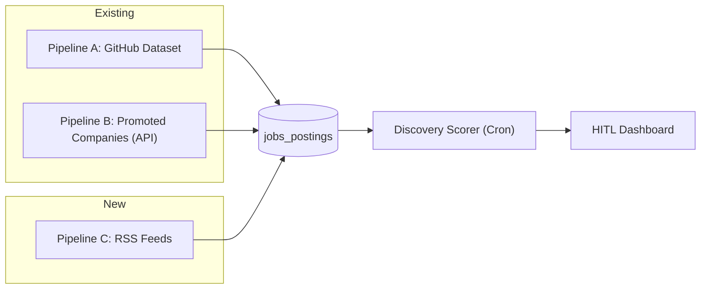

# RSS Feed Aggregator Pipeline (Pipeline C)

A new programmatic pipeline that discovers jobs from **ATS RSS feeds** (Greenhouse, Lever) and **industry-wide feeds** (WeWorkRemotely, Remotive) using zero AI — only regex-based XML parsing and keyword/location heuristic scoring.

## Architecture Context



This pipeline runs alongside Pipelines A and B on a cron trigger. Unlike the job scanner agent (which uses AI triage), RSS ingestion is **100% programmatic** — regex XML parsing, keyword scoring, and deduplication only.

---

## User Review Required

> [!IMPORTANT]
> **Schema Migration:** Adding `'rss_feed'` to the `pipeline_source` enum in `jobs_postings` requires a Drizzle migration (`pnpm run db:generate`).

> [!IMPORTANT]
> **Wrangler Cron:** A new cron expression is needed (`0 */8 * * *` — every 8 hours) to run RSS scans separately from existing pipelines. This requires updating `wrangler.jsonc`.

## Open Questions

> [!NOTE]
> 1. **Feed frequency:** Is every 8 hours the right cadence, or would you prefer a different interval (e.g. every 4 hours alongside health checks, or every 12 hours alongside freelance)?
>
> 2. **Industry feeds scope:** The plan includes WeWorkRemotely (programming + devops) and Remotive. Do you want to add more RSS sources out of the gate, or start with these and expand via config?
>
> 3. **Greenhouse RSS vs API:** For companies that are already promoted (Pipeline B uses the Greenhouse REST API), should the RSS feed pipeline skip those boards to avoid duplicates? Or do you want RSS to act as a secondary signal for faster detection?
>
> 4. **KV dedup cache:** The plan uses KV to cache seen `jobSiteId`s per feed URL to avoid redundant D1 writes. Should this use a TTL (e.g. 30 days) to eventually allow re-checking of previously seen IDs, or persist indefinitely?

---

## Proposed Changes

### Component 1: XML Parser Service

#### [NEW] `src/backend/services/rss/xml-parser.ts`

Lightweight, V8-native XML parser using regex — no npm dependencies. Extracts `<item>` (RSS 2.0) and `<entry>` (Atom) elements.

```ts
interface RssItem {
  title: string;
  link: string;
  description: string;
  pubDate?: string;
  guid?: string;
  category?: string;
}

function parseRssXml(xmlString: string): RssItem[]
function extractTagContent(xmlBlock: string, tagName: string): string
function extractAtomLink(xmlBlock: string): string  // handles <link href="..."/>
function stripCdata(text: string): string
function stripHtml(html: string): string  // regex strip for plain text extraction
```

---

### Component 2: Feed Provider Registry

#### [NEW] `src/backend/services/rss/feeds/types.ts`

```ts
interface RssFeedProvider {
  /** Unique key: "greenhouse_rss", "lever_rss", "weworkremotely", "remotive" */
  name: string;
  /** Display label */
  displayName: string;
  /** Feed type: "ats" (per-company) or "industry" (global) */
  type: "ats" | "industry";
  /** Config key in health_check_config for test tokens (ATS feeds only) */
  healthConfigKey?: string;

  /** Build the feed URL for a given token/slug (ATS feeds) or return the static URL (industry feeds) */
  buildFeedUrl(token?: string): string;
  /** Normalize a parsed RSS item into a NormalizedRssJob */
  normalize(item: RssItem, feedToken?: string): NormalizedRssJob;
}

interface NormalizedRssJob {
  jobSiteId: string;      // Deterministic unique ID (hash of link or guid)
  jobTitle: string;
  company: string;
  location: string | null;
  jobUrl: string | null;
  pubDate: string | null;
  feedSource: string;      // provider.name
}
```

#### [NEW] `src/backend/services/rss/feeds/greenhouse-rss.ts`

- Feed URL: `https://boards.greenhouse.io/${token}/feed`
- Normalization: extracts company from token, job ID from link path (`/jobs/{id}`), location from `<content:encoded>` or description HTML

#### [NEW] `src/backend/services/rss/feeds/lever-rss.ts`

- Feed URL: `https://api.lever.co/v0/postings/${token}?mode=xml`
- Normalization: extracts job ID from link path, location from `<categories>` if present

#### [NEW] `src/backend/services/rss/feeds/weworkremotely.ts`

- Static URLs:
  - `https://weworkremotely.com/categories/remote-programming-jobs.rss`
  - `https://weworkremotely.com/categories/remote-devops-sysadmin-jobs.rss`
- Normalization: extracts company from title prefix (pattern: "Company: Job Title"), location = "Remote"

#### [NEW] `src/backend/services/rss/feeds/remotive.ts`

- Static URL: `https://remotive.com/remote-jobs/rss-feed`
- Normalization: extracts company from title, category from `<category>`, location = "Remote"

#### [NEW] `src/backend/services/rss/feeds/index.ts`

Registry barrel — exports `RSS_FEED_PROVIDERS`, `getAtsFeedProviders()`, `getIndustryFeedProviders()`

---

### Component 3: RSS Aggregator Service

#### [NEW] `src/backend/services/rss/aggregator.ts`

Core orchestration — fetches feeds, parses, deduplicates, and inserts into D1.

```ts
interface AggregatorResult {
  feedsProcessed: number;
  feedsFailed: number;
  jobsDiscovered: number;
  jobsInserted: number;
  jobsSkipped: number;  // duplicates
  perFeed: Array<{
    feedUrl: string;
    provider: string;
    jobCount: number;
    insertedCount: number;
    skippedCount: number;
    error?: string;
    latencyMs: number;
  }>;
}

async function runRssAggregator(env: Env): Promise<AggregatorResult>
```

**Flow:**
1. Load `health_check_config` from D1 to get ATS tokens (e.g. `greenhouse_tokens`, `lever_tokens`)
2. Build feed URLs: ATS feeds × tokens + static industry feeds
3. `Promise.allSettled()` to fetch all feeds concurrently
4. Parse XML → normalize → deduplicate against KV cache
5. Batch upsert into `jobs_postings` with `pipelineSource: "rss_feed"`
6. Update KV dedup cache with newly seen IDs

**Deduplication strategy:**
- **Layer 1 (KV):** `RSS_DEDUP:{feedProvider}` stores a JSON set of recently seen `jobSiteId`s — prevents redundant D1 writes
- **Layer 2 (D1):** `jobs_postings.job_site_id` UNIQUE constraint — catches any KV misses

---

### Component 4: Schema Migration

#### [MODIFY] `src/backend/db/schemas/pipeline/jobs/jobs-postings.ts`

Add `'rss_feed'` to the `pipelineSource` enum:

```diff
-pipelineSource: text("pipeline_source", { enum: ["github_dataset", "promoted_company", "freelance", "external_agent"] }),
+pipelineSource: text("pipeline_source", { enum: ["github_dataset", "promoted_company", "freelance", "external_agent", "rss_feed"] }),
```

Update `JOBS_POSTINGS_COLUMN_DESCRIPTIONS.pipeline_source` string.

---

### Component 5: Cron Handler

#### [MODIFY] `src/_worker.ts`

Add RSS cron block to the `scheduled()` handler:

```ts
// 8-hour RSS feed aggregator
if (cronExpression === "0 */8 * * *") {
  try {
    const { runRssAggregator } = await import("./backend/services/rss/aggregator");
    const result = await runRssAggregator(env);
    console.log(
      `[cron:rss] Processed ${result.feedsProcessed} feeds — ` +
      `${result.jobsInserted} inserted, ${result.jobsSkipped} skipped`
    );
  } catch (e) {
    console.error("[cron:rss] Failed to run RSS aggregator:", e);
  }
  return;
}
```

#### [MODIFY] `wrangler.jsonc`

Add the new cron expression:

```diff
-"crons": ["0 */4 * * *", "0 */6 * * *", "0 */12 * * *"],
+"crons": ["0 */4 * * *", "0 */6 * * *", "0 */8 * * *", "0 */12 * * *"],
```

---

### Component 6: API Route

#### [NEW] `src/backend/api/routes/pipeline/rss.ts`

Manual trigger + configuration endpoints:

```ts
// POST /api/pipeline/rss/scan          — manual trigger (returns AggregatorResult)
// GET  /api/pipeline/rss/feeds         — list configured feed sources
// GET  /api/pipeline/rss/stats         — per-feed insertion stats
```

#### [MODIFY] `src/backend/api/routes/pipeline/index.ts`

Mount the new RSS router.

---

### Component 7: Config Defaults

#### [MODIFY] `src/backend/api/routes/config.ts`

Extend `health_check_config` defaults to include `lever_tokens` (for RSS feeds):

```diff
 {
   key: "health_check_config",
   value: {
     greenhouse_tokens: ["anthropic", "cloudflare"],
     ashby_tokens: ["replicate", "lattice"],
-    gem_tokens: ["gc-ai"]
+    gem_tokens: ["gc-ai"],
+    rss_industry_feeds: ["weworkremotely_programming", "weworkremotely_devops", "remotive"],
+    lever_tokens: []
   },
 },
```

---

### Component 8: Health Check

#### [NEW] `src/backend/health/checks/job-board-apis/rss-feeds.ts`

Probes each configured RSS feed URL with a HEAD/GET request and validates XML response:
- Check: response is valid XML with `<item>` or `<entry>` elements
- Metrics: latency, item count, last publish date

#### [MODIFY] `src/backend/health/checks/job-board-apis/index.ts`

Add RSS feed check to the unified `checkJobBoardApiConnectivity` aggregation.

---

### Component 9: Documentation

#### [MODIFY] `AGENTS.md`

Add RSS Feed Pipeline section under the Job Board Provider Registry.

#### [NEW] `src/frontend/content/docs/integrations/rss-feeds.md`

Full documentation page covering:
- Feed provider registry architecture
- XML parsing strategy (no npm dependencies)
- Deduplication flow
- Adding new feeds
- Cron schedule

#### [MODIFY] `src/frontend/content/docs/integrations/job-boards.md`

Cross-link to RSS feeds page.

#### [NEW] `.agent/rules/rss-feed-pipeline.md`

Agent rules for the RSS pipeline.

---

## File Structure

```
src/backend/services/rss/
├── xml-parser.ts           # V8-native regex XML parser
├── aggregator.ts           # Orchestrator: fetch → parse → dedup → insert
└── feeds/
    ├── types.ts            # RssFeedProvider interface
    ├── greenhouse-rss.ts   # Greenhouse RSS feed provider
    ├── lever-rss.ts        # Lever XML feed provider
    ├── weworkremotely.ts    # WeWorkRemotely RSS provider
    ├── remotive.ts         # Remotive RSS provider
    └── index.ts            # Registry barrel

src/backend/api/routes/pipeline/
├── rss.ts                  # Manual trigger + config endpoints

src/backend/health/checks/job-board-apis/
├── rss-feeds.ts            # RSS feed health probe
```

---

## Verification Plan

### Automated Tests
- `pnpm run db:generate` — clean migration for `pipeline_source` enum change
- `pnpm run build` — zero compilation errors
- `pnpm run types` — zero type errors

### Manual Verification
- `POST /api/pipeline/rss/scan` — trigger manual scan, verify jobs appear in `jobs_postings` with `pipeline_source = 'rss_feed'`
- Verify deduplication: run scan twice, second run should show `jobsSkipped > 0`
- Verify discovery scorer picks up RSS-sourced jobs and scores them
- Verify health dashboard shows RSS feed check results
