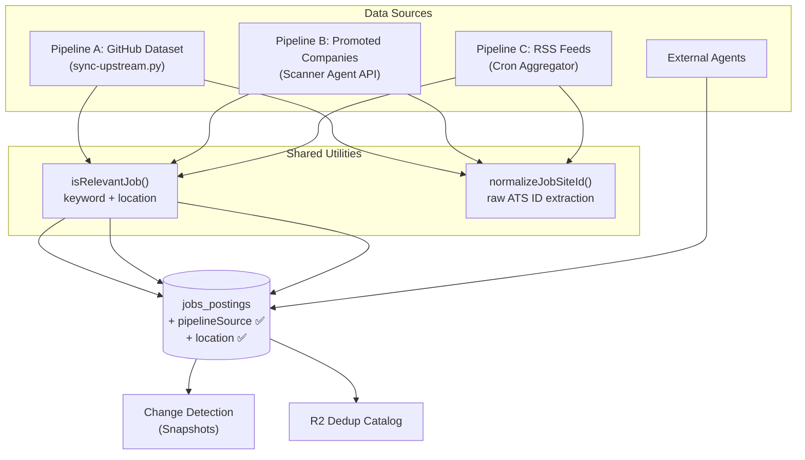

# RSS Feed Pipeline + Cross-Pipeline Normalization

Two workstreams in one pass: **normalize all existing pipelines** to write consistent data, then **build Pipeline C (RSS feeds)** using the same normalized patterns.

---

## Architecture



---

## User Decisions (Resolved)

| Question | Decision |
|----------|----------|
| Cron frequency | **Every 12 hours** (shares the freelance slot) |
| Industry feeds | **Start with WeWorkRemotely + Remotive**, easy to add more |
| RSS vs Pipeline B overlap | **Scan all sources in parallel** — speed matters. Dedup on ATS job ID. Keep snapshots for change detection |
| Dedup cache | **Persist indefinitely** on R2 data catalog (not KV) |
| `jobSiteId` format | **Raw ATS job ID** — same job recognized across pipelines |
| `isRecommended` logic | **Shared utility function** with keyword + location rules from config. No salary check yet |

---

## Workstream 1: Cross-Pipeline Normalization

### Component 1A: Shared Relevance Utility

#### [NEW] `src/backend/services/jobs/relevance.ts`

A pure function used by **all pipelines** to decide `isRecommended`. No AI — keyword + location matching only.

```ts
interface RelevanceInput {
  jobTitle: string;
  location?: string | null;
  description?: string | null;
  // salary?: number | null;  — reserved for future
}

interface RelevanceResult {
  isRelevant: boolean;
  score: number;                // 0–100
  reason: string;               // human-readable explanation
  signals: {
    titleMatch: boolean;
    locationMatch: boolean;
    descriptionMatch: boolean;
  };
}

/**
 * Loads keywords + locations from globalConfig (applicant_profile)
 * at call time. Results are deterministic given the same config.
 *
 * Rules:
 * - Title and/or description contains config keywords → title/description match
 * - Location is SF Bay Area, California, or fully remote → location match
 * - Both title AND location must match for isRelevant = true
 */
async function isRelevantJob(env: Env, input: RelevanceInput): Promise<RelevanceResult>
```

This replaces the inline scoring logic duplicated across:
- [discovery-scorer.ts](file:///Volumes/Projects/workers/core-resumes/src/backend/cron/discovery-scorer.ts) — will import `isRelevantJob()`
- [sync-upstream.py](file:///Volumes/Projects/workers/core-resumes/scripts/github_actions/sync-upstream.py) `check_company_jobs()` — Python side stays as-is (separate runtime), but the Worker-side paths all unify

---

### Component 1B: `jobSiteId` Normalization

#### [NEW] `src/backend/services/jobs/normalize-id.ts`

Extracts the raw ATS job ID from any prefixed or unprefixed format so the same job is recognized regardless of discovery pipeline.

```ts
/**
 * Strips pipeline prefixes ("gh-stripe-", "lv-vercel-", "as-replicate-")
 * and returns the raw ATS-assigned job ID.
 *
 * "gh-stripe-4567890" → "4567890"
 * "lv-vercel-abc123"  → "abc123"
 * "4567890"           → "4567890" (already raw)
 * "ext-a1b2c3"        → "ext-a1b2c3" (external agent IDs are synthetic, keep as-is)
 * "rss-{hash}"        → "rss-{hash}" (RSS-only jobs with no ATS ID, keep as-is)
 */
function normalizeJobSiteId(rawId: string): string
```

---

### Component 1C: Fix Existing Pipeline Insertions

#### [MODIFY] [api-companies.ts](file:///Volumes/Projects/workers/core-resumes/src/backend/api/routes/pipeline/api-companies.ts)

**Bulk sync path (L213-L224):**
```diff
 db.insert(jobsPostings).values({
-  jobSiteId:     job.jobSiteId,
+  jobSiteId:     normalizeJobSiteId(job.jobSiteId),
   jobTitle:      job.jobTitle,
   company:       job.company,
   location:      job.location,
   triagePassed:  job.triagePassed,
   triageReason:  job.triageReason,
+  pipelineSource: "github_dataset",
 })
```

**Real-time recommend path (L1006-L1021):**
```diff
 db.insert(jobsPostings).values({
-  jobSiteId:           job.id.toString(),
+  jobSiteId:           normalizeJobSiteId(job.id.toString()),
   jobTitle:            job.title,
   company:             body.token,
   location:            job.location,
   triagePassed:        true,
   triageReason:        "...",
   isRecommended:       true,
   recommendationScore: 100,
   recommendationReason: body.recommendationReason,
+  pipelineSource: "github_dataset",
 })
```

---

#### [MODIFY] [scan-board.ts](file:///Volumes/Projects/workers/core-resumes/src/backend/ai/agents/job/scanner/methods/scan-board.ts)

**L73-L91:** Extract location from the Greenhouse API response and set `pipelineSource`.

```diff
 db.insert(jobsPostings).values({
   jobSiteId:    job.id.toString(),
   jobTitle:     job.title,
   company:      token,
+  location:     (job as any).location?.name ?? null,
   triagePassed: passed,
   triageReason: reasoning,
+  pipelineSource: "promoted_company",
 })
```

---

#### [MODIFY] [external-agents.ts](file:///Volumes/Projects/workers/core-resumes/src/backend/api/routes/pipeline/external-agents.ts)

**L161-L170:** Already sets `pipelineSource: "external_agent"` ✅. Only fix: add triageReason.

```diff
 db.insert(jobsPostings).values({
   jobSiteId:      siteId,
   jobTitle:       job.jobTitle,
   company:        job.company,
   location:       job.location ?? null,
   pipelineSource: "external_agent",
   triagePassed:   false,
   isRecommended:  false,
+  triageReason:   "Submitted by external agent — awaiting HITL review",
 })
```

---

### Component 1D: Schema Migration

#### [MODIFY] [jobs-postings.ts](file:///Volumes/Projects/workers/core-resumes/src/backend/db/schemas/pipeline/jobs/jobs-postings.ts)

Add `'rss_feed'` to the `pipelineSource` enum:

```diff
-pipelineSource: text("pipeline_source", { enum: ["github_dataset", "promoted_company", "freelance", "external_agent"] }),
+pipelineSource: text("pipeline_source", { enum: ["github_dataset", "promoted_company", "freelance", "external_agent", "rss_feed"] }),
```

Update `JOBS_POSTINGS_COLUMN_DESCRIPTIONS.pipeline_source` to include `'rss_feed'`.

---

## Workstream 2: RSS Feed Aggregator Pipeline

### Component 2A: XML Parser Service

#### [NEW] `src/backend/services/rss/xml-parser.ts`

Lightweight, V8-native XML parser — **no npm dependencies**. Handles both RSS 2.0 (`<item>`) and Atom (`<entry>`) feeds.

```ts
interface RssItem {
  title: string;
  link: string;
  description: string;
  pubDate?: string;
  guid?: string;
  category?: string;
}

function parseRssXml(xmlString: string): RssItem[]
function extractTagContent(block: string, tag: string): string
function extractAtomLink(block: string): string
function stripCdata(text: string): string
function stripHtml(html: string): string
```

---

### Component 2B: Feed Provider Registry

Modular provider system — adding a new feed = one new file + one registry entry.

#### [NEW] `src/backend/services/rss/feeds/types.ts`

```ts
interface RssFeedProvider {
  name: string;                        // "greenhouse_rss", "lever_rss", "weworkremotely", "remotive"
  displayName: string;
  type: "ats" | "industry";           // ATS = per-company token, Industry = static URL
  buildFeedUrl(token?: string): string;
  normalize(item: RssItem, feedToken?: string): NormalizedRssJob;
}

interface NormalizedRssJob {
  jobSiteId: string;       // raw ATS ID when available, otherwise hash of link
  jobTitle: string;
  company: string;
  location: string | null;
  jobUrl: string | null;
  pubDate: string | null;
  feedSource: string;       // provider.name
  descriptionText?: string; // stripped HTML for relevance matching
}
```

#### [NEW] `src/backend/services/rss/feeds/greenhouse-rss.ts`

- URL: `https://boards.greenhouse.io/${token}/feed`
- `normalize()`: extracts raw job ID from link path (`/jobs/{id}`), company from token, location from description HTML

#### [NEW] `src/backend/services/rss/feeds/lever-rss.ts`

- URL: `https://api.lever.co/v0/postings/${token}?mode=xml`
- `normalize()`: extracts job ID from link, location from `<categories>` element

#### [NEW] `src/backend/services/rss/feeds/weworkremotely.ts`

- URLs:
  - `https://weworkremotely.com/categories/remote-programming-jobs.rss`
  - `https://weworkremotely.com/categories/remote-devops-sysadmin-jobs.rss`
- `normalize()`: parses "Company: Title" pattern, location = "Remote"

#### [NEW] `src/backend/services/rss/feeds/remotive.ts`

- URL: `https://remotive.com/remote-jobs/rss-feed`
- `normalize()`: extracts company from title, category from `<category>`, location = "Remote"

#### [NEW] `src/backend/services/rss/feeds/index.ts`

```ts
const RSS_FEED_PROVIDERS: RssFeedProvider[] = [/* all providers */];

function getAtsFeedProviders(): RssFeedProvider[]
function getIndustryFeedProviders(): RssFeedProvider[]
function getAllProviders(): RssFeedProvider[]

// To add a new provider:
// 1. Create src/backend/services/rss/feeds/{name}.ts implementing RssFeedProvider
// 2. Add it to RSS_FEED_PROVIDERS array in index.ts
// That's it.
```

---

### Component 2C: R2 Dedup Catalog

#### [NEW] `src/backend/services/rss/dedup-catalog.ts`

Persists seen `jobSiteId` sets per feed source **indefinitely** on R2 (not KV).

```ts
interface DedupCatalog {
  /** Load the set of known IDs for a feed provider */
  loadSeenIds(provider: string): Promise<Set<string>>;
  /** Persist newly discovered IDs */
  appendSeenIds(provider: string, newIds: string[]): Promise<void>;
}

// R2 key: `rss-dedup/{provider}.json.gz`
// Format: gzipped JSON array of jobSiteId strings
// On append: load existing → merge → rewrite
```

Uses `env.R2_DATA_CATALOG` (or similar R2 binding — will check what's available).

---

### Component 2D: RSS Aggregator Service

#### [NEW] `src/backend/services/rss/aggregator.ts`

Core orchestration — fetch → parse → normalize → relevance check → dedup → insert.

```ts
interface AggregatorResult {
  feedsProcessed: number;
  feedsFailed: number;
  jobsDiscovered: number;
  jobsInserted: number;
  jobsSkipped: number;
  perFeed: Array<{
    feedUrl: string;
    provider: string;
    jobCount: number;
    insertedCount: number;
    skippedCount: number;
    error?: string;
    latencyMs: number;
  }>;
}

async function runRssAggregator(env: Env): Promise<AggregatorResult>
```

**Flow:**
1. Load ATS tokens from `health_check_config` (greenhouse_tokens, lever_tokens)
2. Build feed URLs: ATS providers × configured tokens + static industry feed URLs
3. `Promise.allSettled()` to fetch all feeds concurrently with `AbortSignal.timeout(10_000)`
4. Parse XML → normalize each item
5. Run `isRelevantJob()` on each normalized job for recommendation scoring
6. Dedup against R2 catalog
7. Batch upsert into `jobs_postings` with `pipelineSource: "rss_feed"`, `onConflictDoUpdate` to capture changes
8. Append new IDs to R2 dedup catalog

**Change Detection:** On conflict (same `jobSiteId` already exists), update `jobTitle`, `location` to capture any changes. The `date_first_seen` stays unchanged — giving you a historical record.

---

### Component 2E: Cron Handler

#### [MODIFY] [_worker.ts](file:///Volumes/Projects/workers/core-resumes/src/_worker.ts)

The RSS scan shares the **12-hour cron** with freelance. Insert the RSS block before the freelance scan:

```ts
// 12-hour cron: RSS feed aggregator + freelance pipeline
if (cronExpression === "0 */12 * * *") {
  // RSS feed aggregator
  try {
    const { runRssAggregator } = await import("./backend/services/rss/aggregator");
    const result = await runRssAggregator(env);
    console.log(
      `[cron:rss] Processed ${result.feedsProcessed} feeds — ` +
      `${result.jobsInserted} inserted, ${result.jobsSkipped} skipped`
    );
  } catch (e) {
    console.error("[cron:rss] Failed to run RSS aggregator:", e);
  }

  // Freelance pipeline scan (existing)
  try {
    const { getAgentByName } = await import("agents");
    const agent = await getAgentByName(env.FREELANCE_SCANNER_AGENT, "global");
    const sessionIds = await (agent as any).scanAll();
    console.log(`[cron:freelance] Scan triggered — ${sessionIds.length} session(s) started`);
  } catch (e) {
    console.error("[cron:freelance] Failed to trigger freelance scan:", e);
  }
  return;
}
```

No `wrangler.jsonc` change needed — reuses existing `0 */12 * * *` cron.

---

### Component 2F: API Route

#### [NEW] `src/backend/api/routes/pipeline/rss.ts`

```ts
// POST /api/pipeline/rss/scan         — manual trigger (returns AggregatorResult)
// GET  /api/pipeline/rss/feeds        — list configured feed sources + last scan stats
```

#### [MODIFY] [pipeline/index.ts](file:///Volumes/Projects/workers/core-resumes/src/backend/api/routes/pipeline/index.ts)

Mount `rssRouter` under `/rss`.

---

### Component 2G: Config Defaults

#### [MODIFY] [config.ts](file:///Volumes/Projects/workers/core-resumes/src/backend/api/routes/config.ts)

Extend `health_check_config` defaults:

```diff
 {
   key: "health_check_config",
   value: {
     greenhouse_tokens: ["anthropic", "cloudflare"],
     ashby_tokens: ["replicate", "lattice"],
     gem_tokens: ["gc-ai"],
+    lever_tokens: [],
+    rss_industry_feeds: ["weworkremotely_programming", "weworkremotely_devops", "remotive"],
   },
 },
```

---

### Component 2H: Health Check

#### [NEW] `src/backend/health/checks/job-board-apis/rss-feeds.ts`

Probes each configured RSS feed URL — validates XML response contains `<item>` or `<entry>` elements, reports latency and item count.

#### [MODIFY] [health/checks/job-board-apis/index.ts](file:///Volumes/Projects/workers/core-resumes/src/backend/health/checks/job-board-apis/index.ts)

Add RSS feed check to the unified `checkJobBoardApiConnectivity` aggregation.

---

### Component 2I: Documentation

#### [MODIFY] [AGENTS.md](file:///Volumes/Projects/workers/core-resumes/AGENTS.md)

- Add "RSS Feed Aggregator Pipeline" section
- Document R2 dedup catalog
- Document `isRelevantJob()` shared utility
- Document `normalizeJobSiteId()` utility

#### [NEW] `src/frontend/content/docs/integrations/rss-feeds.md`

Full documentation: feed registry, XML parsing, dedup flow, adding new feeds, cron schedule.

#### [MODIFY] [job-boards.md](file:///Volumes/Projects/workers/core-resumes/src/frontend/content/docs/integrations/job-boards.md)

Cross-link to RSS feeds page.

#### [NEW] `.agent/rules/rss-feed-pipeline.md`

Agent rules: how to add new RSS providers, dedup catalog conventions, relevance utility usage.

---

## File Summary

### New Files (14)
| File | Purpose |
|------|---------|
| `src/backend/services/jobs/relevance.ts` | Shared `isRelevantJob()` — keyword + location matching |
| `src/backend/services/jobs/normalize-id.ts` | `normalizeJobSiteId()` — strip pipeline prefixes |
| `src/backend/services/rss/xml-parser.ts` | V8-native regex XML parser |
| `src/backend/services/rss/dedup-catalog.ts` | R2-backed dedup persistence |
| `src/backend/services/rss/aggregator.ts` | RSS aggregator orchestrator |
| `src/backend/services/rss/feeds/types.ts` | `RssFeedProvider` interface |
| `src/backend/services/rss/feeds/greenhouse-rss.ts` | Greenhouse RSS provider |
| `src/backend/services/rss/feeds/lever-rss.ts` | Lever XML feed provider |
| `src/backend/services/rss/feeds/weworkremotely.ts` | WeWorkRemotely RSS provider |
| `src/backend/services/rss/feeds/remotive.ts` | Remotive RSS provider |
| `src/backend/services/rss/feeds/index.ts` | Feed provider registry barrel |
| `src/backend/api/routes/pipeline/rss.ts` | Manual trigger + feed listing API |
| `src/backend/health/checks/job-board-apis/rss-feeds.ts` | RSS health probe |
| `src/frontend/content/docs/integrations/rss-feeds.md` | Frontend docs |

### Modified Files (7)
| File | Changes |
|------|---------|
| `jobs-postings.ts` (schema) | Add `'rss_feed'` to pipelineSource enum |
| `api-companies.ts` | Set `pipelineSource: "github_dataset"` + normalize jobSiteId (2 paths) |
| `scan-board.ts` | Extract location + set `pipelineSource: "promoted_company"` |
| `external-agents.ts` | Add triageReason |
| `_worker.ts` | Add RSS aggregator to 12-hour cron |
| `pipeline/index.ts` | Mount RSS router |
| `config.ts` | Add lever_tokens + rss_industry_feeds defaults |

### Documentation (3)
| File | Changes |
|------|---------|
| `AGENTS.md` | RSS pipeline + shared utilities |
| `job-boards.md` | Cross-link |
| `.agent/rules/rss-feed-pipeline.md` | [NEW] Agent rules |

---

## Verification Plan

### Automated Tests
- `pnpm run db:generate` — clean migration for `pipeline_source` enum
- `pnpm run build` — zero compilation errors across all modified files

### Manual Verification
- **Normalization:** Query `jobs_postings` → verify existing Pipeline A/B jobs now have correct `pipelineSource` values
- **Dedup:** Promote a Greenhouse company via Pipeline B, then scan the same company's RSS feed → same `jobSiteId` should match, no duplicates
- **RSS scan:** `POST /api/pipeline/rss/scan` → verify jobs appear with `pipeline_source = 'rss_feed'`
- **Relevance:** Verify `isRelevantJob()` correctly scores jobs matching config keywords + location
- **R2 catalog:** Run RSS scan twice → second run shows `jobsSkipped > 0`, R2 object persists
- **Change detection:** Modify a job listing → re-scan → verify `onConflictDoUpdate` captures the change
- **Health:** Dashboard shows RSS feed check results
