# Salary Agent Refactor — Drop Python Sandbox, Adopt SQL Benchmark Battery + Dynamic Worker Loader

## Background

The current `SalaryAgent` ([index.ts](file:///Volumes/Projects/workers/core-resumes/src/backend/ai/agents/salary/index.ts)) is a Cloudflare Agents SDK Durable Object that spins up a `@cloudflare/sandbox` Python container to run [salary_analysis.py](file:///Volumes/Projects/workers/core-resumes/scripts/container_src/salary_analysis.py). The Python script performs basic JSON reshaping (percentile lookups, remote/local deltas) — work that is better suited to deterministic SQL queries.

The refactor replaces this with a 3-layer architecture:
1. **Benchmark Battery** — deterministic SQL-backed comparisons returning structured `Finding` objects
2. **Leverage Scorer** — pure function deriving negotiation leverage from findings
3. **Agent** — interpretive layer in three modes (single-role, aggregate/career-dreamer, chat)

---

## User Review Required

> [!IMPORTANT]
> **Sandbox is shared with TranscriptionAgent.** The `Sandbox` container DO, `Dockerfile`, `containers` block in `wrangler.jsonc`, and the `@cloudflare/sandbox` package are **also used by** [TranscriptionAgent](file:///Volumes/Projects/workers/core-resumes/src/backend/ai/agents/transcription/index.ts) for ffmpeg audio processing. We **cannot** delete the `Dockerfile`, `Sandbox` class export, or container bindings. Instead, we:
> - Remove `salary_analysis.py` from the Dockerfile COPY (keep `process_audio.py`)
> - Remove sandbox imports/usage **only** from SalaryAgent files
> - Keep the `SANDBOX` DO binding, `Sandbox` export, and container config intact

> [!WARNING]
> **Dynamic Worker Loader is in open beta.** I need to verify the current API surface before implementing the arquero sandbox escape hatch (Phase 11). If the API has changed or isn't available in your compat date, we'll flag it and potentially defer that phase.

> [!CAUTION]
> **`roles` table has no `metro` column.** Your spec's cross-market benchmark assumes `roles.metro` exists. It doesn't — `roles` has `location` (raw text) but no normalized metro. We need to either:
> - (a) Add a `metro` column + backfill script (my recommendation — cleaner for SQL)
> - (b) Add metro normalization to `role_family_taxonomy` and join there
> - I'll go with **(a)** in the plan below. Confirm.

## Open Questions

> [!IMPORTANT]
> 1. **`pivot_trajectory` data feasibility:** You have ~47k roles in the pipeline but no person-level career-transition data. The plan uses Option 2 (cross-sectional comp ladder inference) as you recommended. Do you have any career-history data in LinkedIn scrapes or elsewhere that could upgrade this to Option 3 later?

> [!IMPORTANT]
> 2. **`roles.seniority` column:** The `roles` table doesn't have a `seniority` column. The spec references `roles.seniority` in several benchmarks. We'll derive seniority from `role_family_taxonomy.level` via join. Confirm this is acceptable.

> [!IMPORTANT]
> 3. **`roles.industry` column:** Also missing from `roles`. The spec's data dictionary mentions it. Since `company_segments.segment` serves the same purpose, I'll use that and omit `roles.industry` from the dictionary. Confirm.

> [!IMPORTANT]
> 4. **Existing `marketSandboxRuns` table fate:** This table logs Python sandbox executions. After the refactor, the new `salary_findings` and `salary_agent_queries` tables replace its function. Should we keep the old table (frozen, read-only for history) or plan a migration to move useful data?

---

## Proposed Changes

### Phase 1: Schema Migration (Drizzle)

New tables + column additions, all via `drizzle-kit generate`.

---

#### [NEW] [company-segments.ts](file:///Volumes/Projects/workers/core-resumes/src/backend/db/schemas/applications/company-segments.ts)

```ts
// company_segments — company taxonomy
// PK: company_name (lowercased), segment, classified_at, classifier_version
```

Fields: `companyName` TEXT PK, `segment` TEXT (enum: faang, big_tech, public_mid_cap, late_stage_private, early_stage_startup, non_tech_enterprise, consulting, finance, unknown), `classifiedAt` TEXT ISO-8601, `classifierVersion` TEXT.

Indexes: `segment`.

---

#### [NEW] [cost-of-living-index.ts](file:///Volumes/Projects/workers/core-resumes/src/backend/db/schemas/applications/cost-of-living-index.ts)

```ts
// cost_of_living_index — COL per metro
// PK: metro, col_index REAL, source TEXT, as_of TEXT
```

~25 metros. Static seed from BLS COLI data.

---

#### [NEW] [role-family-taxonomy.ts](file:///Volumes/Projects/workers/core-resumes/src/backend/db/schemas/applications/role-family-taxonomy.ts)

```ts
// role_family_taxonomy — title normalization
// PK: raw_title (lowercased), family TEXT, level TEXT
```

Maps raw job titles → `{ family, level }`. Reuses the normalization logic already in [salary-intelligence.ts](file:///Volumes/Projects/workers/core-resumes/src/backend/api/routes/pipeline/salary-intelligence.ts#L29-L58) `normalizeRoleType()` as a starting point, but persists results in D1 for SQL joins.

---

#### [NEW] [salary-findings.ts](file:///Volumes/Projects/workers/core-resumes/src/backend/db/schemas/applications/salary-findings.ts)

```ts
// salary_findings — durable battery output
// id INTEGER PK, role_id TEXT nullable, mode TEXT, finding JSON, created_at TEXT
```

Indexes: `role_id`, `mode`.

---

#### [NEW] [salary-agent-queries.ts](file:///Volumes/Projects/workers/core-resumes/src/backend/db/schemas/applications/salary-agent-queries.ts)

```ts
// salary_agent_queries — SQL tool audit log
// id INTEGER PK, role_id TEXT nullable, mode TEXT, sql TEXT, rows_returned INTEGER,
// duration_ms INTEGER, created_at TEXT
```

---

#### [NEW] [career-model-assumptions.ts](file:///Volumes/Projects/workers/core-resumes/src/backend/db/schemas/applications/career-model-assumptions.ts)

```ts
// career_model_assumptions — configurable projection parameters
// key TEXT PK, value REAL, rationale TEXT, updated_at TEXT
```

---

#### [MODIFY] [roles.ts](file:///Volumes/Projects/workers/core-resumes/src/backend/db/schemas/applications/roles.ts)

Add `metro` column: `text("metro")` (nullable). Will be populated at ingest time and backfilled for existing rows.

Index on `metro`.

---

#### [MODIFY] [index.ts](file:///Volumes/Projects/workers/core-resumes/src/backend/db/schemas/applications/index.ts) (applications barrel)

Add re-exports for all 6 new schema files.

---

#### [MODIFY] [schema.ts](file:///Volumes/Projects/workers/core-resumes/src/backend/db/schema.ts)

No change needed — the barrel already re-exports `./schemas/applications`.

---

### Phase 2: Seed Scripts

---

#### [NEW] Seed: `company_segments`

One-pass LLM classification: SELECT DISTINCT `company_name` from `market_company_salaries` + `roles` → batch classify via Workers AI → INSERT into `company_segments`. Run as a one-time script.

#### [NEW] Seed: `cost_of_living_index`

Static insert of ~25 metros with BLS-sourced COL indices. Hardcoded in a seed script.

#### [NEW] Seed: `role_family_taxonomy`

Extract DISTINCT `lower(job_title)` from `roles` + `market_company_salaries` → normalize via the existing `normalizeRoleType()` logic + level inference heuristic → INSERT.

#### [NEW] Seed: `career_model_assumptions`

Default values: `time_in_level:junior=2`, `time_in_level:mid=3`, `time_in_level:senior=3`, `time_in_level:staff=4`, `within_level_raise=0.035`.

#### [NEW] Backfill: `roles.metro`

Script to normalize `roles.location` → metro string for existing rows.

---

### Phase 3: Types & Benchmark Battery

---

#### [NEW] [types.ts](file:///Volumes/Projects/workers/core-resumes/src/backend/services/salary/types.ts)

Core types: `Finding`, `LeverageScore`, `BenchmarkInput`, `CrossMarketInput`, `TrackInput`, `PivotTrajectoryInput`, `YearPoint`, `Track`, `MetroRow`, `LadderRow`.

---

#### [NEW] [benchmark-battery.ts](file:///Volumes/Projects/workers/core-resumes/src/backend/services/salary/benchmark-battery.ts)

Orchestrator: takes a `BenchmarkInput` → runs all 10 checks in parallel → returns `Finding[]`. Pure function, cacheable, callable from outside the agent.

---

#### [NEW] Individual benchmark files under `src/backend/services/salary/benchmarks/`:

| File | Check | Description |
|------|-------|-------------|
| [vs-google-anchor.ts](file:///Volumes/Projects/workers/core-resumes/src/backend/services/salary/benchmarks/vs-google-anchor.ts) | `vs_google_anchor` | Preserve existing Google comparison |
| [vs-same-role-same-company.ts](file:///Volumes/Projects/workers/core-resumes/src/backend/services/salary/benchmarks/vs-same-role-same-company.ts) | `vs_same_role_same_company` | H1B filings for {company, jobTitle, seniority} |
| [vs-peer-companies.ts](file:///Volumes/Projects/workers/core-resumes/src/backend/services/salary/benchmarks/vs-peer-companies.ts) | `vs_peer_companies` | Same role family at same `company_segment` |
| [vs-cross-market.ts](file:///Volumes/Projects/workers/core-resumes/src/backend/services/salary/benchmarks/vs-cross-market.ts) | `vs_cross_market` | Raw + COL-adjusted cross-metro comparison |
| [vs-adjacent-levels.ts](file:///Volumes/Projects/workers/core-resumes/src/backend/services/salary/benchmarks/vs-adjacent-levels.ts) | `vs_adjacent_levels` | One level up/down at same/peer companies |
| [vs-company-trend.ts](file:///Volumes/Projects/workers/core-resumes/src/backend/services/salary/benchmarks/vs-company-trend.ts) | `vs_company_trend` | Company comp over last 2 years |
| [vs-yoe-band.ts](file:///Volumes/Projects/workers/core-resumes/src/backend/services/salary/benchmarks/vs-yoe-band.ts) | `vs_yoe_band` | Market band for role at user's YOE |
| [vs-offer-range-position.ts](file:///Volumes/Projects/workers/core-resumes/src/backend/services/salary/benchmarks/vs-offer-range-position.ts) | `vs_offer_range_position` | Where in min/max does midpoint sit |
| [variance-check.ts](file:///Volumes/Projects/workers/core-resumes/src/backend/services/salary/benchmarks/variance-check.ts) | `variance_check` | Wide p25-p75 spread → low confidence |
| [recency-check.ts](file:///Volumes/Projects/workers/core-resumes/src/backend/services/salary/benchmarks/recency-check.ts) | `recency_check` | Latest filing date for {company, role} |

Each: `(db: DrizzleD1, input: BenchmarkInput) => Promise<Finding>`. Unit tests with fixture data covering all 4 status outcomes.

---

### Phase 4: Leverage Scorer

---

#### [NEW] [leverage-scorer.ts](file:///Volumes/Projects/workers/core-resumes/src/backend/services/salary/leverage-scorer.ts)

Pure function: `(findings: Finding[]) => LeverageScore`. Rules per spec (strong if < p50 of peers with high confidence, etc.). Unit tests covering strong/moderate/weak/insufficient_data.

---

### Phase 5: SQL Tool

---

#### [NEW] [sql-tool.ts](file:///Volumes/Projects/workers/core-resumes/src/backend/services/salary/sql-tool.ts)

`querySalaryData(db, env, sql, opts)`:
- **SELECT-only guard:** Regex + parsed token check. Reject DDL/DML (`DROP`, `INSERT`, `UPDATE`, `DELETE`, `ALTER`, `CREATE`, `REPLACE`).
- **LIMIT injection:** Force `LIMIT 5000` if no LIMIT present.
- **Timeout:** 5s `AbortSignal.timeout`.
- **Row truncation:** Return at most 1000 rows.
- **Audit logging:** Write to `salary_agent_queries` table.
- **Security tests:** Confirm `DROP TABLE`, `INSERT INTO`, `UPDATE`, `DELETE FROM` are all rejected.

---

### Phase 6: Data Dictionary

---

#### [NEW] [data-dictionary.ts](file:///Volumes/Projects/workers/core-resumes/src/backend/services/salary/data-dictionary.ts)

Template literal system-prompt fragment per your spec. Reconciled against actual Drizzle schema:
- `roles` → confirmed columns, noting `metro` is new, `seniority`/`industry` absent (derived via joins)
- All `snake_case` column names verified against Drizzle definitions
- SQLite-specific notes (no `PERCENTILE_CONT`, nearest-rank pattern)
- Join map + example queries

---

### Phase 7: Aggregate Benchmarks (Mode B)

---

#### [NEW] Files under `src/backend/services/salary/aggregate-benchmarks/`:

| File | Check | Description |
|------|-------|-------------|
| [industry-comp-trends.ts](file:///Volumes/Projects/workers/core-resumes/src/backend/services/salary/aggregate-benchmarks/industry-comp-trends.ts) | Comp trends by company_segment over snapshot timeline |
| [role-demand-heat.ts](file:///Volumes/Projects/workers/core-resumes/src/backend/services/salary/aggregate-benchmarks/role-demand-heat.ts) | Posting count + velocity by role family |
| [pivot-trajectory.ts](file:///Volumes/Projects/workers/core-resumes/src/backend/services/salary/aggregate-benchmarks/pivot-trajectory.ts) | Cross-sectional comp ladder projection (stay vs pivot) |
| [skills-overlap.ts](file:///Volumes/Projects/workers/core-resumes/src/backend/services/salary/aggregate-benchmarks/skills-overlap.ts) | Skills overlap between current role and target industries |
| [geo-arbitrage.ts](file:///Volumes/Projects/workers/core-resumes/src/backend/services/salary/aggregate-benchmarks/geo-arbitrage.ts) | Best real comp markets after COL adjustment |

`pivot-trajectory.ts` implements the cross-sectional inference model (Option 2) per your spec, using `career_model_assumptions` from D1 and the `role_family_taxonomy` comp ladder. Method caveats are baked into the Finding.

---

### Phase 8: SalaryAgent Rewrite (Three Modes)

---

#### [MODIFY] [index.ts](file:///Volumes/Projects/workers/core-resumes/src/backend/ai/agents/salary/index.ts)

Complete rewrite. The agent becomes a thin router:
- Remove all `@cloudflare/sandbox` imports and `getSandbox` calls
- Remove `analyzeBroadTrends()`, `analyzeRoleCompensation()`, `answerSalaryQuestion()`
- Add three RPC methods: `analyzeRole(roleId)`, `analyzeAggregate(input)`, `chat(messages, context)`
- Tools available to all modes:
  - `query_salary_data` → `sql-tool.ts`
  - `run_benchmark_battery` → `benchmark-battery.ts` (idempotent)
  - `explore_in_sandbox` → `arquero-sandbox.ts` (Phase 11)
- Mode routing determined by method entry point
- Keep `@callable()` on `healthProbe`

---

#### [NEW] Mode files under `src/backend/ai/agents/salary/modes/`:

| File | Mode | Description |
|------|------|-------------|
| [single-role.ts](file:///Volumes/Projects/workers/core-resumes/src/backend/ai/agents/salary/modes/single-role.ts) | A | Runs full battery + leverage + agent narrative for one role |
| [aggregate.ts](file:///Volumes/Projects/workers/core-resumes/src/backend/ai/agents/salary/modes/aggregate.ts) | B | Runs aggregate benchmarks over the full pipeline |
| [chat.ts](file:///Volumes/Projects/workers/core-resumes/src/backend/ai/agents/salary/modes/chat.ts) | C | Streamed response via assistant-ui protocol |

---

#### [NEW] Mode-specific prompts under `src/backend/ai/agents/salary/prompts/`:

| File | Purpose |
|------|---------|
| [single-role-system.ts](file:///Volumes/Projects/workers/core-resumes/src/backend/ai/agents/salary/prompts/single-role-system.ts) | System prompt for Mode A (transactional, "here's how to negotiate") |
| [aggregate-system.ts](file:///Volumes/Projects/workers/core-resumes/src/backend/ai/agents/salary/prompts/aggregate-system.ts) | System prompt for Mode B (educational, "here's what the pipeline tells you") |
| [chat-system.ts](file:///Volumes/Projects/workers/core-resumes/src/backend/ai/agents/salary/prompts/chat-system.ts) | System prompt for Mode C (context-aware, scoped by entry point) |

All prompts use template literals (no array `.join()` per repo rules). Data dictionary injected into all modes.

---

### Phase 9: API Routes

---

#### [NEW] [analyze-role.ts](file:///Volumes/Projects/workers/core-resumes/src/backend/api/routes/salary/analyze-role.ts)

`POST /api/salary/analyze/role/{roleId}` — Mode A entry point.

#### [NEW] [analyze-aggregate.ts](file:///Volumes/Projects/workers/core-resumes/src/backend/api/routes/salary/analyze-aggregate.ts)

`POST /api/salary/analyze/aggregate` — Mode B entry point.

#### [NEW] [chat.ts](file:///Volumes/Projects/workers/core-resumes/src/backend/api/routes/salary/chat.ts)

`POST /api/salary/chat` — Mode C, streamed response via AI SDK data stream protocol. Context from request body (`roleId` for role viewport, `null` for career dreamer).

#### [NEW] [findings.ts](file:///Volumes/Projects/workers/core-resumes/src/backend/api/routes/salary/findings.ts)

`GET /api/salary/findings/{id}` — Retrieve stored findings by ID.

---

#### [MODIFY] Existing salary routes

| File | Change |
|------|--------|
| [salary-stats.ts](file:///Volumes/Projects/workers/core-resumes/src/backend/api/routes/pipeline/salary-stats.ts) | `analyze-trends` endpoint: switch from `agent.analyzeBroadTrends()` sandbox call to new `agent.analyzeAggregate()`. Remove `SalaryAgent` import of old class. |
| [salary-intelligence.ts](file:///Volumes/Projects/workers/core-resumes/src/backend/api/routes/pipeline/salary-intelligence.ts) | Keep as-is (reads existing tables). Future refactor to consume findings. |

---

### Phase 10: Update Consumers

---

#### [MODIFY] [chat/index.ts](file:///Volumes/Projects/workers/core-resumes/src/backend/ai/agents/chat/index.ts)

Update `consultSalaryAgent` tool:
- Replace `agent.answerSalaryQuestion(query, roleId)` → new RPC method
- Update tool description to remove "Python" / "sandbox" references

#### [MODIFY] [salary.ts](file:///Volumes/Projects/workers/core-resumes/src/backend/ai/agents/core-resumes-mcp/methods/tools/salary.ts)

Update tool descriptions: remove "Sandbox container" / "Python analytics" references. Point `analyze_salary_trends` at new aggregate endpoint.

#### [MODIFY] [SalaryIntelChatProvider.tsx](file:///Volumes/Projects/workers/core-resumes/src/frontend/components/salary/SalaryIntelChatProvider.tsx)

Update system prompt: remove "Python simulations" reference, add "benchmark battery", "SQL queries", "career dreamer" capabilities.

---

### Phase 11: Dynamic Worker Loader (Escape Hatch)

---

#### [NEW] [arquero-sandbox.ts](file:///Volumes/Projects/workers/core-resumes/src/backend/services/salary/arquero-sandbox.ts)

Dynamic Worker Loader wrapper:
- Loads a TypeScript snippet into a sandboxed dynamic worker
- Seeds an arquero DataFrame from a prior SQL result
- `globalOutbound: null` (no internet)
- Returns structured output
- Health check: noop loader exec

> [!WARNING]
> This phase depends on Dynamic Worker Loader API availability. If the API isn't stable at your compat date, this phase will be deferred and the `explore_in_sandbox` tool will return a "not yet available" message.

---

### Phase 12: Cleanup — Remove Sandbox from SalaryAgent

---

#### [DELETE] [salary_analysis.py](file:///Volumes/Projects/workers/core-resumes/scripts/container_src/salary_analysis.py)

Remove the Python salary analysis script.

#### [MODIFY] [Dockerfile](file:///Volumes/Projects/workers/core-resumes/Dockerfile)

Remove the `COPY scripts/container_src/salary_analysis.py` line. Keep `process_audio.py` for TranscriptionAgent.

#### [MODIFY] [health.ts](file:///Volumes/Projects/workers/core-resumes/src/backend/ai/agents/salary/health.ts)

Complete rewrite: replace sandbox provisioning health check with:
1. SQL tool health check (`SELECT 1` via `querySalaryData`)
2. Dynamic Worker Loader noop exec (if available)
3. D1 connectivity check on salary-related tables

#### [MODIFY] [salary-sandbox.ts](file:///Volumes/Projects/workers/core-resumes/src/backend/health/checks/salary-sandbox.ts)

Rename to `salary-sql.ts`. Replace sandbox verification with SQL tool + benchmark battery smoke test.

#### [MODIFY] [health/index.ts](file:///Volumes/Projects/workers/core-resumes/src/backend/health/index.ts)

Replace `checkSalarySandbox` import + registration with new `checkSalarySql`.

---

### Phase 13: Docs & Observability

---

#### [MODIFY] [docs.ts](file:///Volumes/Projects/workers/core-resumes/src/backend/api/routes/docs.ts)

Update `SalaryAgent.docsMetadata()` — new method names, descriptions, remove sandbox references.

#### [NEW] Frontend documentation pages

Update `src/frontend/content/docs/` with:
- Salary Agent architecture (Mermaid diagram: 3 layers + 3 modes)
- Benchmark battery reference (all 10 checks documented)
- Career Dreamer methodology disclosure (cross-sectional inference caveats)
- SQL tool security model documentation

#### [MODIFY] [AGENTS.md](file:///Volumes/Projects/workers/core-resumes/AGENTS.md)

Add section documenting the new SalaryAgent architecture, RPC methods, and the benchmark battery.

---

### Phase 14: Frontend — Career Dreamer Dashboard (Mode B UI)

> [!NOTE]
> This phase creates the visual surfaces for Mode B (Career Dreamer) and the PivotTrajectoryChart component per your spec. The existing `/salary-intelligence` page continues to work — this adds new pages/components.

---

#### New Components

| Component | Purpose |
|-----------|---------|
| `PivotTrajectoryChart.tsx` | Recharts line chart: stay vs pivot curves, crossover markers, confidence styling, caveats |
| `BenchmarkFindingsPanel.tsx` | Card grid displaying Finding objects with status badges |
| `LeverageScoreCard.tsx` | Summary card: overall score + primary levers + caveats |

#### New Page

`/career-dreamer` — aggregate analysis dashboard with:
- Pipeline-wide comp trends (industry-comp-trends)
- Geographic arbitrage map (geo-arbitrage)
- Role demand heat grid (role-demand-heat)  
- Pivot trajectory calculator (pivot-trajectory + PivotTrajectoryChart)
- assistant-ui chat modal (Mode C, aggregate context)

---

## Architecture Diagram

```mermaid
flowchart TB
    subgraph "API Layer"
        A1["POST /api/salary/analyze/role/:id"]
        A2["POST /api/salary/analyze/aggregate"]
        A3["POST /api/salary/chat"]
    end

    subgraph "SalaryAgent DO"
        SA["analyzeRole()"]
        SB["analyzeAggregate()"]
        SC["chat()"]
    end

    subgraph "Layer 1: Benchmark Battery"
        BB["benchmark-battery.ts"]
        B1["vs-google-anchor"]
        B2["vs-same-role-same-company"]
        B3["vs-peer-companies"]
        B4["vs-cross-market"]
        B5["vs-adjacent-levels"]
        B6["vs-company-trend"]
        B7["vs-yoe-band"]
        B8["vs-offer-range-position"]
        B9["variance-check"]
        B10["recency-check"]
        BB --> B1 & B2 & B3 & B4 & B5 & B6 & B7 & B8 & B9 & B10
    end

    subgraph "Layer 1b: Aggregate Benchmarks"
        AB["aggregate orchestrator"]
        AB1["industry-comp-trends"]
        AB2["role-demand-heat"]
        AB3["pivot-trajectory"]
        AB4["skills-overlap"]
        AB5["geo-arbitrage"]
        AB --> AB1 & AB2 & AB3 & AB4 & AB5
    end

    subgraph "Layer 2: Leverage Scorer"
        LS["leverage-scorer.ts"]
    end

    subgraph "Layer 3: Agent Tools"
        T1["query_salary_data"]
        T2["run_benchmark_battery"]
        T3["explore_in_sandbox"]
    end

    subgraph "Storage"
        D1["D1 Tables"]
        SF["salary_findings"]
        SQ["salary_agent_queries"]
    end

    A1 --> SA --> BB --> LS
    A2 --> SB --> AB
    A3 --> SC --> T1 & T2 & T3

    BB -.-> D1
    AB -.-> D1
    T1 -.-> D1
    BB --> SF
    T1 --> SQ
```



---

## Verification Plan

### Automated Tests (Vitest)

1. **Benchmark battery unit tests** — each of the 10 checks with fixture data, covering `below`/`at`/`above`/`insufficient_data`
2. **Leverage scorer unit tests** — strong/moderate/weak/insufficient_data
3. **SQL tool security tests** — confirm `DROP TABLE`, `INSERT`, `UPDATE`, `DELETE`, `ALTER`, `CREATE` are all rejected; confirm LIMIT injection; confirm timeout
4. **Pivot trajectory tests** — crossover detection, cumulative payback, ladder confidence
5. **Integration test** — `analyzeRole` end-to-end with seeded D1 fixture data
6. **No sandbox references** — grep test: zero occurrences of `getSandbox`, `@cloudflare/sandbox`, `sandbox.exec`, `sandbox.readFile`, `sandbox.writeFile` in `src/backend/ai/agents/salary/`

### Manual Verification

1. Build succeeds: `pnpm run build`
2. Migration generates cleanly: `pnpm run db:generate`
3. Health check passes with new SQL-based probe
4. Existing salary-intelligence dashboard continues to render (no regression)
5. `consultSalaryAgent` tool in RoleChatAgent works with new RPC methods

---

## Execution Order

| Phase | Description | Deps |
|-------|-------------|------|
| 1 | Schema migration (Drizzle) | — |
| 2 | Seed scripts (company_segments, COL, taxonomy, assumptions, metro backfill) | 1 |
| 3 | Types + benchmark battery + per-check unit tests | 1 |
| 4 | Leverage scorer + tests | 3 |
| 5 | SQL tool with guards + security tests | 1 |
| 6 | Data dictionary system-prompt fragment | 1 |
| 7 | Aggregate benchmarks (Mode B) | 3, 6 |
| 8 | SalaryAgent rewrite (3 modes) + Mode A integration test | 3, 4, 5, 6 |
| 9 | API routes | 8 |
| 10 | Update consumers (RoleChatAgent, MCP tools, frontend provider) | 8, 9 |
| 11 | Dynamic Worker Loader for arquero escape hatch | 8 |
| 12 | Cleanup — remove sandbox from SalaryAgent, update Dockerfile, health checks | 8, 10 |
| 13 | Update docs (AGENTS.md, frontend docs, Mermaid diagrams) | All |
| 14 | Frontend — Career Dreamer dashboard + PivotTrajectoryChart | 7, 9 |

---

## Files Summary

### New Files (~35)

```
src/backend/db/schemas/applications/
  company-segments.ts
  cost-of-living-index.ts
  role-family-taxonomy.ts
  salary-findings.ts
  salary-agent-queries.ts
  career-model-assumptions.ts

src/backend/services/salary/
  types.ts
  benchmark-battery.ts
  leverage-scorer.ts
  sql-tool.ts
  arquero-sandbox.ts
  data-dictionary.ts
  benchmarks/
    vs-google-anchor.ts
    vs-same-role-same-company.ts
    vs-peer-companies.ts
    vs-cross-market.ts
    vs-adjacent-levels.ts
    vs-company-trend.ts
    vs-yoe-band.ts
    vs-offer-range-position.ts
    variance-check.ts
    recency-check.ts
  aggregate-benchmarks/
    industry-comp-trends.ts
    role-demand-heat.ts
    pivot-trajectory.ts
    skills-overlap.ts
    geo-arbitrage.ts

src/backend/ai/agents/salary/
  modes/
    single-role.ts
    aggregate.ts
    chat.ts
  prompts/
    single-role-system.ts
    aggregate-system.ts
    chat-system.ts

src/backend/api/routes/salary/
  analyze-role.ts
  analyze-aggregate.ts
  chat.ts
  findings.ts
```

### Modified Files (~12)

```
src/backend/db/schemas/applications/roles.ts          (add metro column)
src/backend/db/schemas/applications/index.ts          (add exports)
src/backend/ai/agents/salary/index.ts                 (complete rewrite)
src/backend/ai/agents/salary/health.ts                (replace sandbox health)
src/backend/ai/agents/chat/index.ts                   (update consultSalaryAgent)
src/backend/ai/agents/core-resumes-mcp/methods/tools/salary.ts (update descriptions)
src/backend/api/routes/pipeline/salary-stats.ts       (update analyze-trends)
src/backend/health/checks/salary-sandbox.ts           (→ salary-sql.ts)
src/backend/health/index.ts                           (replace registration)
src/backend/api/routes/docs.ts                        (update docsMetadata)
src/frontend/components/salary/SalaryIntelChatProvider.tsx (update prompt)
Dockerfile                                            (remove salary_analysis.py COPY)
AGENTS.md                                             (add salary section)
```

### Deleted Files (1)

```
scripts/container_src/salary_analysis.py
```

### NOT Deleted (Shared with TranscriptionAgent)

```
Dockerfile                          ← kept, only removing salary COPY line
wrangler.jsonc containers block     ← kept (TranscriptionAgent needs it)
wrangler.jsonc SANDBOX binding      ← kept
src/_worker.ts Sandbox export       ← kept
@cloudflare/sandbox package         ← kept in package.json
```
