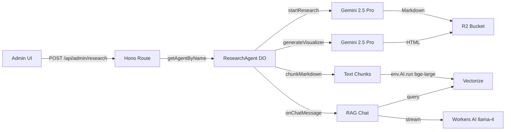

# Research Center — Implementation Walkthrough

## Summary

Built the complete **Home Remodel Research Center** feature across 5 phases — 13 new files created, 5 existing files modified. The system allows an admin to submit a research topic, orchestrate Gemini deep research, store findings in R2, embed into Vectorize for RAG, generate interactive visualizer webapps, and chat with research findings.

---

## Phase 1: Database Layer

### New Files

#### [research_sessions.ts](file:///Volumes/Projects/workers/core-remodel/src/backend/db/schema/admin/research_sessions.ts)
Drizzle schema defining the `research_sessions` table with lifecycle status tracking (`pending` → `researching` → `embedding` → `generating` → `complete` | `failed`), R2 keys for markdown and visualizer, Vectorize namespace tag, and chunk count.

### Modified Files

#### [index.ts](file:///Volumes/Projects/workers/core-remodel/src/backend/db/schema/index.ts)
Added `export * from "./admin/research_sessions"` barrel export (line 66).

---

## Phase 2: ResearchAgent

### Architecture



### New Files

| File | Purpose |
|------|---------|
| [types.ts](file:///Volumes/Projects/workers/core-remodel/src/backend/ai/agents/ResearchAgent/types.ts) | Agent state interface, R2 key helpers, Vectorize namespace helper |
| [index.ts](file:///Volumes/Projects/workers/core-remodel/src/backend/ai/agents/ResearchAgent/index.ts) | **Main agent** — `AIChatAgent<Env>` with `@callable startResearch()`, RAG `onChatMessage()`, health probe |
| [health.ts](file:///Volumes/Projects/workers/core-remodel/src/backend/ai/agents/ResearchAgent/health.ts) | Binding validation probe |
| [chunk-markdown.ts](file:///Volumes/Projects/workers/core-remodel/src/backend/ai/agents/ResearchAgent/methods/chunk-markdown.ts) | Section-aware text chunking (512-token safe, overlap-aware) |
| [embed-chunks.ts](file:///Volumes/Projects/workers/core-remodel/src/backend/ai/agents/ResearchAgent/methods/embed-chunks.ts) | Vectorize embedding pipeline via `env.AI.run()` |
| [generate-visualizer.ts](file:///Volumes/Projects/workers/core-remodel/src/backend/ai/agents/ResearchAgent/methods/generate-visualizer.ts) | Gemini visualizer webapp generation (Tailwind CDN + Recharts CDN) |
| [methods/index.ts](file:///Volumes/Projects/workers/core-remodel/src/backend/ai/agents/ResearchAgent/methods/index.ts) | Barrel export |

### Key Decisions

- **Model split**: `gemini-2.5-pro` for research + visualizer, Workers AI `llama-4-scout` for chat streaming
- **Gemini via AI Gateway**: Same pattern as existing [image-editor.ts](file:///Volumes/Projects/workers/core-remodel/src/backend/services/image-processor/image-editor.ts) — `env.GEMINI_API_KEY.get()` + AI Gateway proxy
- **Embeddings**: `env.AI.run("@cf/baai/bge-large-en-v1.5")` — no constructor pattern
- **Vectorize namespace**: `research:{sessionId}` within existing `remodel-embeddings` index
- **State broadcasting**: `this.setState()` pushes progress to connected WebSocket clients

---

## Phase 3: Hono API Routes

#### [research.ts](file:///Volumes/Projects/workers/core-remodel/src/backend/api/routes/research.ts)

| Method | Path | Status | Description |
|--------|------|--------|-------------|
| `POST` | `/` | **202** | Async — fires `startResearch()` without awaiting, returns `sessionId` immediately |
| `GET` | `/` | 200 | List all sessions (ordered by `createdAt desc`) |
| `GET` | `/:id` | 200 | Single session detail |
| `GET` | `/:id/markdown` | 200 | Stream markdown from R2 |
| `GET` | `/:id/visualizer` | 200 | **Dynamic Worker sandbox** — wraps HTML in a Worker module, serves via `env.LOADER.load()` with strict CSP |
| `DELETE` | `/:id` | 200 | Cleans up D1 + R2 + Vectorize |

### Key Design: Async Dispatch

```typescript
// POST / — Fire and forget
agent.startResearch(topic, session.id).catch((err) => {
  console.error(`Research pipeline failed for session ${session.id}:`, err);
});
return c.json({ sessionId: session.id, status: "pending", topic }, 202);
```

### Key Design: CSP Header

The Dynamic Worker response includes a strict Content-Security-Policy preventing parent-window navigation and limiting script sources to CDN origins only.

#### [index.ts](file:///Volumes/Projects/workers/core-remodel/src/backend/api/index.ts)
Mounted `researchRouter` at `/api/admin/research` (line 90).

---

## Phase 4: Infrastructure

#### [wrangler.jsonc](file:///Volumes/Projects/workers/core-remodel/wrangler.jsonc)

Three additions:
1. **DO binding**: `RESEARCH_AGENT` → `ResearchAgent`
2. **Migration v7**: `new_sqlite_classes: ["ResearchAgent"]`
3. **Worker Loaders**: `binding: "LOADER"` for Dynamic Workers

#### [_worker.ts](file:///Volumes/Projects/workers/core-remodel/src/_worker.ts)
Added `export { ResearchAgent } from "./backend/ai/agents/ResearchAgent"` (line 24).

---

## Phase 5: Frontend

### Astro Pages

| File | Description |
|------|-------------|
| [research.astro](file:///Volumes/Projects/workers/core-remodel/src/frontend/pages/admin/research.astro) | Library listing page |
| [research/[id].astro](file:///Volumes/Projects/workers/core-remodel/src/frontend/pages/admin/research/%5Bid%5D.astro) | Detail page with dynamic route |

### React Islands

#### [ResearchLibraryApp.tsx](file:///Volumes/Projects/workers/core-remodel/src/frontend/components/ResearchLibraryApp.tsx)
- Card grid of research sessions with status badges
- Auto-polling for in-progress sessions (5s interval)
- New research form with topic input
- Search filter
- Delete with R2 + Vectorize cleanup

#### [ResearchDetailApp.tsx](file:///Volumes/Projects/workers/core-remodel/src/frontend/components/ResearchDetailApp.tsx)
Bento-grid layout with 3 panels:

1. **Document Panel** (left, 2/5 width) — Markdown renderer with prose styling, download button
2. **Visualizer Panel** (right-top) — Sandboxed iframe pointing to Dynamic Worker endpoint
3. **Chat Panel** (right-bottom) — `assistant-ui` Thread using `useAgentChat` from `@cloudflare/ai-chat/react` (NOT `ai/react`)

All panels support expand/collapse. Chat pattern mirrors [BudgetDashboardApp](file:///Volumes/Projects/workers/core-remodel/src/frontend/components/BudgetDashboardApp.tsx#L2246-L2272).

#### [AppSidebar.tsx](file:///Volumes/Projects/workers/core-remodel/src/frontend/components/AppSidebar.tsx)
Added "Research Center" nav link under Admin section (line 277).

---

## Remaining Steps (require local terminal)

Run these commands in your terminal to complete the setup:

```bash
# 1. Regenerate worker types (adds RESEARCH_AGENT + LOADER to Env)
pnpm run cf-typegen

# 2. Generate D1 migration for research_sessions table
pnpm run db:generate

# 3. Apply migration locally
pnpm run migrate:local

# 4. Build check
pnpm run build

# 5. Dev server smoke test
pnpm run dev
```

> [!IMPORTANT]
> After `cf-typegen`, verify that `worker-configuration.d.ts` now includes `RESEARCH_AGENT: DurableObjectNamespace` and `LOADER: Fetcher` (or equivalent Dynamic Worker type).

> [!TIP]
> The first research session will take 30-60 seconds to complete (Gemini deep research + embedding + visualizer generation). The frontend auto-polls every 3 seconds on the detail page and 5 seconds on the library page to reflect status transitions.
