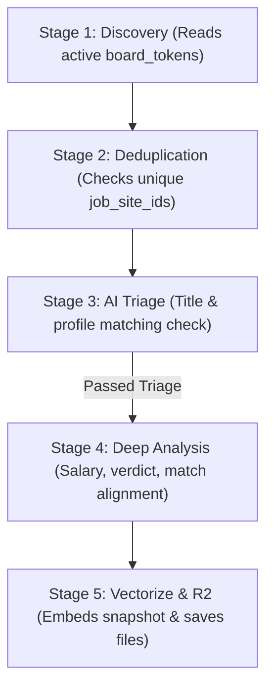

# Active Board Tracker (Pipeline B)

The **Active Board Tracker (Pipeline B)** is the automated background scraping, triage, deep analysis, and archiving engine of the job board ecosystem. Mapped to a periodic Cloudflare Cron Trigger, it iterates through all promoted and active company tokens, extracts job postings via ATS-specific Public Boards APIs (supporting Greenhouse, Ashby, and others), processes them through specialized AI triage and deep analysis models, indexes them for semantic search, and archives raw content for long-term historical records.

Unlike general-purpose scrapers, Pipeline B is a **point-in-time snapshot engine**. Each time it runs, it builds a historical log of how job postings, salary offerings, and team requirements change over time, creating a rich comparative timeline of hiring activities.

---

## The 5-Stage AI Lifecycle

Every pipeline execution follows a structured, sequential lifecycle designed to minimize inference costs, ensure data quality, and maximize semantic recall:



### Stage 1: Discovery
The engine queries D1 to retrieve all active company tokens from the `board_tokens` table. For each company, it queries the relevant public board API endpoint (supporting Greenhouse and Ashby JSON endpoints).

### Stage 2: Deduplication
Each discovered job has a unique public ID (`job_site_id`). The scraper checks if a parent record already exists in the `jobs_postings` table:
- **New Job**: Creates a parent record in `jobs_postings` and flags it for **AI Triage**.
- **Existing Job**: Skips Triage and creates a new point-in-time entry directly in `job_snapshots` to capture any updates.

### Stage 3: AI Triage
New postings undergo a fast, cost-effective relevance check (`MODEL_TRIAGE`) through AI Gateway. The triage evaluates the title, description, and applicant's core profile:
- If a posting fails triage (e.g., mismatched seniority level or irrelevant domain), it is flagged with `triage_passed = false` and skipped.
- If it passes, it is flagged with `triage_passed = true`, its AI-generated triage reasoning is saved, and it is queued for Deep Analysis.

### Stage 4: Deep Analysis (Snapshot Generation)
Queue jobs undergo comprehensive, structured analysis using specialized Workers AI models. This produces a rich point-in-time snapshot containing:
- **Relevance Scoring**: Overall match score (0-100) and detailed qualitative rationale.
- **Verdict Classification**: Triage category of `High`, `Medium`, or `Low` relevance.
- **Salary Extraction**: Parses raw compensation text into integer bounds (`salary_min`, `salary_max`) and ISO currency.
- **Benefits Extraction**: Fielded summaries of medical, equity, retirement, PTO, and bonuses.
- **Commute Analysis**: Injects factual travel times using the decoupled **OpenRoute/Google Maps commute pipeline**.
- **Taxonomy Tagging**: Automatically extracts categories and technical keyword mappings.
- **Career Memory Alignment**: Compares the posting against historical resume bullets and previous alignment logs.

### Stage 5: Vectorize & Archive
- **Semantic Vector Indexing**: The snapshot is embedded via `@cf/baai/bge-large-en-v1.5` and committed to the Vectorize index `greenhouse-jobs` for semantic discovery.
- **Asset Archiving**: The raw HTML, rendered markdown, and generated PDF formats of the job posting are archived directly in the **Cloudflare R2 Bucket (`R2_JOBS_BUCKET`)** to guard against external deletion.

---

## Snapshot Tracking & Change Detection

Job postings are living listings. Companies adjust salaries, relax or tighten remote policies, and refine requirements based on applicant response. Pipeline B preserves this history by using an **append-only snapshots model** instead of destructive overrides.

```
jobs_postings (Parent Record: Vercel - Staff Engineer)
  ├── Snapshot #1 (Feb 01) -> $180k-$210k | Hybrid (3 RTO) | 5 requirements
  ├── Snapshot #2 (Feb 15) -> $180k-$210k | Remote (Flexible) | 5 requirements (policy shifted)
  └── Snapshot #3 (Mar 01) -> $195k-$230k | Remote (Flexible) | 7 requirements (comp bumped, skills added)
```

### Monitored Changes
- **Compensation Fluctuations**: Track starting salary adjustments over a listing's market lifetime.
- **RTO Policy Shifts**: Identify when a company moves from rigid in-office requirements to flexible/hybrid setups.
- **Requirements Shift**: Track the additions of required tools or credentials as roles remain unfilled.
- **Turnover / Relistings**: Detect roles that vanish and reappear under similar templates, indicating potential team turnover or restaffing.

---

## Data Model

Pipeline B uses a comprehensive set of D1 tables to manage metadata, index snapshots, store analytics, and support human curation.

### Core Tables

#### 1. `board_tokens`
Declares the target company boards active in the scraper.

| Column | Drizzle Property | Type | Nullable | Description |
| :--- | :--- | :--- | :--- | :--- |
| `id` | `id` | `INTEGER` | No | Auto-incrementing primary key. |
| `token` | `token` | `TEXT` | No | Unique ATS board token (e.g. `cloudflare`). |
| `company_name` | `companyName` | `TEXT` | Yes | Display name of the company. |
| `company_url` | `companyUrl` | `TEXT` | Yes | Company homepage URL. |
| `email_domain` | `emailDomain` | `TEXT` | Yes | Company domain used for inbound email routing. |
| `is_active` | `isActive` | `INTEGER` | No | True if the board is actively scanned by cron runs. |

#### 2. `jobs_postings`
The parent listing record for a unique job posting on an external board.

| Column | Drizzle Property | Type | Nullable | Description |
| :--- | :--- | :--- | :--- | :--- |
| `id` | `id` | `INTEGER` | No | Auto-incrementing primary key. |
| `job_site_id` | `jobSiteId` | `TEXT` | No | ATS unique public job ID. |
| `job_title` | `jobTitle` | `TEXT` | No | Title of the position. |
| `company` | `company` | `TEXT` | No | Parent company board name. |
| `date_first_seen`| `dateFirstSeen` | `INTEGER` | No | Timestamp of initial discovery. |
| `triage_passed` | `triagePassed` | `INTEGER` | Yes | True if the role passed AI triage. |
| `triage_reason` | `triageReason` | `TEXT` | Yes | AI rationale for the triage decision. |
| `analysis_executed`| `analysisExecuted`| `INTEGER` | Yes | True if deep snapshot analysis was completed. |
| `is_favorite` | `isFavorite` | `INTEGER` | Yes | Stars the posting for quick dashboard filters. |

#### 3. `job_snapshots`
Appended analyses for each posting, detailing structured AI insights and archive links.

| Column | Drizzle Property | Type | Nullable | Description |
| :--- | :--- | :--- | :--- | :--- |
| `id` | `id` | `INTEGER` | No | Auto-incrementing primary key. |
| `job_id` | `jobId` | `INTEGER` | No | Foreign key linking to `jobs_postings.id`. |
| `snapshot_timestamp`| `snapshotTimestamp`| `INTEGER` | No | Timestamp of this analysis snapshot. |
| `vectorize_id` | `vectorizeId` | `TEXT` | Yes | UUID matching the vector index record. |
| `session_uuid` | `sessionUuid` | `TEXT` | Yes | UUID of the session cron run that triggered it. |
| `match_score` | `matchScore` | `INTEGER` | Yes | Overall candidate match rating (0-100). |
| `verdict` | `verdict` | `TEXT` | Yes | Relevance assessment: `High`, `Medium`, or `Low`. |
| `salary_min` | `salaryMin` | `INTEGER` | Yes | Lower annual compensation boundary. |
| `salary_max` | `salaryMax` | `INTEGER` | Yes | Upper annual compensation boundary. |
| `salary_currency`| `salaryCurrency`| `TEXT` | Yes | ISO currency symbol. |
| `archive_md_key` | `archiveMdKey` | `TEXT` | Yes | R2 key of markdown archive. |
| `archive_pdf_key` | `archivePdfKey` | `TEXT` | Yes | R2 key of PDF copy. |

#### 4. `session_runs`
Maintains operational logs of background executions.

| Column | Drizzle Property | Type | Nullable | Description |
| :--- | :--- | :--- | :--- | :--- |
| `id` | `id` | `INTEGER` | No | Auto-incrementing primary key. |
| `session_uuid` | `sessionUuid` | `TEXT` | No | Unique UUID identifying the execution run. |
| `timestamp` | `timestamp` | `INTEGER` | No | Timestamp when the cron run started. |
| `total_scraped` | `totalScraped` | `INTEGER` | No | Number of jobs discovered. |
| `total_triaged` | `totalTriaged` | `INTEGER` | No | Total postings processed through AI triage. |
| `total_analyzed` | `totalAnalyzed` | `INTEGER` | No | Total jobs deep-analyzed. |
| `total_failed` | `totalFailed` | `INTEGER` | No | Count of failed scrapings or classifications. |

---

## Health & Diagnostics Screenings

Pipeline B features **9 edge diagnostics** checking dependencies, resources, and database constraints under the `greenhouse` health check:

| Screening Code | Targets Checked | What is Verified |
| :--- | :--- | :--- |
| `greenhouse_env_vars` | Worker Environment | Confirms that secret variables, R2 variables, and bindings are present. |
| `greenhouse_api` | Network Connectivity | Resolves the external Greenhouse board endpoint to ensure DNS and endpoints resolve. |
| `r2_jobs_bucket` | Object Storage | Validates Write/Read/Delete operations directly on the R2 engine. |
| `vectorize_jobs` | Vector Index | Verifies connection, query, and dimension constraints. |
| `jobs_schema_integrity` | D1 Storage | Scans for the existence and structure of all 19 job-domain tables. |
| `board_token_config` | Core Assets | Ensures active board tokens are configured and responding. |
| `jobs_data_quality` | Data Integrity | Checks and graphs snapshot ratios, verdict spreads, and parsing defects. |
| `gemini_provider` | AI Model Gateway | Tests Workers AI / Gemini key and endpoint routing. |
| `pipeline_sessions` | Cron State | Checks session freshness, average completion speeds, and highlights stuck runs. |

Users can trigger these health checks on-demand from the **Pipeline Tracker** page or navigate to the comprehensive [Health Dashboard](/health).

---

## API Reference

### `GET` `/api/pipeline/stats`
Retrieves aggregated statistics and session run histories for dashboard listings.

### `GET` `/api/pipeline/board-tokens`
Lists active board tokens and corresponding metadata.

### `POST` `/api/pipeline/board-tokens`
Declares a new active company board token.
- **Body**: `{ token: "stripe", companyName: "Stripe", companyUrl: "stripe.com", emailDomain: "stripe.com" }`

### `GET` `/api/pipeline/insights`
Calculates analytics including pie distributions for verdicts, salary spreads, and company coverage counts.

---

## Key Files & Modules

- **Scanner Cron Router**: `src/backend/api/routes/pipeline.ts` - Hosts scraper hooks and stats APIs.
- **Scraper Orchestrator**: `src/backend/services/jobs/scanner.ts` - Logic processing Discovery -> Archive.
- **Commute Calculator**: `src/backend/services/openroute-service.ts` - Directions calculation pipeline.
- **Job Posting Schema**: [jobs-postings.ts](file:///Volumes/Projects/workers/core-resumes/src/backend/db/schemas/jobs/jobs-postings.ts) - Parent job record schema.
- **Snapshot Schema**: [job-snapshots.ts](file:///Volumes/Projects/workers/core-resumes/src/backend/db/schemas/jobs/job-snapshots.ts) - Appended snapshot analyzer schema.
- **Operational Runs Schema**: [session-runs.ts](file:///Volumes/Projects/workers/core-resumes/src/backend/db/schemas/jobs/session-runs.ts) - Cron execution tracker schema.
- **Tracker Widget**: [PipelineBTrackerDocs.tsx](file:///Volumes/Projects/workers/core-resumes/src/frontend/components/docs/PipelineBTrackerDocs.tsx) - Interactive stats, health panels, and run history viewer.
