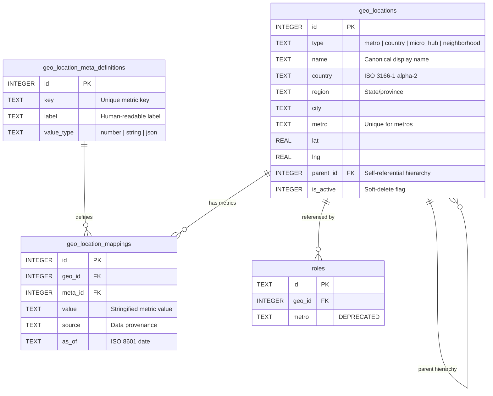

# Geo Data Architecture

The Career Orchestrator uses a centralized geographic data system built on three D1 tables that serve as the **single source of truth** for all location data across the platform — salary benchmarks, map visualizations, AI fact extraction, and cross-market analysis.

## Why This Exists

Previously, geographic data was scattered across 5+ independent sources:

| Source | Problem |
|--------|---------|
| `cost_of_living_index` table | String PK, no coordinates, no FK relations |
| `roles.metro` column | Free-text with no validation or FK |
| Frontend `COUNTRY_COORDS` dict | 57 hardcoded countries, not queryable |
| Frontend `HUB_COORDS` dict | ~50 hardcoded metros/micro-hubs |
| AI prompt free-text extraction | No geo_id tagging, no validation |

This fragmentation caused data relation issues, inconsistent metro naming, and made it impossible to guarantee that all geo charts referenced the same canonical locations.

## Schema



### `geo_locations` — Location Records

Every geographic entity is a row in this table:

- **`metro`** — US tech hub metros (San Francisco, CA; New York, NY; Seattle, WA; etc.)
- **`country`** — 57 country centroids for freelance dashboard maps
- **`micro_hub`** — Bay Area sub-regions (Mountain View, Palo Alto, SoMa, etc.) with `parent_id` → SF metro
- **`neighborhood`** — Reserved for future fine-grained SF neighborhood data

**Key columns:**
- `id` — Autoincrement integer PK (no UUID overhead)
- `metro` — Unique index for metro-type records (used as the canonical join key)
- `lat` / `lng` — WGS84 coordinates for map markers
- `parent_id` — Self-referential FK enabling micro_hub → metro hierarchy

### `geo_location_meta_definitions` — EAV Attribute Registry

Defines what metrics can be attached to locations. Current definitions:

| Key | Label | Value Type | Description |
|-----|-------|------------|-------------|
| `cost_of_living_index` | Cost of Living Index | `number` | BLS-sourced multiplier (1.00 = baseline) |

To add new metrics (e.g., `tech_hub_tier`, `remote_discount_factor`), insert a new definition row — no schema migration needed.

### `geo_location_mappings` — EAV Value Store

Links locations to their metric values. One row per (geo_id, meta_id) pair.

**Example data:**
| geo_id | meta_id | value | source |
|--------|---------|-------|--------|
| 1 (SF) | 1 (COL) | "1.34" | BLS 2024 |
| 2 (NYC) | 1 (COL) | "1.29" | BLS 2024 |

## API Endpoints

All endpoints are under `GET /api/geo/locations`:

| Endpoint | Description |
|----------|-------------|
| `GET /api/geo/locations` | List all locations. Supports `?type=metro&country=US&includeMetrics=true`. |
| `GET /api/geo/locations/list` | Compact list (id, name, type, country) for AI agent prompt injection. |
| `GET /api/geo/locations/{id}` | Single location with all EAV metric mappings. |
| `POST /api/geo/locations/seed` | Bulk upsert locations + EAV metrics. |
| `POST /api/geo/locations/backfill-roles` | Backfill `roles.geo_id` from metro strings. |

### Query Parameters

| Param | Values | Description |
|-------|--------|-------------|
| `type` | `metro`, `country`, `micro_hub`, `neighborhood` | Filter by location type |
| `country` | ISO alpha-2 code (e.g., `US`) | Filter by country |
| `includeMetrics` | `true` | Join EAV metrics inline in the response |

## Consumer Integration

### Salary Benchmarks

All salary benchmark functions join through `geo_locations` + EAV:

```sql
-- Cross-market COL-adjusted comparison
SELECT gl.name AS metro, CAST(glm.value AS REAL) AS col_index,
       AVG((m.salary_min + m.salary_max) / 2) AS median
FROM marketCompanySalaries m
JOIN geo_locations gl ON m.metro = gl.metro
JOIN geo_location_mappings glm ON gl.id = glm.geo_id
JOIN geo_location_meta_definitions gmd ON glm.meta_id = gmd.id
  AND gmd.key = 'cost_of_living_index'
WHERE m.snapshot_id = ? AND gl.type = 'metro'
GROUP BY gl.name, glm.value
ORDER BY CAST(glm.value AS REAL) DESC;
```

### AI Agent Geo-Tagging

The fact extraction pipeline (`facts.ts`) receives a compact geo list in its system prompt:

```json
[{"id":1,"name":"San Francisco, CA","type":"metro"},{"id":2,"name":"New York, NY","type":"metro"}]
```

The AI matches extracted locations against this list and returns a `geoId` in its structured response, which is then set as `roles.geo_id`.

### Frontend Charts

- **GeographicPremiumChart** — Accepts optional `geoLocations` prop from `GET /api/geo/locations`. Falls back to hardcoded coords when API data unavailable.
- **FreelanceDashboard** — Fetches `GET /api/geo/locations?type=country` on mount for client hub map markers.

## Seeding

Run `POST /api/pipeline/seed-salary-refactor/col-index` to seed:
1. 13 US metros with coordinates and COL indices
2. 56 country centroids
3. 16 Bay Area micro-hubs with parent_id → SF metro
4. EAV meta definition for `cost_of_living_index`
5. COL values via `geo_location_mappings`

## Deprecation Notes

> [!WARNING]
> The `cost_of_living_index` table and `roles.metro` column are **deprecated**. They are preserved during the migration period for backward compatibility. All new code must use `geo_locations` + `geo_location_mappings` and `roles.geo_id` respectively.

### Migration Path
1. `roles.metro` → `roles.geo_id` (FK to `geo_locations.id`)
2. `cost_of_living_index` → `geo_location_mappings` WHERE `key = 'cost_of_living_index'`
3. Frontend `COUNTRY_COORDS` → `GET /api/geo/locations?type=country`
4. Frontend `HUB_COORDS` → `GET /api/geo/locations?type=metro`
