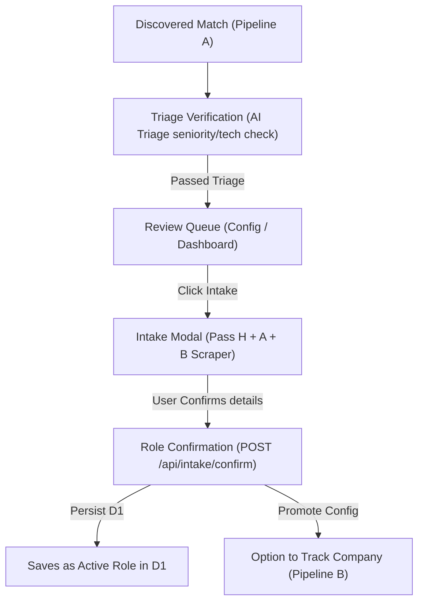
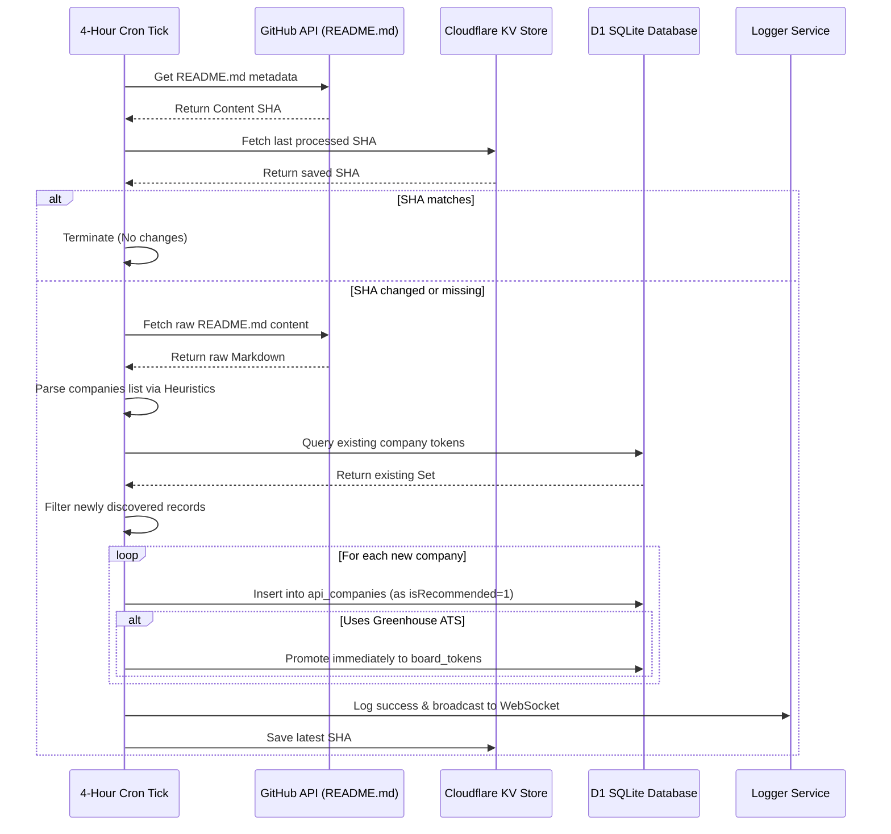

# Discovery Board Aggregator (Pipeline A)

The **Discovery Board Aggregator (Pipeline A)** is the upstream discovery and synchronization system. Its primary role is to monitor external, massive listings of companies and job boards, ingest them, track their active statuses, and present them in a global directory for Human-in-the-Loop (HITL) promotion into the active scanning queue.

Rather than running expensive and continuous web crawls across arbitrary domains on the serverless edge, Pipeline A offloads bulk raw parsing to a decoupled **GitHub Actions workflow**. It then uses **Durable Object WebSockets** to broadcast real-time sync progress directly to the browser before updating the local SQLite database.

It supports multiple Applicant Tracking Systems (ATS) including **Greenhouse**, **Ashby**, and others, automatically normalizing their schemas and tracking active statuses.

---

## High-Level Architecture

The aggregator follows a hybrid edge-and-CI architecture that splits concerns between edge storage, Edge compute, and heavy runner parsing:

```mermaid
flowchart TD
    UI["Pipeline Dashboard (UI)"] -->|1. Trigger Sync| GH["GitHub Actions (Sync Upstream)"]
    GH -->|2. Send Progress Update (POST /sync-progress)| Worker["Cloudflare Worker"]
    Worker -->|3. reportProgress RPC| DO["SyncBroadcastAgent (Durable Object)"]
    DO -->|4. WebSocket Broadcast| UI
    GH -->|5. Sync Completed (POST /sync)| Worker
    Worker -->|6. Batch Ingest| DB[("D1 SQLite Database (api_companies)")]
```

### Flow Lifecycle

1. **Triggering**: The user clicks **Trigger Sync** on the Pipeline Operations dashboard.
2. **Dispatching**: The Hono backend uses a GitHub Personal Access Token to invoke a `repository_dispatch` event on the target repository (`jmbish04/core-resumes` / `GITHUB_DISPATCH_REPO`).
3. **Execution**: A GitHub Action runner spins up and executes the synchronization script (`sync-upstream.py`).
4. **WebSocket Progress Fanning**: As the python script parses upstream assets, it sends HTTPS POST requests back to the Worker (`/api/pipeline/api-companies/sync-progress`). The Worker forwards the payloads to the **Durable Object (`SyncBroadcastAgent`)** which pushes them out over WebSockets to any active dashboard UI clients, showing live progress bars.
5. **Database Syncing**: Once finished, the GitHub Action posts the complete list of discovered board tokens to `/api/pipeline/api-companies/sync`. The database updates records in `api_companies`, recording deactivated, reactivated, and newly discovered tokens, and logging the run history in `api_company_sync_stats`.

---

## Data Model

Pipeline A uses two core tables under the `jobs` domain in D1 to manage upstream metadata and track sync history.

### Core Tables

#### 1. `api_companies`
Tracks all discovered job boards found upstream. Each board represents a company that *could* be promoted to the active lists.

| Column | Drizzle Property | Type | Nullable | Description |
| :--- | :--- | :--- | :--- | :--- |
| `id` | `id` | `INTEGER` | No | Auto-incrementing primary key. |
| `name` | `name` | `TEXT` | Yes | Display name of the company if known. |
| `job_board_token` | `jobBoardToken` | `TEXT` | No | Unique ATS board token (e.g. `cloudflare`, `stripe`, `ashby-token`). |
| `system` | `system` | `TEXT` | No | The applicant tracking system (e.g., `greenhouse`, `ashby`, `lever`). |
| `source` | `source` | `TEXT` | No | Path to the source JSON file in the upstream aggregator repo. |
| `timestamp_added` | `timestampAdded` | `INTEGER` | No | When this board token was first discovered and indexed. |
| `timestamp_inactive`| `timestampInactive`| `INTEGER` | Yes | When this company was last detected as removed from upstream. |
| `is_active` | `isActive` | `INTEGER` | No | True if the company was present in the last upstream sync. |

#### 2. `api_company_sync_stats`
Tracks the history and metrics of each aggregator sync run.

| Column | Drizzle Property | Type | Nullable | Description |
| :--- | :--- | :--- | :--- | :--- |
| `id` | `id` | `INTEGER` | No | Auto-incrementing primary key. |
| `run_timestamp` | `runTimestamp` | `INTEGER` | No | Timestamp when the sync run completed. |
| `files_processed` | `filesProcessed` | `INTEGER` | No | Count of files parsed from the upstream aggregator repo. |
| `companies_added` | `companiesAdded` | `INTEGER` | No | Total new company boards discovered during this run. |
| `companies_deactivated`| `companiesDeactivated`| `INTEGER`| No | Active boards marked inactive because they left upstream. |
| `companies_reactivated`| `companiesReactivated`| `INTEGER`| No | Inactive boards reactivated because they returned upstream. |
| `status` | `status` | `TEXT` | No | Outcome status (e.g., `success`, `failed`). |
| `error` | `error` | `TEXT` | Yes | Error message if the run failed. |

---

## HITL Promotion Workflow

Discovering thousands of board tokens is only useful if we can curate them. Pipeline A acts as a vetting filter, preventing Pipeline B from bloating with unwanted scans:

1. **Discovery View**: Discovered companies list under the **Config → Promote Companies** tab.
2. **Filtering**: Users can search by keyword or filter by source to find target companies.
3. **Promotion**: Promoting a company transfers its metadata and config from `api_companies` directly into the official `board_tokens` table.
4. **Activation**: Upon promotion, the board token has its `is_active` status set to `true`, instantly making it visible to Pipeline B (Tracker) for scanning on the very next cron cycle.

---

## API Reference

These endpoints compose the aggregator's sub-router under `/api/pipeline`:

### `POST` `/api/pipeline/api-companies/trigger-sync`
Triggers the GitHub repository dispatch to start a new upstream aggregator run.
- **Headers**: Requires a valid session token.
- **Return**: `{ success: true }` or a 500 error if `GITHUB_PERSONAL_ACCESS_TOKEN` is missing.

### `POST` `/api/pipeline/api-companies/sync-progress`
Receives live execution progress from the running GitHub Action script.
- **Body**:
  ```json
  {
    "status": "in_progress",
    "message": "Parsing greenhouse/company-list.json...",
    "current": 4,
    "total": 12
  }
  ```
- **Fanning**: Automatically relays these variables to the `SyncBroadcastAgent` Durable Object to broadcast them over WebSockets.

### `POST` `/api/pipeline/api-companies/sync`
Consumes the complete, completed list of boards from the GitHub action.
- **Logic**: Deduplicates, updates active/inactive listings, inserts new entries into D1, and commits stats to `api_company_sync_stats`.

### `GET` `/api/pipeline/api-companies/sync-stats`
Fetches a list of the 50 most recent sync runs for the execution table.

---

## Key Files & Modules

- **API Sub-Router**: [api-companies.ts](file:///Volumes/Projects/workers/core-resumes/src/backend/api/routes/pipeline/api-companies.ts) - Composes routes for dispatching syncs, consuming results, and broadcasting progress.
- **Sync Stats Schema**: [api-company-sync-stats.ts](file:///Volumes/Projects/workers/core-resumes/src/backend/db/schemas/jobs/api-company-sync-stats.ts) - D1 table schema mapping.
- **Discovered Boards Schema**: [api-companies.ts](file:///Volumes/Projects/workers/core-resumes/src/backend/db/schemas/jobs/api-companies.ts) - Aggregator results D1 table.
- **Broadcasting Agent**: [sync-broadcast/index.ts](file:///Volumes/Projects/workers/core-resumes/src/backend/ai/agents/sync-broadcast/index.ts) - Durable Object managing WebSockets.
- **Dashboard Component**: [PipelineOperations.tsx](file:///Volumes/Projects/workers/core-resumes/src/frontend/components/pipeline/PipelineOperations.tsx) - Renders run tables and sync dispatch buttons.
- **Promote Tab UI**: [PromoteCompaniesEditor.tsx](file:///Volumes/Projects/workers/core-resumes/src/frontend/components/config/PromoteCompaniesEditor.tsx) - Manages HITL promotion and sorting controls.

---

## <a id="recommendation-engine"></a>Recommendation Engine & Matching Algorithms

To automate the discovery of high-value opportunities without overwhelming active crawlers, Pipeline A integrates a lightweight **AI/JSON-based Recommendation Engine**. This system acts as a heuristic vetting filter before any board token is added to the active scanning profile (Pipeline B).

### 1. Vetting Algorithms & Keyword Rules

During a sync run, the GitHub Action sync client crawls untracked boards to inspect public job listings against a strict set of candidate preference criteria.

#### **Job Title Matching**
The engine performs case-insensitive keyword scanning against the job title. Highly relevant keywords include:
*   `software engineer` / `software developer`
*   `frontend` / `front-end`
*   `backend` / `back-end`
*   `fullstack` / `full-stack`
*   `platform` / `infrastructure`
*   `devops` / `sre` / `site reliability`
*   `systems engineer`

#### **Geographic Location Filtering**
To ensure high quality matching, the location field must satisfy specific geographical criteria:
*   **Remote-first**: Matches `remote`, `us-remote`, `telecommute`, or `distributed`.
*   **San Francisco Bay Area**: Matches `san francisco`, `sf`, `oakland`, `south san francisco`, `mountain view`, `palo alto`, `sunnyvale`, `san jose`, or `bay area`.

> [!NOTE]
> Postings matching both title keywords AND location criteria are cataloged as high-confidence recommendations. Unmatched postings are ignored.

---

## Vetting & Human-in-the-Loop (HITL) Intake Flow

When a recommended company or role is identified, it enters a structured **Human-in-the-Loop Review Queue** to ensure high-fidelity data extraction and allow user validation before committing to the main system.



### 1. AI Triage Verification
Before appearing in the review queue, matched postings are evaluated by the fast triage model (`MODEL_TRIAGE`) through the AI Gateway. This assesses suitability (seniority level, tech stack compatibility, and responsibilities) and outputs a verdict (`High`, `Medium`, or `Low`) along with a structured matching rationale.

### 2. Intake Modal Scraper (Pass H + A + B)
When the user clicks the **Intake** button on a matching role:
1.  The system opens the **Intake Modal** and runs the robust 3-pass extraction pipeline.
2.  **Pass H (Heuristics)**: Direct Harvest API call to fetch raw structured metadata.
3.  **Pass A (AI Parser)**: Generative extraction of atomic skills, years of experience, and location metrics.
4.  **Pass B (Browser Rendering)**: High-fidelity DOM scrape using full-browser rendering for detailed salary ranges and RTO policies.

### 3. Persisted Role Origin & Origin Badging
Upon clicking **Confirm Role**:
*   The payload including `source: "pipeline_scan"` (supporting Greenhouse or Ashby) and the `sourceSnapshotId` is sent to the `/api/intake/confirm` endpoint.
*   The backend saves the role and attaches the scanner origin to the SQLite table.
*   Both the **Roles List page** and the **Roles Viewport header** dynamically render a high-fidelity `"ATS Scan"` or `"Sourced from Discovery Pipeline"` badge, showing exactly where the application originated.
*   If the company's board token is not currently tracked for scheduled crawls, a prominent **Track Company** button appears in the UI, allowing the user to promote it to Pipeline B with a single click.

---

## <a id="github-watch-alert"></a>GitHub Watching Alert (Hiring Without Whiteboards)

To expand our tracking coverage to high-quality, vetting-first communities, Pipeline A includes an automated **GitHub Watching Alert** for the popular [hiring-without-whiteboards](https://github.com/poteto/hiring-without-whiteboards/) repository. 

This system polls for additions to the list, parses metadata, logs matches, and feeds them into the Pipeline operations board with zero manual overhead.

### 1. Polling & Alert Lifecycle

The check runs on the default 4-hour background cron check alongside health screenings. It executes the following automated lifecycle:



### 2. Heuristic ATS Token & System Discovery

When a new company line is parsed from the markdown (e.g. `- [Company Name](url) | Location | Description`), the engine automatically extracts the ATS provider and board token from the destination URL:

*   **Greenhouse**: Matches `greenhouse.io` URLs, extracts the board slug, and automatically adds it to the active tracking profile `board_tokens` so Pipeline B starts scanning postings on the very next cycle.
*   **Lever**: Matches `lever.co` URLs and extracts the Lever board token.
*   **Ashby**: Matches `ashbyhq.com` URLs and extracts the Ashby board token.
*   **Rippling**: Matches `rippling.com` URLs and extracts the Rippling token.
*   **Fallback**: Slugifies the company name and defaults to Greenhouse token discovery.

---

## 🚀 Advanced AI Deep Analysis & Promotion Engine (Phases 3b, 4, 5)

To bridge the gap between wide-net heuristic scraping and personalized high-fidelity career targeting, the Discovery Pipeline integrates a multi-tier **AI-assisted Deep Analysis and Promotion Engine**.

### 1. Phase 3b: Dynamic AI Batch Analyzer (Kimi-k2.5)

Once the 4-hour cron scores active jobs via heuristics (Step 3a), a separate **AI Batch Analyzer Cron** (`runDiscoveryAnalyzer`) processes recommended but unscored jobs:

*   **Prioritization & Sorting**: If the queue of recommended unprocessed jobs exceeds 100, the system sends a single, high-context prompt containing basic listings to **Kimi-k2.5 (256K window)**. The model ranks the jobs against the applicant profile and filters the top 100 highest-quality fits.
*   **Decoupled Batch Scrapes**: The cron scrapes Greenhouse detail pages in parallel batches.
*   **Unified Batch AI Analysis**: Job details are grouped in batches of 5-10 and sent in a structured JSON request to Kimi-k2.5. The AI returns comprehensive alignment metrics, verdicts, traps, historic comparisons, salary/benefit summaries, and atomic qualification maps.
*   **Unified Persistence**: The results are parsed and populated into five downstream tables:
    *   `job_snapshots` — overall scores, verdict rationale, salary min/max, benefits, historic analyses.
    *   `job_req_snapshots` — 1-10 scoring and detailed match rationales for each requirement.
    *   `job_skill_snapshots` — alignment scores for preferred skills.
    *   `job_responsibility_snapshots` — alignment scores for core responsibilities.
    *   `job_categories` & `job_category_mappings` — dynamic category taxonomy discovery (e.g. Engineering, Legal Ops) and mappings.
    *   `job_tags` & `job_tag_mappings` — dynamic attribute tags (e.g., Remote, AI-Heavy, Startup).
    *   `session_runs` — execution counts and logs.

### 2. Phase 4: Promotion REST APIs

Once analysed, a role or company can be seamlessly promoted to the core tracking database via two dedicated REST endpoints:

#### **POST** `/api/pipeline/api-companies/:id/promote-company`
Promotes a wide-net discovered company to the main `companies` table, mapping names, descriptions, and Greenhouse board tokens.

#### **POST** `/api/pipeline/jobs-postings/:id/promote-role`
Promotes a scanned job posting to an active `role` application. 
*   **Auto Company Promotion**: Automatically promotes the parent company if it does not exist in the main `companies` table.
*   **Qualifications Seeding**: Fetches all extracted requirements, preferred skills, and key responsibilities from `job_req_snapshots`, `job_skill_snapshots`, and `job_responsibility_snapshots`, and copies them into the core `role_bullets` table as active bullets. This immediately prepares the intake viewport for document generation and resume optimization!

### 3. Phase 5: High-Fidelity HITL Discovery Viewport

The `/discovery` workspace brings all wide-net operations into a single cohesive, premium interface:

*   **Dashboard Viewport (`DiscoveryDashboard.tsx`)**: Composed of three main sections:
    1.  **Analyzed Jobs Tab**: Cards displaying overall match scores, verdict badges (High/Medium/Low), and JD trap alerts. Expands to show details (Builder alignment, salary ranges, historic fits, requirements table, and categories/tags). Includes a "Promote to Core Applications" button.
    2.  **Unanalyzed Queue Tab**: Fast table displaying recommended jobs awaiting Kimi scoring, with an interactive "Analyze Job" button that triggers real-time scraper-to-model analysis with spinners.
    3.  **Hot Companies Tab**: Grid showing discovered companies flagged by the discovery scorer with an instant "Promote to Watch List" action button.
*   **Sidebar Integration**: The sidebar config `siteConfig.sidebarItems` dynamically incorporates the new **Discovery** (`/discovery`) tab with a high-fidelity sparkles icon for immediate access.

