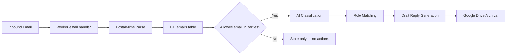

# Email Pipeline

The Career Orchestrator processes inbound recruiting emails through a multi-stage pipeline: reception → parsing → D1 persistence → AI classification → draft reply generation → Google Drive archival.

## Forwarding Setup

Forward recruiting emails to the worker's inbound email address:

```
job-pipeline@hacolby.app
```

This address is configured as `WORKER_EMAIL_INBOX` in `wrangler.jsonc` vars. The worker will parse **every email** it receives and persist it to D1, regardless of sender. However, AI-powered actions (classification, draft reply, role matching) are only triggered when an **allowed email address** appears in the email's parties list.

### Allowed Emails

The `ALLOWED_EMAILS` array in `wrangler.jsonc` controls which senders/recipients are treated as "me" (the user):

```json
"ALLOWED_EMAILS": [
  "justin@126colby.com",
  "jmbish04@gmail.com"
]
```

When forwarding an entire email thread, the pipeline registers **every message** in the thread as a separate D1 record, tagging which parties match the allowed list.

## Processing Pipeline



### Stages

1. **Reception** — Cloudflare Worker `email()` handler receives the raw email.
2. **Parsing** — `PostalMime` extracts subject, body, sender, attachments, and thread metadata (`In-Reply-To`, `Message-ID`).
3. **D1 Persistence** — Each message is stored in the `emails` table with full metadata. Attachments go to a separate `email_attachments` table. Sender/recipient parties are stored in `email_parties`.
4. **AI Classification** — Workers AI analyzes the email to extract: intent (interview, rejection, offer, update), company name, job title, sender person name, hiring manager name, confidence score, and suggested next action.
5. **Draft Reply** — If the classification suggests a reply is warranted, an AI-generated draft is stored in the `draft_reply` column.
6. **Role Matching** — The pipeline attempts to match the email to an existing role based on company name and job title. Matched emails receive `processedStatus: "associated"`.
7. **Google Drive Archival** — The email (and attachments) are rendered as a PDF and uploaded to the role's Google Drive folder, in an `emails/` subfolder organized by subject.

## Email Inbox Widget

The `EmailInbox` component provides a unified email browsing experience structurally inspired by the shadcn `sidebar-09` mail-list pattern. It serves as the primary hub for viewing, correcting, and actioning role associations.

### Where It Appears

| Page | Filter | Description |
|------|--------|-------------|
| `/emails` (Global) | None — shows all emails | Full dashboard with stats cards + inbox. Includes manual override controls and Context-Aware Assistant-UI. |
| `/roles/{id}` (Role Viewport) | `roleId` | Shows only emails associated with this role |
| `/companies/{id}` (Company Viewport) | `companyId` | Shows all emails across all roles for this company |

### Features

- **Mail list** — Clickable list with sender, subject, date, 2-line preview, intent badge, status badge.
- **Detail panel** — Full email view containing the message body and the auto-generated **AI Draft Reply**.
- **Intelligent Role Mapping Block** — Displays the AI's association mapping, `aiRoleMatchConfidence`, and `aiRoleMatchRationale`.
- **Action Needed Alert** — If the AI cannot confidently match the email to a role (or if it guesses incorrectly), the detail pane flags a red "Action Needed" modal with the AI's reasoning for skipping the association, providing an immediate "Manually Associate Role" button to resolve the thread.
- **Context-Aware Assistant-UI** — A floating modal present on the screen that is directly aware of the email currently open in the preview pane. Users can chat with the agent to execute actions based on the email context:
  - **Drafting & Editing:** Ask the agent to generate a draft reply (e.g., confirming scheduling, negotiating total comp, sending a post-interview thank you letter). If a draft already exists, the user can ask the agent to modify or refine it.
  - **Automated Actions:** The agent can be instructed to auto-update the role's status (e.g., automatically shifting status to "Rejected" upon processing a rejection letter).
  - **Document CRUD:** The agent can create, read, update, or delete related artifacts via its tooling based purely on the conversation and the contextual email being viewed.

### Props Reference

```tsx
interface EmailInboxProps {
  /** API filter — scope by roleId or companyId */
  filter?: { roleId?: string; companyId?: string };
  /** Max height for the inbox container */
  maxHeight?: string;
  /** Whether to show the "Forward emails to…" banner */
  showForwardBanner?: boolean;
  /** Worker email address (defaults to env value) */
  workerEmail?: string;
}
```

## API Endpoints

| Method | Path | Description |
|--------|------|-------------|
| `GET` | `/api/emails` | List all emails (optional filters: `roleId`, `companyId`, `processedStatus`) |
| `GET` | `/api/emails/stats` | Aggregate counts for dashboard badges |
| `GET` | `/api/emails/unmatched` | Emails awaiting manual association |
| `GET` | `/api/emails/:id` | Get single email with full body |
| `GET` | `/api/emails/:id/parties` | Get email sender/recipient parties |
| `GET` | `/api/emails/:id/attachments` | Get email attachments |
| `POST` | `/api/emails/:id/associate` | Associate email with a role (triggers AI workflow) |

## Database Tables

### `emails`
Primary email records with subject, body, sender, classification JSON, draft reply, and processing status.

### `email_parties`
Records each sender/recipient with role (from, to, cc, bcc) and whether they match an allowed email address.

### `email_attachments`
File attachments with R2 keys for binary storage.

## Status Lifecycle

```
pending → unmatched → associated → action_taken / responded / ignored
```

- **pending** — Just received, not yet processed
- **unmatched** — AI could not auto-match to a role
- **associated** — Linked to a role (auto or manual)
- **action_taken** — AI action completed (e.g., draft generated)
- **responded** — User sent a reply
- **ignored** — User dismissed the email
