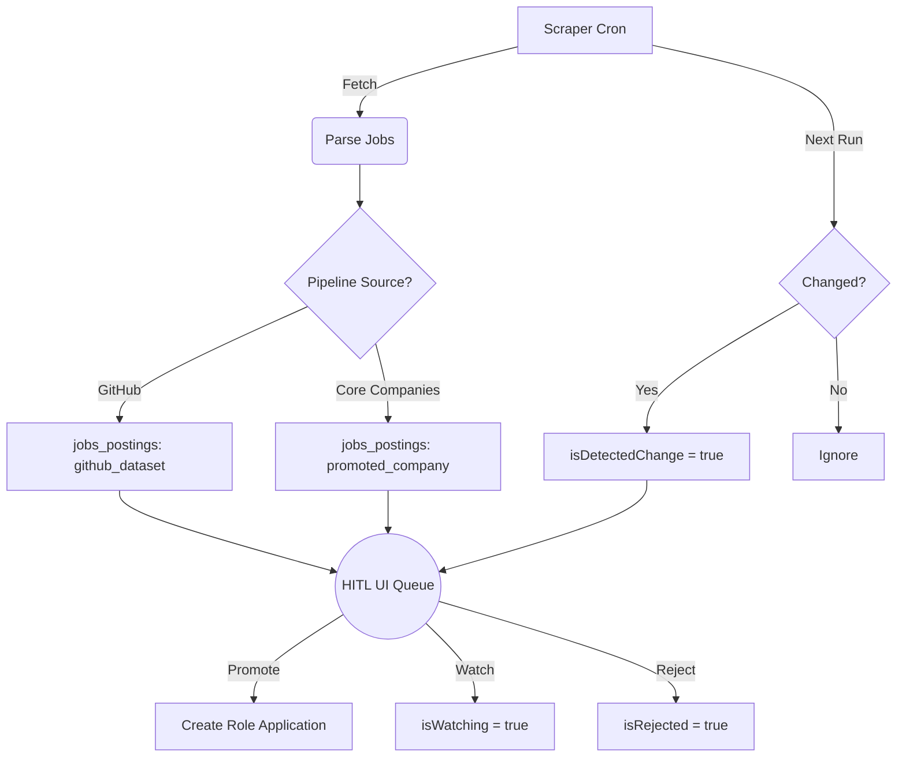

# Human-in-the-Loop (HITL) Workflow

The Human-in-the-Loop (HITL) pipeline provides a unified interface for reviewing automated job scrapes before they become active applications in your CRM.

By utilizing the **Roles** dashboard, you can effectively manage signal-to-noise ratio and keep track of interesting opportunities without cluttering your core role applications list.

## Core Pipelines

The HITL system ingests job postings (`jobs_postings`) from three distinct pipeline sources:

### 1. GitHub Dataset
- The wide-net pipeline that consumes large-scale daily commits of open jobs. 
- These jobs appear under the **GitHub Dataset Queue** tab.
- Heavily relies on algorithmic matching and Greenhouse Board scrapers to bubble up relevant roles based on titles and locations.

### 2. Promoted Companies
- The focused, active pipeline. 
- When a company from the discovery pipeline or manual entry is "Promoted", it is added to the core `companies` list.
- A scheduled scraper regularly polls all job boards mapped to these promoted companies (e.g. hitting their specific Greenhouse or Ashby endpoint).
- These targeted jobs appear under the **Companies Scrape Queue** tab.

### 3. Freelance
- Specialized pipeline for gig-work or freelance opportunity scraping (e.g., Upwork, specialized boards).
- Governed by the same HITL triage mechanics.

---

## Triage Actions

When reviewing a queued job, you have three primary actions. These govern how the system presents the job to you in the future.

### Process / Promote
> Promotes a scraped job into a tracked, active application.

- Extracts the job URL and automatically opens the intake creation flow.
- Removes it from the triage queue.
- Generates a new record in the `roles` table which you can track in the **Processed Roles** tab (Active Applications).

### Watch
> Saves an interesting job for later without turning it into an active application.

- Click **Watch** to remove the job from your daily review queue (`isWatching = true`).
- The pipeline will continue to monitor this job in the background. 
- The job will *only* reappear in your queue if the scraper detects a change in the posting (e.g. `isDetectedChange = true`), such as an updated salary band, title tweak, or deadline update.

### Reject
> Discards a job that is not a fit.

- Removes the job from the UI (`isRejected = true`).
- You can optionally provide a `rejectReason` (e.g., "Too senior", "Requires Go", "Fake listing").
- This ensures that subsequent daily scrapes of the same job board will ignore this listing, preventing duplicate reviews.

---

## Technical Implementation

All interactions use the `/api/pipeline/jobs` endpoints to quickly transition state and keep your review workflow snappy.
