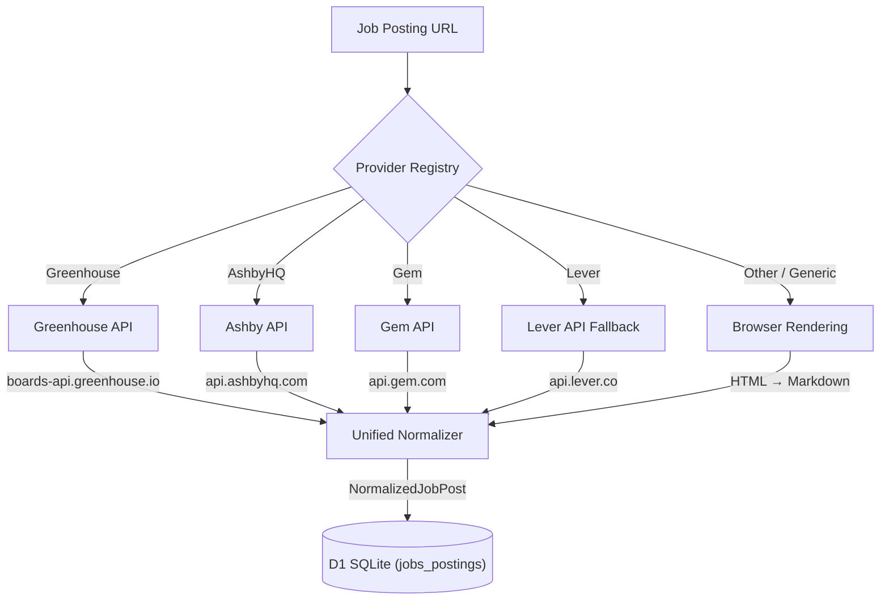
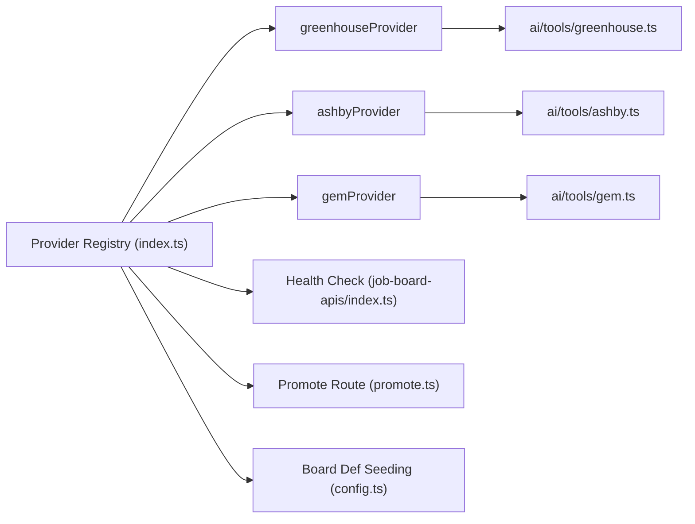

# Job Board Integrations (Greenhouse, Ashby, Gem, Lever)

The Career Orchestrator is designed to ingest and parse jobs from multiple **Applicant Tracking Systems (ATS)**, including **Greenhouse**, **AshbyHQ**, **Gem**, **Lever**, and others. A unified **Provider Registry** standardizes health checking, board scraping, and single-job extraction across all providers.

---

## 1. Scraping and Ingestion Architecture

Job scraping handles two distinct paths: the **Provider Registry** for ATS platforms with structured APIs, and headless browser rendering as a fallback for JS-heavy career pages.

---

## 2. Platform Specific Implementations

### A. Greenhouse Ingestion
* **Tool Module:** `src/backend/ai/tools/greenhouse.ts`
* **Provider:** `src/backend/pipeline/job-board-providers/greenhouse.ts`
* **Scrape URL Pattern:** Parses common board shapes (e.g. `boards.greenhouse.io/{boardToken}/{jobId}`).
* **Direct API:** Uses `boards-api.greenhouse.io/v1/boards/{boardToken}/jobs/{jobId}` (Public Harvest Job Board API — zero authentication required).

### B. Ashby Ingestion
* **Tool Module:** `src/backend/ai/tools/ashby.ts`
* **Provider:** `src/backend/pipeline/job-board-providers/ashby.ts`
* **Scrape URL Pattern:** Parses Ashby posting URLs (e.g. `jobs.ashbyhq.com/{boardToken}/{jobId}`).
* **Direct API:** Fetches from `api.ashbyhq.com/posting-api/job-board/{boardToken}?includeCompensation=true`.

### C. Gem Ingestion
* **Tool Module:** `src/backend/ai/tools/gem.ts`
* **Provider:** `src/backend/pipeline/job-board-providers/gem.ts`
* **Scrape URL Pattern:** Parses Gem URLs (e.g. `jobs.gem.com/{slug}/{jobId}` or `api.gem.com/job_board/v0/{slug}/job_posts`).
* **Direct API:** Fetches all posts from `api.gem.com/job_board/v0/{vanitySlug}/job_posts` and filters in memory (no single-job endpoint).

### D. Lever Ingestion
* **Scrape URL Pattern:** Identifies Lever URLs (e.g. `jobs.lever.co/{boardToken}/{jobId}`).
* **Direct API Fallback:** Invokes `api.lever.co/v0/postings/{boardToken}/{jobId}` to retrieve clean JSON representations.
* **Note:** Lever is not yet a registered provider — it's handled as a legacy fallback in the promote route.

---

## 3. Provider Registry Architecture

All ATS providers are managed through a centralized **Provider Registry** at `src/backend/pipeline/job-board-providers/`.

### `JobBoardProvider` Interface

Every provider implements the `JobBoardProvider` interface from `types.ts`:

| Method | Purpose |
|--------|---------|
| `testToken(token)` | Health check — probe a single board token and return status + job count |
| `scrapeBoard(token)` | Fetch all active jobs for a company board token → `NormalizedJobPost[]` |
| `scrapeJob(token, jobId)` | Fetch a single job by ID → `ScrapedPage` |

### Registered Providers

| Provider | System Key | Display Name | API Base URL | Config Key |
|----------|-----------|--------------|-------------|------------|
| Greenhouse | `greenhouse` | Greenhouse | `boards-api.greenhouse.io/v1/boards` | `greenhouse_tokens` |
| AshbyHQ | `ashby` | AshbyHQ | `api.ashbyhq.com/posting-api/job-board` | `ashby_tokens` |
| Gem | `gem` | Gem | `api.gem.com/job_board/v0` | `gem_tokens` |

### Onboarding a New Provider

1. Create `src/backend/ai/tools/<provider>.ts` — implement `scrapeBoard` + `scrapeJob`
2. Create `src/backend/pipeline/job-board-providers/<provider>.ts` — implement `JobBoardProvider`
3. Add to `JOB_BOARD_PROVIDERS[]` in `index.ts`
4. Create health check at `src/backend/health/checks/job-board-apis/<provider>-api.ts`
5. Import in `job-board-apis/index.ts` — add to `PROVIDER_CHECKS` array
6. Add `<provider>_tokens` to `health_check_config` defaults
7. Add seed row to `JOB_BOARD_DEF_SEEDS` in `config.ts`
8. Update `AGENTS.md`, `.agent/rules`, and this documentation page

---

## 4. Database Representation

### `company_job_board_defs` Table

Global dictionary of all scrape-able surfaces. Provider auto-seeds these on first company promote.

| Column | Type | Purpose |
|--------|------|---------|
| `id` | text (UUID) | Primary key |
| `name` | text | Display name (e.g. "Greenhouse", "AshbyHQ", "Gem") |
| `description` | text | Human-readable description |
| `is_api` | boolean | True if this surface has a structured API |
| `is_rss` | boolean | True if this surface supports RSS feeds |
| `is_active` | boolean | Whether this surface is currently active |

### `company_job_board_mapping` Table

Links a promoted company to a specific board configuration.

| Column | Type | Purpose |
|--------|------|---------|
| `id` | text (UUID) | Primary key |
| `company_id` | text (FK) | References `companies.id` |
| `board_id` | text (FK) | References `company_job_board_defs.id` |
| `board_identifier` | text | The specific board token or URL to scrape |

---

## 5. Health Checking

The unified `job_board_api_connectivity` health check runs all 3 provider checks in parallel and aggregates results into a single `HealthStepResult` with a per-provider breakdown.

**Location:** `src/backend/health/checks/job-board-apis/index.ts`

Each provider's `testToken()` method probes sample board tokens from the `health_check_config` and returns latency, job count, and status.

---

## 6. Related Links
* **[Discovery Board Aggregator (Pipeline A)](/docs/discovery-board-aggregator)** — Discovers and indexes company boards upstream.
* **[Active Board Tracker (Pipeline B)](/docs/active-board-tracker)** — Scans, snapshots, and alerts on active promoted company boards.
* **[RSS Feed Pipeline (Pipeline C)](/docs/integrations/rss-feeds)** — Automated RSS/Atom feed aggregation for job discovery.
* **[Role Intake Flow](/docs/role-intake)** — Real-time scrape, parse, and manual override confirmation.
