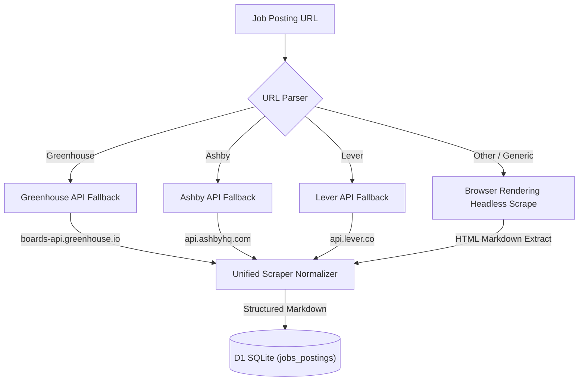

# Job Board Integrations (Greenhouse, Ashby, Lever)

The Career Orchestrator is designed to ingest and parse jobs from multiple **Applicant Tracking Systems (ATS)**, including **Greenhouse**, **Ashby**, **Lever**, and others. Rather than treating each board as a bespoke layout scraper, the system uses a unified API fallback pipeline and company token system.

---

## 1. Scraping and Ingestion Architecture

Job scraping handles two distinct paths: headless browser rendering for JS-heavy boards and direct public ATS API fallback when the browser block fails or is too slow.

---

## 2. Platform Specific Implementations

### A. Greenhouse Ingestion
* **Module:** `src/backend/ai/tools/greenhouse.ts`
* **Scrape URL Pattern:** Parses common board shapes (e.g. `boards.greenhouse.io/{boardToken}/{jobId}`).
* **Direct API Fallback:** Uses `boards-api.greenhouse.io/v1/boards/{boardToken}/jobs/{jobId}` (Public Harvest Job Board API — zero authentication required) to retrieve structural job content, bypassing edge bot protection.

### B. Ashby Ingestion
* **Scrape URL Pattern:** Parses Ashby posting URLs (e.g. `ashbyhq.com/{boardToken}/jobs/{jobId}` or direct posting page urls).
* **Direct API Fallback:** Fetches raw job details from `api.ashbyhq.com/posting-api/job-board/{boardToken}` or specific listing APIs to extract descriptions in full fidelity.

### C. Lever Ingestion
* **Scrape URL Pattern:** Identifies Lever URLs (e.g. `jobs.lever.co/{boardToken}/{jobId}`).
* **Direct API Fallback:** Invokes `api.lever.co/v0/postings/{boardToken}/{jobId}` to retrieve clean, sanitized JSON representations of the job specs.

---

## 3. Database Representation (`companies`)

The D1 database `companies` table (`src/backend/db/schemas/companies.ts`) stores:
* **`greenhouse_token`** — The primary ATS board identifier (acts as the company slug for any configured board, e.g., `cloudflare`, `stripe`, `ashby-company-token`).
* **`system`** — Enum or string tracking the target ATS (e.g., `greenhouse`, `ashby`, `lever`).

This design permits the frontend viewport and background pipelines to easily dispatch API calls and fetch statistics regardless of the underlying recruitment software utilized by the target enterprise.

---

## 4. Related Links
* **[Discovery Board Aggregator (Pipeline A)](/docs/discovery-board-aggregator)** — Discovers and indexes company boards upstream.
* **[Active Board Tracker (Pipeline B)](/docs/active-board-tracker)** — Scans, snapshots, and alerts on active promoted company boards.
* **[Role Intake Flow](/docs/role-intake)** — Real-time scrape, parse, and manual override confirmation.
