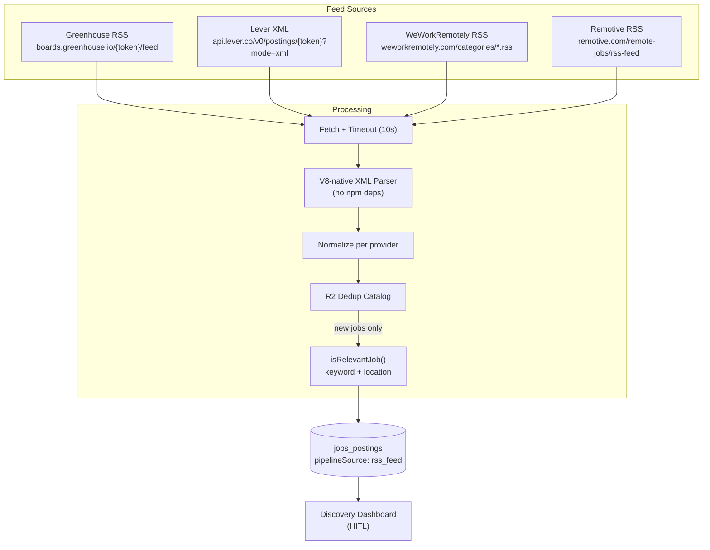

# RSS Feed Pipeline (Pipeline C)

Pipeline C automatically discovers job postings from **RSS and Atom feeds** across ATS platforms (Greenhouse, Lever) and industry job boards (WeWorkRemotely, Remotive). It runs on a **12-hour cron** alongside the freelance scanner.

> **No AI at this stage** — Pipeline C uses pure regex XML parsing and keyword + location heuristics. AI analysis happens later in the HITL flow.

---

## 1. Architecture



---

## 2. Feed Provider Registry

Each feed source is implemented as a separate TypeScript module under `src/backend/services/rss/feeds/`.

| Provider | Type | File | Feed URL |
|----------|------|------|----------|
| Greenhouse RSS | ATS | `greenhouse-rss.ts` | `boards.greenhouse.io/{token}/feed` |
| Lever XML | ATS | `lever-rss.ts` | `api.lever.co/v0/postings/{token}?mode=xml` |
| WeWorkRemotely | Industry | `weworkremotely.ts` | `weworkremotely.com/categories/*.rss` |
| Remotive | Industry | `remotive.ts` | `remotive.com/remote-jobs/rss-feed` |

### Adding a New Provider

1. Create `src/backend/services/rss/feeds/{name}.ts` implementing `RssFeedProvider`
2. Import and add to `RSS_FEED_PROVIDERS` array in `index.ts`
3. For ATS providers: add token config key to `health_check_config`
4. For industry feeds: add provider name to `rss_industry_feeds` config array

---

## 3. XML Parser

The parser at `src/backend/services/rss/xml-parser.ts` uses only V8-native regex operations — no npm XML libraries.

**Supported formats:**
- **RSS 2.0** — `<item>` blocks with `<title>`, `<link>`, `<description>`, `<pubDate>`, `<guid>`, `<category>`
- **Atom** — `<entry>` blocks with `<title>`, `<link href="...">`, `<content>`/`<summary>`, `<published>`/`<updated>`, `<id>`

**Utilities exported:**
- `parseRssXml(xml)` — auto-detects RSS vs Atom, returns `RssItem[]`
- `stripCdata(text)` — removes CDATA wrappers
- `stripHtml(html)` — strips tags and collapses whitespace
- `extractTagContent(block, tag)` — extracts tag text content
- `extractAtomLink(block)` — extracts Atom `<link>` href

---

## 4. Deduplication (R2 Catalog)

Seen job IDs are persisted **indefinitely** to R2, not KV.

| Setting | Value |
|---------|-------|
| R2 binding | `R2_JOBS_BUCKET` |
| Key pattern | `rss-dedup/{provider}.json` |
| Format | JSON array of `jobSiteId` strings |
| Lifecycle | Persist forever — never auto-expire |

**On each scan:**
1. Load existing seen IDs from R2 for each provider
2. Filter normalized jobs against the seen set
3. Insert only unseen jobs into D1
4. Append new IDs back to R2

---

## 5. Job Site ID Normalization

All pipelines use `normalizeJobSiteId()` from `src/backend/services/jobs/normalize-id.ts` to produce raw ATS job IDs:

| Input | Output | Rule |
|-------|--------|------|
| `gh-stripe-4567890` | `4567890` | Strip `gh-{token}-` prefix |
| `lv-vercel-abc123` | `abc123` | Strip `lv-{token}-` prefix |
| `as-replicate-xyz` | `xyz` | Strip `as-{token}-` prefix |
| `4567890` | `4567890` | Already raw |
| `ext-a1b2c3` | `ext-a1b2c3` | Synthetic — keep |
| `rss-gh-abc` | `rss-gh-abc` | RSS fallback — keep |

This ensures the UNIQUE constraint on `jobs_postings.job_site_id` catches duplicates regardless of which pipeline discovered the job first.

---

## 6. Relevance Scoring

`isRelevantJob()` from `src/backend/services/jobs/relevance.ts` applies to all newly discovered jobs:

- **Title match**: job title contains any keyword from `applicant_profile.target_roles`
- **Location match**: location is remote OR matches `applicant_profile.locations`
- **Both required**: `isRelevant = true` only when title AND location match
- **Score**: 0–100 (50 for title match, 40 for location match, 30 for description-only match)

Relevant jobs get `isRecommended = true` and appear in the Discovery Dashboard's "Unanalyzed Queue" tab.

---

## 7. API Endpoints

| Method | Path | Description |
|--------|------|-------------|
| `POST` | `/api/pipeline/rss/scan` | Manually trigger a full RSS scan |
| `GET` | `/api/pipeline/rss/feeds` | List configured providers + R2 dedup catalog stats |
| `POST` | `/api/pipeline/rss/migrate-ids` | One-time migration to normalize prefixed `job_site_id` values |

---

## 8. Configuration

RSS feed behavior is controlled via the `health_check_config` global config key:

```json
{
  "greenhouse_tokens": ["anthropic", "cloudflare"],
  "lever_tokens": [],
  "rss_industry_feeds": ["weworkremotely_programming", "weworkremotely_devops", "remotive"]
}
```

- `greenhouse_tokens` / `lever_tokens` — ATS board tokens to generate feed URLs from
- `rss_industry_feeds` — which industry feed providers to enable (must match provider `name`)

---

## 9. Cron Schedule

| Cron | Schedule | Actions |
|------|----------|---------|
| `0 */12 * * *` | Every 12 hours | RSS aggregator → Freelance scanner |
| `0 */4 * * *` | Every 4 hours | Health checks (includes RSS feed probes) |

---

## See Also

- [Job Board API Integrations](/docs/integrations/job-boards) — Provider registry for Greenhouse, Ashby, Gem, Lever APIs
- [Pipeline A (GitHub Dataset)](/docs/pipeline/pipeline-a-aggregator) — GitHub Action sync pipeline
- [Discovery Dashboard](/docs/pipeline/discovery-dashboard) — HITL review interface
