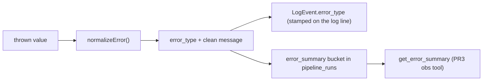

# Error Classification

Last updated: May 29, 2026

`normalizeError()` (`src/backend/lib/observability/logger.ts`) maps any thrown value to a normalized `error_type` plus a clean message. This is what turns a pile of unstructured stack traces into a **rankable error distribution** — the difference between "100 failed" and "97 `TIMEOUT`, 3 `AUTH`."

## Why classify at all

The original "100 failed / 0 scraped" incident had no `error_type` and no row — every failure looked identical. A normalized taxonomy lets the observability tools answer:

- _What **kind** of failure is dominating right now?_ (`get_error_summary` ranks by count)
- _Is this a D1 pressure problem or an upstream problem?_ (`D1_OVERLOAD` vs `UPSTREAM_5XX`)
- _Did a credential expire?_ (`AUTH` spiking in isolation)

## The taxonomy

`PipelineErrorType` is a fixed enum (defined in `pipeline-runs.ts`, re-used by the logger):

| `error_type` | Meaning | Typical cause |
| --- | --- | --- |
| `D1_OVERLOAD` | D1/SQLite write pressure or contention | the exact failure this whole subsystem was built to kill |
| `TIMEOUT` | a deadline elapsed | slow RapidAPI/upstream, aborted fetch |
| `DEST_UNAVAILABLE` | the destination could not be reached | DNS failure, connection refused, `fetch failed` |
| `PARSE_ERROR` | a response could not be parsed | malformed JSON, unexpected token, invalid payload |
| `AUTH` | authentication/authorization rejected | expired API key, 401/403, invalid credential |
| `UPSTREAM_4XX` | an upstream client error | a 4xx that isn't specifically auth |
| `UPSTREAM_5XX` | an upstream server error | a 5xx from a scraped board or API |
| `UNKNOWN` | nothing matched | the catch-all default |

## The heuristic

`normalizeError()` lower-cases the message and tests ordered regexes — **first match wins**, so the ordering encodes priority:

```ts
export function normalizeError(e: unknown): { error_type: PipelineErrorType; message: string } {
  const message = e instanceof Error ? e.message : String(e);
  const lower = message.toLowerCase();

  let error_type: PipelineErrorType = "UNKNOWN";
  if (/\bd1\b|sqlite|database is locked|too many|d1_error|overload/.test(lower)) {
    error_type = "D1_OVERLOAD";
  } else if (/timeout|timed out|deadline|aborted/.test(lower)) {
    error_type = "TIMEOUT";
  } else if (/unreachable|econnrefused|enotfound|dns|connection refused|fetch failed/.test(lower)) {
    error_type = "DEST_UNAVAILABLE";
  } else if (/json|parse|unexpected token|invalid|malformed/.test(lower)) {
    error_type = "PARSE_ERROR";
  } else if (/unauthorized|forbidden|401|403|api key|invalid key|auth/.test(lower)) {
    error_type = "AUTH";
  } else if (/\b4\d\d\b/.test(lower)) {
    error_type = "UPSTREAM_4XX";
  } else if (/\b5\d\d\b/.test(lower)) {
    error_type = "UPSTREAM_5XX";
  }

  return { error_type, message };
}
```

### Ordering matters

`D1_OVERLOAD` is tested first because D1 relief is the highest-signal classification — if D1 is contending, that's the thing to know. `AUTH` is tested **before** the generic `4XX`/`5XX` status-code patterns so a `403 Forbidden` lands in `AUTH` (specific) rather than `UPSTREAM_4XX` (generic). The bare status-code regexes (`\b4\d\d\b`, `\b5\d\d\b`) are last-resort buckets for messages that carry a code but no recognizable keyword.

> The heuristic is intentionally regex-based, not exhaustive. It is "stable enough to rank" — the goal is a useful distribution, not perfect per-error truth. When in doubt it falls through to `UNKNOWN`, which is itself a signal (a spike of `UNKNOWN` means the heuristic needs a new pattern).

## Where classification is consumed



1. **On the log line.** [`ObsLogger.error(message, err)`](/docs/observability/structured-logger) auto-classifies and stamps `error_type` on the emitted `LogEvent`, folding the normalized message into the line.
2. **On the run row.** [`RunHandle.recordFailure(err)`](/docs/observability/run-pipeline) tallies the `error_type` into the `error_summary` bucket (count + first sample), which lands on the terminal `pipeline_runs` row.
3. **In the tooling (PR3).** `get_error_summary` reads those ranked buckets to surface the dominant failure modes.

## File reference

- `src/backend/lib/observability/logger.ts` — `normalizeError()`, and its use inside `ObsLogger.error()`.
- `src/backend/db/schemas/pipeline/pipeline-runs.ts` — the `PipelineErrorType` enum and `PipelineErrorSummary` shape.
- `src/backend/lib/observability/run-pipeline.ts` — `recordFailure()` → `tallyError()` ranking.
