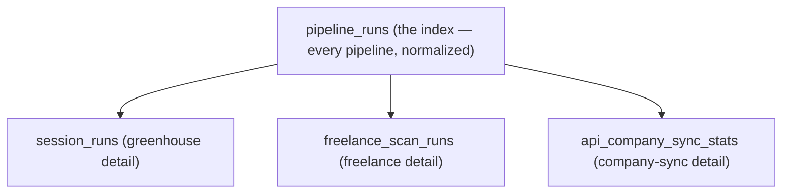

# Pipeline Runs Table

Last updated: May 29, 2026

`pipeline_runs` (`src/backend/db/schemas/pipeline/pipeline-runs.ts`, migration `0044_powerful_senator_kelly.sql`) is the **cross-pipeline run-status index** — one row per pipeline execution, written via [`runPipeline()`](/docs/observability/run-pipeline) with a guaranteed terminal status. It is the single normalized table the observability tooling queries to answer "which pipelines are running, failing, or stale."

## Where it sits

This table is an **index on top of** the existing per-domain run tables, not a replacement. The detail layer stays where it is:



`pipeline_runs` answers cross-pipeline questions (health, staleness, error rates) with a uniform shape; the per-domain tables keep the rich, domain-specific columns. The `run_id` is the join key that also correlates with the [log timeline](/docs/observability/structured-logger) — every `LogEvent` inside a run carries the same `run_id`.

## Schema

```ts
export const pipelineRuns = sqliteTable("pipeline_runs", {
  runId: text("run_id").primaryKey(),
  pipeline: text("pipeline").notNull(),
  trigger: text("trigger", { enum: ["cron", "manual", "agent", "api"] }).notNull(),
  status: text("status", { enum: ["running", "completed", "failed"] }).notNull(),
  startedAt: integer("started_at", { mode: "timestamp" }).notNull().$defaultFn(() => new Date()),
  finishedAt: integer("finished_at", { mode: "timestamp" }),
  durationMs: integer("duration_ms"),
  attempted: integer("attempted").notNull().default(0),
  succeeded: integer("succeeded").notNull().default(0),
  failed: integer("failed").notNull().default(0),
  errorSummary: text("error_summary", { mode: "json" }).$type<PipelineErrorSummary>(),
  sourceBreakdown: text("source_breakdown", { mode: "json" }).$type<PipelineSourceBreakdown>(),
  metadata: text("metadata", { mode: "json" }).$type<Record<string, unknown>>(),
});
```

## Columns

| Column | Type | Meaning |
| --- | --- | --- |
| `run_id` | text PK | UUID — correlates the run with its log timeline via the `run_id` on every `LogEvent`. |
| `pipeline` | text | Pipeline identifier — `freelance-scan`, `greenhouse-scan`, `salary`, `discovery`, `company-sync`. |
| `trigger` | enum | What initiated the run — `cron`, `manual`, `agent`, or `api`. |
| `status` | enum | `running`, `completed`, or `failed`. A `finally{}` block guarantees a terminal value. |
| `started_at` | timestamp | When the run started (defaults to insert time). |
| `finished_at` | timestamp? | When the run reached a terminal status — `null` while running. |
| `duration_ms` | int? | Wall-clock duration — `null` while running. |
| `attempted` | int | Units the run attempted (boards, listings, jobs). Floored to `succeeded + failed`. |
| `succeeded` | int | Units that succeeded. |
| `failed` | int | Units that failed. |
| `error_summary` | JSON? | Ranked `error_type` buckets with counts + a sample message. |
| `source_breakdown` | JSON? | Per-source outcome breakdown (per board token, per platform). |
| `metadata` | JSON? | Free-form run metadata (query params, config, version). |

### The JSON shapes

```ts
// error_summary — keyed by normalized error_type
export interface PipelineErrorSummary {
  [errorType: string]: { count: number; sample: string };
}
// e.g. { "TIMEOUT": { count: 3, sample: "upwork fetch timed out after 30s" } }

// source_breakdown — keyed by source label
export interface PipelineSourceBreakdown {
  [source: string]: { attempted: number; succeeded: number; failed: number };
}
// e.g. { "upwork": { attempted: 50, succeeded: 47, failed: 3 } }
```

The `error_type` keys come from the [error classification taxonomy](/docs/observability/error-classification).

## Indexes

Three indexes back the common observability queries:

| Index | Column | Serves |
| --- | --- | --- |
| `pipeline_runs_pipeline_idx` | `pipeline` | "show me every run of `freelance-scan`" / per-pipeline health. |
| `pipeline_runs_status_idx` | `status` | "show me everything currently `running`" / stuck-run reaping. |
| `pipeline_runs_started_at_idx` | `started_at` | recency ordering, staleness checks, time-range scans. |

## Migration

The table ships in `drizzle/0044_powerful_senator_kelly.sql`, generated by `pnpm run db:generate` (never hand-edited):

```sql
CREATE TABLE IF NOT EXISTS `pipeline_runs` ( … );
CREATE INDEX IF NOT EXISTS `pipeline_runs_pipeline_idx` ON `pipeline_runs` (`pipeline`);
CREATE INDEX IF NOT EXISTS `pipeline_runs_status_idx` ON `pipeline_runs` (`status`);
CREATE INDEX IF NOT EXISTS `pipeline_runs_started_at_idx` ON `pipeline_runs` (`started_at`);
```

It is applied to local D1 via `migrate:local`; production roll-out is `pnpm run migrate:remote`. See [Rollout & Verification](/docs/observability/rollout).

## drizzle-zod & doc exports

The schema file also exports the contract used by the API and docs layers:

- `insertPipelineRunSchema` / `selectPipelineRunSchema` — drizzle-zod schemas (single source of truth for REST validation).
- `PipelineRun` / `NewPipelineRun` — inferred row types.
- `PIPELINE_RUNS_TABLE_DESCRIPTION` / `PIPELINE_RUNS_COLUMN_DESCRIPTIONS` — surfaced in the schema documentation viewer.
- `PipelineRunStatus`, `PipelineRunTrigger`, `PipelineErrorType`, `PipelineErrorSummary`, `PipelineSourceBreakdown` — shared value types referenced by the logger and the observability service.

## File reference

- `src/backend/db/schemas/pipeline/pipeline-runs.ts` — table, types, drizzle-zod schemas, doc descriptions.
- `src/backend/db/schemas/pipeline/index.ts` — barrel that re-exports the above.
- `drizzle/0044_powerful_senator_kelly.sql` — the generated migration.
