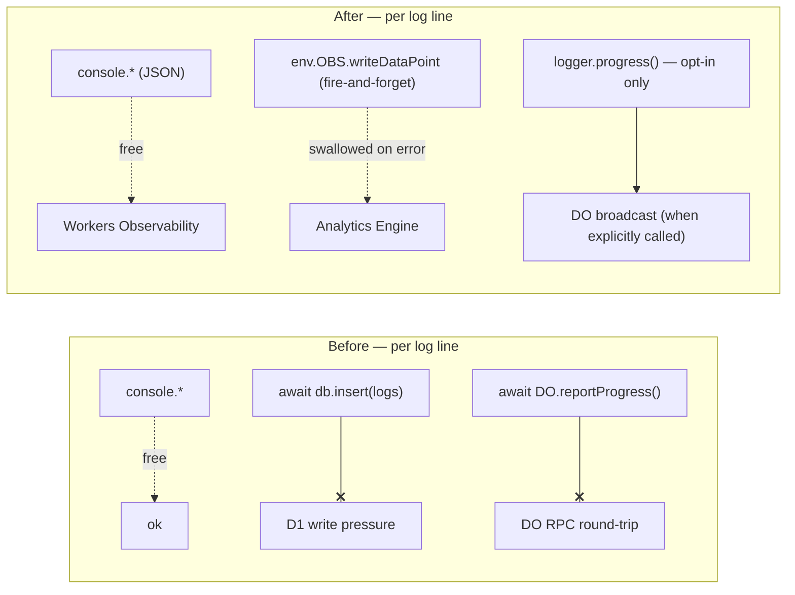

# Rollout & Verification

Last updated: May 29, 2026

This page covers what PR1 actually changed on disk, how the migration is applied, and how to verify the D1 relief once it ships. The headline change is small and surgical: the legacy `Logger` keeps its public API, but its internals were gutted of the two cross-network writes that overloaded D1.

## What changed in `logger.ts`

`src/backend/lib/logger.ts` was **rewritten as a thin facade** over [`ObsLogger`](/docs/observability/structured-logger). The public surface is unchanged:

```ts
export class Logger {
  private obs: ObsLogger;
  constructor(private env: Env) {
    this.obs = ObsLogger.fromEnv(env);
  }
  async info(message, metadata?)  { this.obs.info(message, metadata); }
  async warn(message, metadata?)  { this.obs.warn(message, metadata); }
  async error(message, metadata?) { this.obs.error(message, metadata); }
  async debug(message, metadata?) { this.obs.debug(message, metadata); }
  async progress(payload) { /* opt-in WS broadcast */ }
}
```

The methods keep their `async` signatures so the ~40 existing call sites compile and run unchanged — but internally they now delegate to the synchronous, fire-and-forget `ObsLogger`.

### What was removed

Two per-line network operations are **gone**:

1. **`await db.insert(logs)`** — the D1 `logs` firehose. This was the dominant D1 write pressure; every `info/warn/error/debug` call did a cross-network insert.
2. **The per-line Durable Object RPC** — `getAgentByName(SYNC_BROADCAST_AGENT).reportProgress(...)` fired on *every* log line.

### What replaced them

- A **console mirror** (free — captured by Workers Observability).
- A **fire-and-forget** Analytics Engine write (no-ops when `OBS` is unbound).
- An explicit, **opt-in** `logger.progress(payload)` for the live WebSocket broadcast — no longer implicit on every line. No existing caller relied on the implicit per-line broadcast, so nothing regresses.



## Why the `logs` write was safe to drop

The D1 `logs` table was written **only** by `lib/logger.ts`. It is distinct from `role_logs`, which `role-log-service.ts` reads — that table and its readers are untouched. Dropping the `logs` insert removes write pressure without breaking any reader.

## The migration

PR1 adds the [`pipeline_runs`](/docs/observability/pipeline-runs) table. The migration was generated — never hand-written:

```bash
pnpm run db:generate   # → drizzle/0044_powerful_senator_kelly.sql
pnpm run migrate:local # applied to local D1 ✅
```

Production roll-out is a separate, gated step:

```bash
pnpm run migrate:remote  # applies 0044 to production D1
```

> `migrate:remote` is intentionally deferred to an explicit human-authorized run — it mutates production. The local migration is already applied, so local dev and tests see the table now.

After any `wrangler.jsonc` binding change (the new `OBS` dataset), `pnpm run types` regenerates `worker-configuration.d.ts`.

## Verification checklist

After deploy, confirm the D1 relief actually landed:

| Check | How | Expected |
| --- | --- | --- |
| **D1 `logs` writes stopped** | query the `logs` table row count over time | no new rows after deploy |
| **Logs still captured** | Workers Observability live tail | one JSON line per log call, structured `LogEvent` shape |
| **Analytics Engine receiving** | AE SQL query on `core_resumes_obs` | rows arriving, partitioned by pipeline |
| **`D1_OVERLOAD` trend** | Workers Observability over a high-volume pipeline run | trends toward ~0 |
| **No caller broke** | the ~40 `Logger` call sites | compile + run unchanged; no per-line WS dependency |

## Guardrail (every pipeline PR)

Independent of the logger change, the browser-render + multi-method scraping guardrail must hold: submit a role via `/intake` and assert the full bullet set + HTML + markdown + narrative still come back via the BR-first path and the Greenhouse-API fallback. The observability work moves raw scrape *storage* to R2 in PR5 but never removes a *capture* method.

## File reference

- `src/backend/lib/logger.ts` — the rewritten facade + opt-in `progress()`.
- `src/backend/lib/observability/logger.ts` — the `ObsLogger` engine it delegates to.
- `drizzle/0044_powerful_senator_kelly.sql` — the generated migration.
- `wrangler.jsonc` — the `OBS` Analytics Engine binding.
