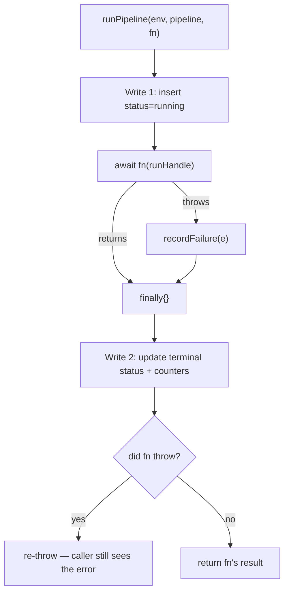

# runPipeline Wrapper

Last updated: May 29, 2026

`runPipeline()` (`src/backend/lib/observability/run-pipeline.ts`) is the single wrapper every background pipeline executes inside. It turns "N failed / no trace" into an inspectable timeline by guaranteeing a terminal [`pipeline_runs`](/docs/observability/pipeline-runs) row — even when the work throws — while handing the body a child [logger](/docs/observability/structured-logger) and lightweight counters.

## The two-write model

The cost of a tracked run is **exactly two D1 writes**, not one-per-log:

1. **Write 1 — claim the run.** Before the body runs, insert a row with `status: "running"`, `started_at`, and a fresh `run_id` (a UUID).
2. **Write 2 — persist the terminal status.** A `finally{}` block updates the same row with `status: "completed" | "failed"`, `finished_at`, `duration_ms`, the rolled-up counters, `error_summary`, and `source_breakdown`.

Because Write 2 lives in `finally{}`, it runs whether the body returns, throws, or a single unit fails. There is no code path that leaves a run stuck at `running` short of the isolate being killed — which the PR4 stuck-run reaper sweeps up.



## Signature

```ts
export async function runPipeline<T>(
  env: Env,
  pipeline: string,
  fn: (run: RunHandle) => Promise<T>,
  options: RunPipelineOptions = {},
): Promise<T>;

export interface RunPipelineOptions {
  trigger?: PipelineRunTrigger; // "cron" | "manual" | "agent" | "api" — defaults to "manual"
  metadata?: Record<string, unknown>;
}
```

`runPipeline` returns whatever `fn` returns. On failure it **re-throws after** persisting the `failed` row, so cron handlers and callers still observe the error — the wrapper adds a trace, it never swallows.

## The `RunHandle`

The body receives a `RunHandle` — its logging + counter surface:

```ts
export interface RunHandle {
  readonly runId: string;
  readonly logger: ObsLogger;          // auto-stamped with pipeline + run_id
  setAttempted(n: number): void;        // declare intended unit count
  recordSuccess(source?: string): void; // tally one success, optionally per-source
  recordFailure(error: unknown, source?: string): void; // tally + classify + log
  setMetadata(meta: Record<string, unknown>): void;     // merge onto the terminal row
}
```

A typical body:

```ts
await runPipeline(env, "freelance-scan", async (run) => {
  const boards = await listBoards();
  run.setAttempted(boards.length);

  for (const board of boards) {
    try {
      const found = await scanBoard(board);
      run.recordSuccess(board.platform);
      run.logger.info("board scanned", { board: board.id, found });
    } catch (e) {
      run.recordFailure(e, board.platform); // classifies + logs "unit failed"
    }
  }
}, { trigger: "cron" });
```

## What the counters roll up into

`RunTracker` (the internal `RunHandle` implementation) accumulates four things that land on the terminal row:

| Counter / field | Source | Terminal column |
| --- | --- | --- |
| `attempted` | `setAttempted(n)`, floored to `succeeded + failed` | `attempted` |
| `succeeded` | each `recordSuccess()` | `succeeded` |
| `failed` | each `recordFailure()` | `failed` |
| `errorSummary` | `recordFailure()` → [`normalizeError()`](/docs/observability/error-classification) ranks by `error_type` | `error_summary` (JSON) |
| `sourceBreakdown` | the optional `source` arg on success/failure | `source_breakdown` (JSON) |
| `metadata` | `setMetadata()` merges | `metadata` (JSON) |

`recordFailure()` does three things in one call: increments `failed`, classifies the error into an `error_type` bucket (with a sample message), and emits an `error`-level `LogEvent` (`"unit failed"`). That means a caller never has to remember to both tally *and* log a failure.

### Terminal status rule

```ts
const status = threw || tracker.failed > 0 ? "failed" : "completed";
```

A run is `failed` if the body threw **or** any single unit failed. A scan that processes 100 boards and loses 3 to RapidAPI timeouts is `failed` with `succeeded: 97, failed: 3` — the partial success is preserved in the counters, but the run is flagged for attention.

## Resilience: the wrapper never blocks the work

Both D1 writes are wrapped in `try/catch`. If Write 1 (the `running` claim) fails, the wrapper logs and continues — telemetry must never stop the actual pipeline. The body runs regardless of whether the index row was successfully claimed.

The closing `logger.info("pipeline finished", …)` emits a single summary `LogEvent` with the rollup (`status`, `duration_ms`, `attempted/succeeded/failed`, `error_types`) so the log firehose carries the run summary even for consumers that don't read D1.

## File reference

- `src/backend/lib/observability/run-pipeline.ts` — `runPipeline`, `RunHandle`, `RunTracker`, `RunPipelineOptions`.
- `src/backend/lib/observability/logger.ts` — the `ObsLogger` the handle exposes and `normalizeError()`.
- `src/backend/db/schemas/pipeline/pipeline-runs.ts` — the `pipeline_runs` row the two writes target.
